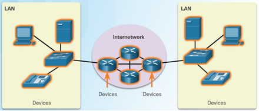

# 1. Control System
---

- Feedback is a mechanism where part of the output is returned as input to influence future actions.

- Positive Feedback Loop
	- A loop that reinforces the original input, increasing the system's response.
	- It aims to amplify deviations from the desired output, often leading to instability.

- Negative Feedback Loop
	- A loop that counteracts the original input, stabilizing the system.
	- It aims to reduce deviations from the desired output, promoting system stability.

| Open Loop Control System                                                                                                                                                      | Closed Loop Control System                                                                                                                            |
| ----------------------------------------------------------------------------------------------------------------------------------------------------------------------------- | ----------------------------------------------------------------------------------------------------------------------------------------------------- |
| **Definition** A control system that uses feedback to compare the actual output with the desired output and adjusts accordingly. the output influences the control action. | **Definition** A control system that operates without feedback; the output does not affect the control action.                                     |
| Operates without feedback.                                                                                                                                                    | Operates using feedback. It continuously measures the output and compares it to a desired setpoint, making corrections as needed.                     |
| The output doesn't influence the control action.                                                                                                                              | The output influences the control action.                                                                                                             |
| Example:  Simple Toaster: It toasts for a set time, whether the bread is perfectly browned or burnt.                                                                       | Example: Air Conditioner: Maintains a target temperature.                                                                                          |
| Pros: Simpler to implement and maintain.                                                                                                                                   | Pros: - More accurate as feedback allows the system to correct errors. - More adaptive to disturbance and better at maintaining desired output. |
| Cons: - Less adaptive to the environmental changes. - Less accurate due to the absence of feedback.                                                                     | Cons: - More complex and costly to design and implement. - Less stable if not properly design.                                                  |

# 2. IoT World Forum Reference Model
---
IoT World Forum Reference Model is a seven-level IoT Reference Model introduced by the IoT World Forum that guides and accelerates IoT deployments. It consists of 7 layers:

- **Physical Devices and Controllers**
	- Includes endpoint devices and sensors that send and receive data.
	- Responsible for collecting data and capable of being queried and/or controlled over a network.

- **Connectivity**
	- Ensure reliable and timely data transmission between devices and networks.
	- It handles translation between protocols, network level security, switching and routing.

- **Edge Computing**
	- Performs data processing close to the network edge/ end devices for faster information processing and reduced latency.

- **Data Accumulation**
	- Stores data for later use.

- **Data Abstraction**
	- Standardizes multiple data formats and ensures a consistent view from various sources

- **Application**
	- Interprets data using software applications.
	- Applications may monitor, control, and provide reports based on the data analysis.

- **Collaboration & Processes**
	- Consumes and shares the application information, involving human and business processes.

**Explain Device-to-Gateway-to-Cloud-to-Application architecture.**
- Devices collect data or perform actions via sensors/actuators.
- Gateways bridge devices to the cloud, handling data collection and basic processing.
- The cloud stores, processes, and analyzes data.
- Applications allow users to interact with data and control devices.

**What are the differences between edge computing and fog computing?**
- Fog computing deploys nodes near IoT endpoints for real-time monitoring and control.
- Edge computing extends fog computing to the IoT endpoint itself.

**What are the pros and cons of distributed computing in IoT?**
- Pros: Faster processing, reduced latency, less network congestion, local data security.
- Cons: Increased complexity, potential inconsistency.

# 3. Network
---
## 3.1. Fog and Cloud Computing

![[image.png]]

Cloud Computing Model
- Provides on-demand access to a shared pool of configurable computing resources. It is suitable for large-scale data storage and complex, non-urgent analysis.
- **Advantages**:
	- Resources can be provisioned quickly with minimal management effort.
	- Reduces capital expenditure on equipment, energy, and IT personnel
	- Cloud providers offer high availability, reliability, and robust security, ensuring that data and resources are readily available.
	- Allows data accumulation and data processing be performed in the cloud instead of the IoT devices, extends the functionality of the IoT system.
- **Pay-as-you-go**: A payment model where one is billed based on the actual resource usage, similar to a utility.

**Fog computing model**
- A distributed, intermediate layer of computing where computing typically operates on intermediary devices.
- **Key Functions & Advantages**:
	- It analyzes real-tie data from multiple edge devices locally, enabling rapid, coordinated actions (M2M/M2P)
	- It reduces network traffic to the cloud, as raw data is processed locally.
	- It enhances security and privacy by keeping sensitive data within the local network unless it needs to be sent to the cloud.

**Edge Computing** Model
- Computation that occurs directly on the **end-device** (e.g., a smart camera or industrial sensor).

## 3.2. Network Types

- **PAN (Personal Area Network)**
	- A type of network that spans a few meters around an individual. It connects personal devices, e.g., smartwatch to phone via Bluetooth.
- **LAN (Local Area Network)**
	- A type of network infrastructure that spans a limited geographical area like a single building or campus.
	- It is typically high-speed and managed by single administrative entity.
	- It is used to connect end devices within that area.
- **WAN (Wide Area Network)**
	- A type of network infrastructure that spans a wide geographical area, connecting multiple LANs together.
	- The internet is the largest WAN.
	- It often involves multiple service providers (ISPs).

| LAN                                          | WAN                                                        |
| -------------------------------------------- | ---------------------------------------------------------- |
| Local Area Network                           | Wide Area Network                                          |
| Spans a limited geographical area            | Spans a large geographical area                            |
| Used to connect end devices                  | Used to connect different LANs.                            |
| Usually high-speed                           | Speed can vary.                                            |
| Controlled by a single administrative entity | May include portions from Internet Service Providers (ISP) |

| Term                 | Definition                                                                                                                                                           |
| -------------------- | -------------------------------------------------------------------------------------------------------------------------------------------------------------------- |
| Network devices      | Devices that connect to each other through a network                                                                                                                 |
| End devices          | Either the source/ destination of a message transmitted over the network                                                                                             |
| Intermediary devices | Devices that connect the individual end devices to the network and can connect multiple individual networks to form an internetwork                                  |
| Network addresses    | Used to uniquely identify devices on a network                                                                                                                       |
| Network Protocols    | Devices must conform to common protocols to communicate. Ethernet: Enable communications between local devices IP: Enable communication between remote devices |
| Basic routing        | The process of directing a network packet to its destination                                                                                                         |

# 4. Security Measures
---

| Plane Type       | Functions                                                                                                                 | Security                                                               |
| ---------------- | ------------------------------------------------------------------------------------------------------------------------- | ---------------------------------------------------------------------- |
| Control Plane    | Manages networking routing protocol and makes *forwarding decisions*.                                                     | Secure the network device, e.g. passwords and data encryption          |
| Data Plane       | Receive and forward data packets between devices                                                                          | Secure the data transmitted over the network devices                   |
| Management Plane | Managing and monitoring network operations. Allow for modifying configuration or updating software that runs on a device. | Secured by updating the software and firmware with the latest patches. |

- **Device Hardening (Securing the "Thing")**
	- This focuses on making the individual IoT device itself as secure as possible.
	- **Authentication and Authorization**
		- Always change default usernames and passwords
		- Use strong, unique passwords and remove unnecessary default accounts
		- Limit system access to authorized personnel only.
	- **Firmware and Software Integrity**
		- Regularly check for and apply the latest software/firmware updates and security patches to fix vulnerabilities
		- Purchase devices from reputable manufacturer who provide ongoing support and facilitate updates.
	- **Minimizing the Attack Surface**
		- Turn off all unnecessary services and close unused network ports to reduce potential entry points.
		- Disable Universal Plug and Play (UPnP) unless absolutely necessary, as it can be exploited.

- Network Security (Securing the Connections)
	- This layer protects the communication paths to and from the IoT device.
	- Securing Network Planes:
		- Control Plane
			- Manages routing protocols and determines how traffic should be directed.
			- Secure it with strong passwords and access controls on routers and switches.
		- Management Plane:
			- Used for managing and monitoring network devices.
			- Secure it by ensuring updates are applied and access is restricted
		- Data Plane:
			- Forwards the actual data packets.
			- Secure it by filtering traffic and preventing unauthorized data flows.

Data Protection (Securing the information)
- This ensures data remains confidential and unaltered, both in storage and during transmission.
- **Encryption at Rest**:
	- Encrypt data that is stored on the device or in the cloud to prevent data theft or tampering.
	- Use self-encrypting drives (SEDs) where the hardware handles encryption automatically.
- **Encryption in Transit**:
	- Encrypt all data transmitted between the IoT device, gateways, and the cloud to prevent interception and manipulation.
	- All endpoints and intermediary devices must use strong, current encryption algorithms.

>[!info]
>- IoT devices might store data locally and temporarily when there's no connection to the gateways or controllers.
>- trick devices into using sub-optimal security parameters under which the connection can be exploited

# 5. Business
---
## Market Types

| Horizontal Market                                                                                                                                                                                                                                                                      | Vertical Market                                                                                                                                                                                                                                                                                                                                                                                                                                                                                                                                                                                                                                                                                                                                                       |
| -------------------------------------------------------------------------------------------------------------------------------------------------------------------------------------------------------------------------------------------------------------------------------------- | --------------------------------------------------------------------------------------------------------------------------------------------------------------------------------------------------------------------------------------------------------------------------------------------------------------------------------------------------------------------------------------------------------------------------------------------------------------------------------------------------------------------------------------------------------------------------------------------------------------------------------------------------------------------------------------------------------------------------------------------------------------------- |
| Meet common/similar needs for a wide range of industries, e.g. security, IT, financial services.                                                                                                                                                                                       | Offer goods/services to a set of customers with specialized needs, e.g. education, automotive, banking, healthcare, retail, etc.                                                                                                                                                                                                                                                                                                                                                                                                                                                                                                                                                                                                                                      |
| Target a broad range of industries with general-purpose services or products.                                                                                                                                                                                                          | Target specific industries with tailored solutions for specialized needs.                                                                                                                                                                                                                                                                                                                                                                                                                                                                                                                                                                                                                                                                                             |
| **Examples**: Financial Auditing, Information Technology Services, Cybersecurity, Cloud Computing.                                                                                                                                                                                     | Examples: Healthcare, Automotive, Agriculture, Retail, Logistics.                                                                                                                                                                                                                                                                                                                                                                                                                                                                                                                                                                                                                                                                                                     |
| **IoT Connectivity Platforms:** Provide the infrastructure (like AWS IoT or Azure IoT Hub) for any industry to connect and manage devices.  **IoT Data Analytics Platforms:** Enable the analysis of large datasets from IoT devices, regardless of the industry source.   | **Agriculture: Smart Irrigation Systems**   Uses soil moisture sensors and weather forecast data to automatically deliver the precise amount of water needed, conserving resources.  **Retail: Smart Inventory Management**   Uses RFID tags or smart shelves to provide real-time tracking of stock levels, automating reordering and reducing theft.  **Automotive: Predictive Maintenance**   Uses sensors in vehicles to monitor engine health and predict part failures before they happen, alerting the owner to schedule service.  **Healthcare: Remote Patient Monitoring**   Uses wearable sensors to transmit patient vitals (e.g., heart rate, glucose levels) directly to healthcare providers for continuous care.   |

## Business Model Canvas

- Help organizations and entrepreneurs map, discuss, design and invent new business models
- A business models consists of customer segments, value propositions, channels, customer relationships, revenue stream, key resources, key activities, key partnerships and cost structure
	- Customer Interface: Customer Segments, Value Proposition, Channels, Customer Relationships
	- Infrastructure Management: Key resources, key activities, key partnership
	- Business finances: cost structure, revenue stream

# 6. Miscellaneous
---
- An *independent network* is a standalone network dedicated to a specific type of device/ service, which is isolated from others.

- A *converged network* is a network that incorporates multiple types of device/service(s) (e.g. data, voice, video, IoT traffic) alongside comprehensive security, analytics, and management capabilities.

- **Convergence**: The process of connecting multiple types of device/service(s) into a unified infrastructure.

- **Machine-to-Machine (M2M)** allows interactions between different devices.

- Big Data is data that is so vast and complex until it is difficult to store, process and analyze using traditional approaches. It is characterized in three dimensions:
	- Volume: The amount of data being transported and stored
	- Velocity: The rate at which the data is generated
	- Variety: The type of data, which is rarely in a state that is perfectly ready for processing and analysis