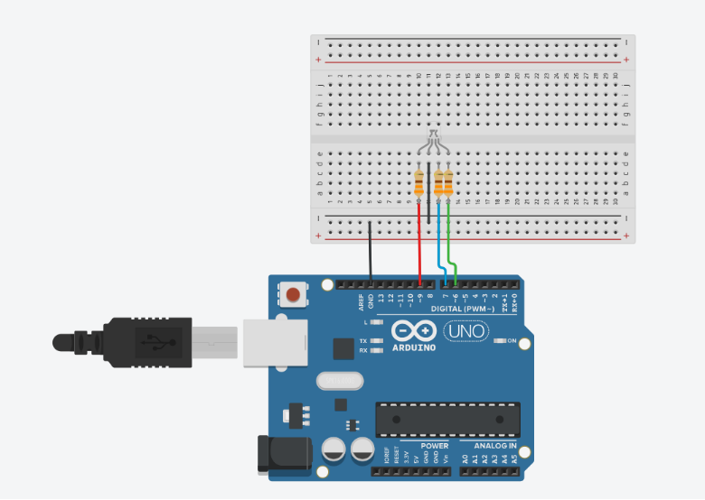
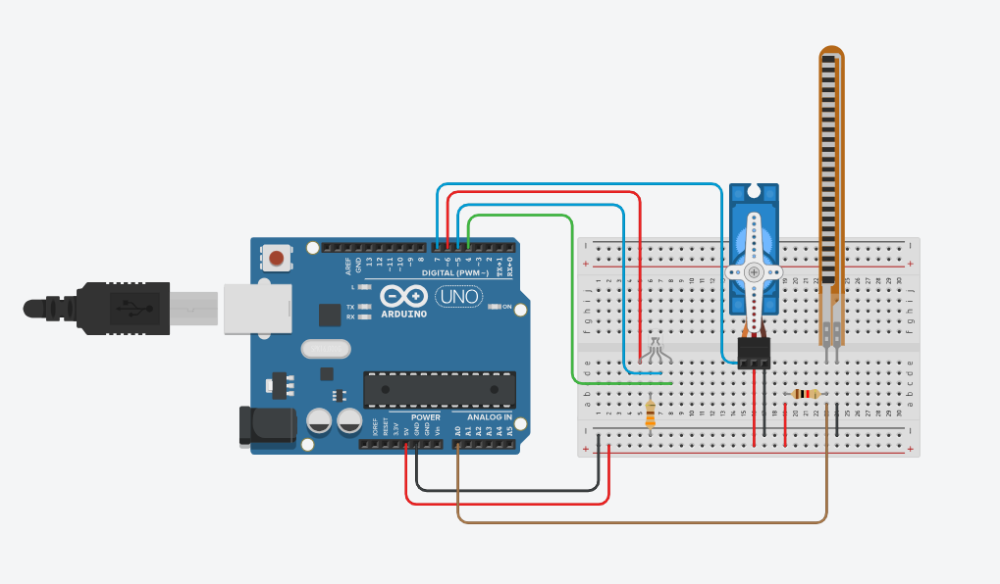
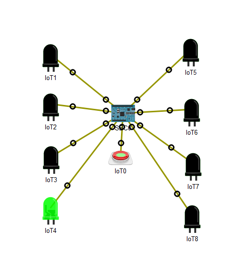
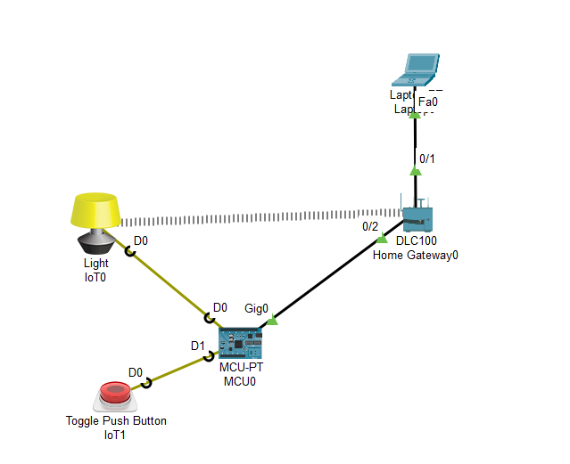
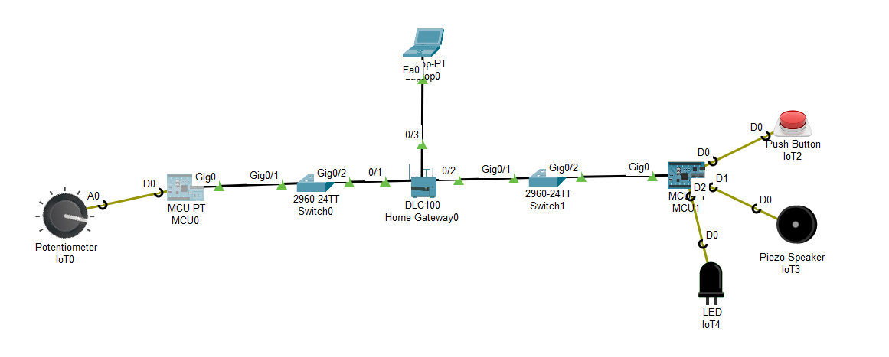
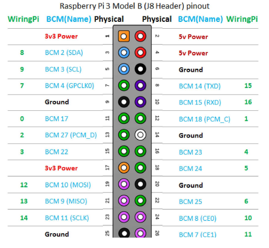
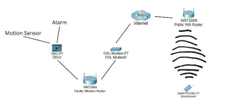
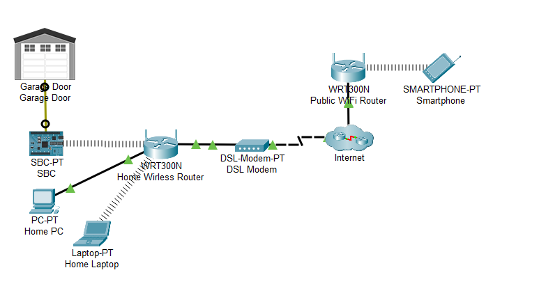
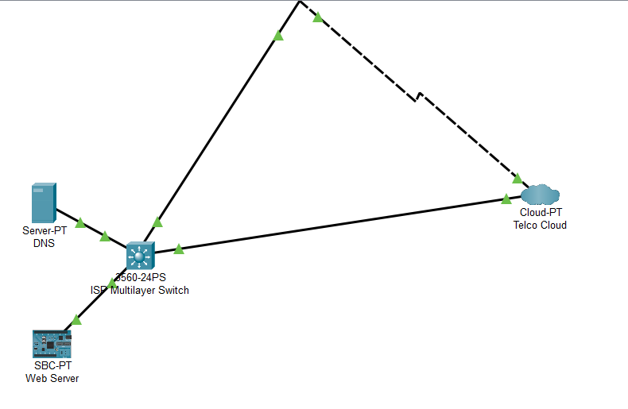

## 1. Tinkercad
---
### 1.1. lab2.2.2.6



```c++
// Ver 1
// C++ code
// 
const int PINS[] = {6, 3, 2};
const int SIZE = 3;
int curr = 0;
int next = 1;

void setup()
{
  for(int i = 0; i < SIZE; i++) {
    pinMode(PINS[i], OUTPUT);
    analogWrite(PINS[i], 0);
  }
}

void loop()
{
  int currPin = PINS[curr];
  int nextPin = PINS[next];
  for(int i = 0; i < 256; i++) {
    analogWrite(currPin, 255 - i);
    analogWrite(nextPin, i);
    delay(10);
  }
  cur = next;
  next = (next + 1) % SIZE;
}

// Ver 2
// C++ code
//

const int RED = 6;
const int BLUE = 3;
const int GREEN = 2;

void setup()
{
  pinMode(RED, OUTPUT);
  pinMode(BLUE, OUTPUT);
  pinMode(GREEN, OUTPUT);
}

void loop()
{
  for(int i = 0; i < 256; i++) {
    analogWrite(RED, 255 - i);
    analogWrite(BLUE, i);
    delay(10);
  }
  for(int i = 0; i < 256; i++) {
    analogWrite(BLUE, 255 - i);
    analogWrite(GREEN, i);
    delay(10);
  }
  for(int i = 0; i < 256; i++) {
    analogWrite(GREEN, 255 - i);
    analogWrite(RED, i);
    delay(10);
  }
}
```

有两种写法，但前者更为简洁。前者算法应用到了 `LinkedList` 的 clear 的思路 —— 这便是学习算法的好处。

### 1.2. lab2.2.3.2


```javascript
// C++ code
//

const int RED = 4;
const int YELLOW = 3;
const int GREEN = 2;
const int LEDS[] = {RED, YELLOW, GREEN};
const int LIGHT = A0;
int index = 0;

// R = 330, V = 5
const int MIN = 2;
const int MAX = 404;
const int RANGE = MAX - MIN;

void setup()
{
  pinMode(LIGHT, INPUT);
  for(int i = 0; i < 3; i++) {
    pinMode(LEDS[i], OUTPUT);
    digitalWrite(LEDS[i], LOW);
  }
  Serial.begin(9600);
}

void loop()
{
  int val = analogRead(LIGHT);
  int index = 3 * (val - MIN) / RANGE;
  digitalWrite(LEDS[index], HIGH);
  digitalWrite(LEDS[(index + 1) % 3], LOW);
  digitalWrite(LEDS[(index + 2) % 3], LOW);
  delay(10);
}
```
### 1.3. lab2.2.4.2



```c++
// C++ code
//
#include<Servo.h>

Servo servo1;
const int RED = 6;
const int BLUE = 5;
const int GREEN = 4;
const int LEDS[] = {RED, BLUE, GREEN};
const int SERVO = 7;
const int FLEX = A0;

// R = 1k, V = 5
const int FLEX_MIN = 990;
const int FLEX_MAX = 1017;
const int FLEX_RANGE = FLEX_MAX - FLEX_MIN + 1;

void setup()
{
  servo1.attach(SERVO);
  pinMode(FLEX, INPUT);
  for(int i = 0; i < 3; i++) {
    pinMode(LEDS[i], OUTPUT);
  }
  Serial.begin(9600);
}

void loop()
{
  int flex = analogRead(FLEX);
  servo1.write(map(flex, 1, 180));
  
  int index = 3 * (flex - FLEX_MIN) / FLEX_RANGE;
  int intensity = map(flex, 0, 255);
  
  analogWrite(LEDS[index], 255 - intensity);
  analogWrite(LEDS[(index + 1) % 3], intensity);
  analogWrite(LEDS[(index + 2) % 3], 0);
}

int map(int flex, int min, int max) {
  return constrain(
    	map(flex, FLEX_MIN, FLEX_MAX, min, max), 
    	min, max
  );
}
```

### 1.4. lab2.3.1.2


```javascript
from gpio import *
from time import *

def main():
	# 1. Set up toggle push button
	pinMode(0, IN)
	
	# 2. Set up LEDs
	LEDS = [i for i in range(1, 9)]
	for led in LEDS:
		pinMode(led, OUT)
		digitalWrite(led, LOW)
		
	SIZE = len(LEDS)
	index = -1;
	
	# 3. Looping
	while True:
		is_continue = digitalRead(0) == LOW
		
		if is_continue:
			prev = (index + SIZE) % SIZE
			index = (index + 1) % SIZE
			digitalWrite(LEDS[prev], LOW)
			digitalWrite(LEDS[index], HIGH)
			sleep(0.5)
			
if __name__ == "__main__":
	main()
```

这也是其中一个我很喜欢的代码。它的精髓在于：每一次的操作都是一个切换，而非开关同时做。区别如下：

```python
# 使用 + SIZE 是为了处理最初 index = -1 的情况
prev = (index + SIZE) % SIZE
index = (index + 1) % SIZE
			
// 切换
digitalWrite(LEDS[prev], LOW)
digitalWrite(LEDS[next], HIGH)

// 开关同时做
digitalWrite(LEDS[prev], HIGH)
sleep(0.5)
digitalWrite(LEDS[prev], LOW)
```

开关同时做的坏处是：他会先开/关 LED 后才检测 Toggle Button，造成滞后性。也可以参考下面代码：

```c++
void loop() {
  bool currentButtonState = digitalRead(PUSH_BUTTON_PIN);

  // Detect button press (HIGH to LOW transition)
  if (currentButtonState == LOW) {
    digitalWrite(LEDS[index], LOW);
    index = (index + 1) % 8;
    digitalWrite(LEDS[index], HIGH);
    
    delay(100); // Must have to avoid over-sensitive
  }
}
```


### 1.5. lab2.2.4.3


这题只要理解了底层原理，那其实也还好，可以看 wic2008-iot.excalidraw 的逐步拆解。

```c++
// C++ code
//

const int RELAY = 3;
const int DELAY = 500;

void setup()
{
  pinMode(RELAY, INPUT);
  Serial.begin(9600);
}

void loop()
{
  digitalWrite(RELAY, HIGH);
  delay(DELAY); // Wait for 1000 millisecond(s)
  digitalWrite(RELAY, LOW);
  delay(DELAY); // Wait for 1000 millisecond(s)
}
```


## 2. `IoEClient`
IoE: Internet of Everything

### 2.1. lab-connecting 2 mcu


一些经验（待验证）
- Home Gateway 是一个 Router。

>[!caution] 一些经验（待验证）
>- Home Gateway 是一个 Router，理论上它可以连接多个 Switch；但同时间只能有一个 Home Gateway（除非额外设置）；
>- 尽量使用 `GigabitEthernet` 而不是 `FastEthernet`，不然会 Fail DHCP request

遇见这类问题时，一个 board 是 logical group of IoT devices；换句话说，这个 board 需要收集特定组合的信息，因为一个 board 只可以 setup 一个 `IoEClient`。看代码：

```javascript
IoEClient.setup({
	type: "Fire Detection",
	states: [
		{
			name: "Fire",
			type: "bool"
		},
		{
			name: "Temperature",
			type: "number",
			unit: "°C",
			imperialUnit: "°F",
			toImperialConversion: "x*1.8+32",
			toMetricConversion: "(x-32)/1.8",
			decimalDigits: 1
		},
		{ 
			name: "Smoke Level",
			type: "number",
			unit: "ppm",
			decimalDigits: 1
		}
	]
});

function loop () {
    var smoke = analogRead(A0);        // ppm
    var temp  = analogRead(A1);        // raw ADC ≈ temperature
    var fire  = (smoke > 50 || temp > 580) ? 1 : 0;

    digitalWrite(1, fire ? HIGH : LOW);
    IoEClient.reportStates([fire, temp, smoke]);
    delay(500);
}
```


Packet Tracer/MCU Board 的 JavaScript 只接受 `var` (ES5-Compatible)，并不接受 `const` 或者 `let`！

```javascript
var ALARM = 0;
var LED = 1;

function setup() {
	// 1. Setup the output pin
	pinMode(ALARM, OUTPUT);
	pinMode(LED, OUTPUT);
	
	// 2. Setup the IoEClient
	IoEClient.setup({
		type: "Alarm System",
		states: [
			{
				name: "Alarm",
				type: "bool",
				controllable: true
			},
			{
				name: "LED",
				type: "bool",
				controllable: true
			}
		]
	});
	
	// 3. Setup the callback when receiving inputs
	IoEClient.onInputReceive = function(input) {
		var values = input.split(",");
		var alarmStatus = parseInt(values[0]);
		var ledStatus = parseInt(values[1]);
		digitalWrite(ALARM, digitalStatus(alarmStatus));
		digitalWrite(LED, digitalStatus(ledStatus));
		IoEClient.reportStates([alarmStatus, ledStatus]);
	}
}

function digitalStatus(status) {
	if(status === 0) {
		return LOW;
	} else {
		return HIGH;
	}
}
```

```javascript
var MOTION = 0;

function setup() {
	// 1. Setup the IoEClient
	IoEClient.setup({
		type: "Motion Detector",
		states: [
			{
				name: "Motion",
				type: "bool"
			}
		]
	});
	
	// 2. Setup the pinMode
	pinMode(MOTION, INPUT);
}

function loop() {
	var val = digitalRead(MOTION);
	IoEClient.reportStates([val === HIGH]);
}
```

重要知识点：

`IoEClient.onInputReceive` 里的 input 是一个 string，如果涉及到多过一个 states 的话要使用以下方式处理：

```javascript
IoEClient.setup({
	type: "Compound Client",
	states: [
		{
			name: "boolStatus",
			type: "bool",
			controllable: true
		},
		{
			// 如果使用 type: "number"，就必须指定 minValue 和 maxValue
			name: "boolStatus",
			type: "number",
			minValue: 0,
			maxValue: 10,
			controllable: true
		},
		{
			name: "stringStatus",
			type: "string",
			controllable: true
		},
		{
			// 如果使用 type: "options"，就必须指定 options
			name: "optionStatus",
			type: "options",
			options: {
				"0": "Off",
				"1": "Cooling",
				"2": "Heating",
				"3": "Auto"
			},
			controllable: true
		},
	]
})

// input: 0,0,"string",0
```

```javascript
function(input) {
	// 1. 使用 .split(",") 把 value 转换成 list
	var values = input.split(",")

	// 2. 通过硬编码的方式转换数值
	var boolStatus = parseInt(value[0]);
	var numberStatus = parseInt(value[1]);
	var stringStatus = value[2].substring(1, value.length - 1);
	var optionStatus = parseInt(value[3]);

	// 3. 使用 digitalWrite/ analogWrite/ customWrite 进行 control

	// 4. 更新 States，顺序必须按照上面的定义
	IoEClient.reportStates([boolStatus, numberStatus, stringStatus, optionStatus]);
}
```

其他用法：
```javascript
attachInterrupt(slow, function() {
	// Your logic here
});
```

当你想要通过 MCU 上的 input 进行控制时，则需要用这个，例子如下：

```javascript
function setup() {
	var motion = 0;
	pinMode(0, INPUT);

	attachInterrupt(0, function() {
		// do something here...
	});
}
```

一言以蔽之，
- 如果你需要从 IoT Monitor 管理某个 MCU（监控 Monitor/ 控制 Control），则需要用到 `IoEClient.setup`
- 如果你需要从 IoT Monitor 空置某个 MCU 的 Actuator，那就需要 register `IoEClient.onInputReceive`
- 如果你的 MCU 还有 Sensor 用来进行控制的话，就需要 register `attachInterrupt()`
- 记得使用 `IoEClient.reportStates([])` 更新状态！

补充资料：

| Property (inside the `api` object)                      | Purpose                                                                               | Required?   |
| ------------------------------------------------------- | ------------------------------------------------------------------------------------- | ----------- |
| `type`                                                  | Human-readable device category shown in the IoT Server UI.                            | ✔           |
| `states[ ].name`                                        | Label of each state (e.g. “On”).                                                      | ✔           |
| `states[ ].type`                                        | `"bool"`, `"number"`, `"options"`, `"string"`. Drives the control widget type.        | ✔           |
| `states[ ].options`                                     | _If type =`"options"`_ — map of numeric values to text labels.                        | conditional |
| `states[ ].unit` / `imperialUnit`                       | For numeric states: Metric & Imperial symbols to display.                             | optional    |
| `states[ ].toImperialConversion` / `toMetricConversion` | JavaScript snippets (with **x** as the original value) for automatic unit conversion. | optional    |
| `states[ ].decimalDigits`                               | How many decimals the server should round to.                                         | optional    |
| `states[ ].controllable`                                | `true` = user can change it from the dashboard.                                       | optional    |
| `states[ ].minValue` / `maxValue`                       | Numeric bounds enforced when `controllable` is `true`.                                | conditional |

| Function                                       | Description                                                                                        |
| ---------------------------------------------- | -------------------------------------------------------------------------------------------------- |
| `attachInterrupt(slot, callback)`              | Register an ISR that fires whenever the input on the given **analog/digital/custom slot** toggles. |
| `customRead(slot)` / `customWrite(slot,val)`   | Exchange **string** data on a “custom” port—handy for non-binary sensors.                          |
| `digitalWrite(slot,val)` / `digitalRead(slot)` | Set or get a digital pin (HIGH/LOW).                                                               |
| `IoEClient.reportStates(states)`               | Push the current state list to the IoT server so the dashboard stays updated.                      |
| `setDeviceProperty(name, prop, value)`         | Update a property shown when you click the device icon in PT’s logical/physical view.              |
| `Serial.print/println()`                       | Debug print to the MCU console window.                                                             |

相关参考资料：
1. [JavaScript API](https://tutorials.ptnetacad.net/help/default/iot_javascript_api.htm)
2. [Packet Tracer 8.2 - IoT advanced programming & automation - Packet Tracer Network](https://www.packettracernetwork.com/internet-of-things/iot-advanced-programming.html)
3. [Connecting two remote micro controller (MCU) in Internet of Things (IoT) using Packet Tracer - YouTube](https://www.youtube.com/watch?v=qcT8_qV90iU)

>[!info] JavaScript vs Arduino
>JavaScript/ Arduino 的 Framework 蛮像的，都是使用 `pinMode(pin, INPUT/OUTPUT),` `delay(millis)`，也有 `function setup()` 和 `function loop()`，这点和 Python 倒是有些不同。


### 2.2. prac-1



题目：通过 Laptop 或者 Toggle Push Button 来开关 Light。

```javascript
var LIGHT = 0;
var TOGGLE = 1;

function setup() {
	pinMode(LIGHT, OUTPUT);
	pinMode(TOGGLE, INPUT);
	
	IoEClient.setup({
		type: "Porch Light",
		states: [{
			name: "On",
			type: "bool",
			controllable: true
		}]
	});
	
	IoEClient.onInputReceive = function(input) {
		if(input.length <= 0) {
			return ;
		}
		var status = parseInt(input);
		setLightStatus(status === 1);
		IoEClient.reportStates([status]);
	}
	
	attachInterrupt(TOGGLE, function() {
		var status = digitalRead(TOGGLE);
		setLightStatus(status === HIGH);
	});
}

function setLightStatus(isOn) {
	if(isOn) {
		customWrite(LIGHT, 2);
	} else {
		customWrite(LIGHT, 0);
	}
}
```

### 2.3. prac-2


题目：A factory installs *Fire Detector* (**Smoke ppm**) and a *Fire Alarm* (40 dB buzzer). The alarm must sound automatically when smoke ≥ 300 ppm. Operators can also silence or test the alarm from the Gateway UI.

```javascript
var P = 0;
var PPM_MIN = 0;
var PPM_MAX = 500;
var PPM_RANGE = PPM_MAX - PPM_MIN + 1;

function setup() {
	pinMode(P, INPUT);
	
	IoEClient.setup({
		type: "Fire Detector",
		states: [
			{
				"name": "Fire",
				"type": "bool"
			},
			{
				"name": "Smoke",
				"type": "number",
				"unit": "ppm"
			},
		]
	});
}

function loop() {
	var smoke = analogRead(P);
	var ppm = mapPPM(smoke);
	Serial.println("Smoke: " + Math.round(ppm * 100) / 100 + "ppm");
	IoEClient.reportStates([ppm >= 300, ppm]);
	delay(1000);
}

function mapPPM(rawValue) {
	// 1. Map rawValue to PPM
	var ppm = ((PPM_MAX - PPM_MIN + 1)/ (1023 - 0 + 1)) * rawValue;
	
	// 2. Constrain the range
	if(ppm < 0) {
		ppm = 0;
	} else if (ppm > 500) {
		ppm = 500;
	}
	return ppm;
}
```

```javascript
var TOGGLE = 0;
var BUZZER = 1;
var LED = 2;
var prevCloseAlarm = false;

function setup() {
	pinMode(TOGGLE, INPUT);
	pinMode(BUZZER, OUTPUT);
	pinMode(LED, OUTPUT);
	
	IoEClient.setup({
		type: "Alarm System",
		states: [
			{
				name: "On",
				type: "bool",
				controllable: true
			},
			{
				name: "Piezo Speaker",
				type: "bool",
			},
			{
				name: "LED",
				type: "bool",
			},
		]
	});
	
	IoEClient.onInputReceive = function(data) {
		// If there's no data sent, do nothing
		if(data.length <= 0) {
			Serial.println("No data!");
			return ;
		}
		
		var on = parseInt(data) === 1;
		if(!on) {
			prevCloseAlarm = false;
		}
		setAlarmStatus(on);
	}
	
	attachInterrupt(TOGGLE, function() {
		var closeAlarm = digitalRead(TOGGLE) === HIGH;
		if(closeAlarm) {
			prevCloseAlarm = true;
			setAlarmStatus(false);
		}
	});
}

function setAlarmStatus(on) {
	var isOn = on && !prevCloseAlarm;
	if(isOn) {
		digitalWrite(BUZZER, HIGH);
		digitalWrite(LED, HIGH);
	} else {
		digitalWrite(BUZZER, LOW);
		digitalWrite(LED, LOW);
	}
	IoEClient.reportStates([on, isOn, isOn]);
}
```


## 3. GPIO
### 3.1. w10-lab3.2.5.14

#### 3.1.1. Part I (Blinking LED)
```python
import RPi.GPIO as GPIO
import time

GPIO.setmode(GPIO.BCM)
LEDPin = 17
GPIO.setup(LEDPin, GPIO.OUT)

for i in range(5):
	# Turn on the LED
    print("ON")
    GPIO.output (LEDPin, True)
    time.sleep(1)

	# Turn off the LED
    print("OFF")
    GPIO.output(LEDPin, False)
    time.sleep(1)
```

#### 3.1.2. Part II (Webex)
##### 3.1.2.1. Step I
```python
import requests
import json
import time

APIAuthorizationKey = 'Bearer YjcxZDkxMTItMWFhMy00NjQ1LTXXXXXXXXXXXXXXXXXXXXXXX'

def check_if_response_ok(response):
	if(response.status_code != 200):
		print("Something wrong has happened:")
	    print(f"ERROR CODE: {response.status_code} \nRESPONSE: {response.text}")
	    assert()
```

##### 3.1.2.2. Step II
```python
# 1. Fetch the data
r = requests.get( 
	"https://api.ciscospark.com/v1//rooms",
	 headers = {
		'Authorization': APIAuthorizationKey
	}
)

# 2. Check if the response status = 200 (ok)
check_if_response_ok(r)

jsonData = r.json()
print(
    json.dumps(
        jsonData,
        indent=4
    )
)

rooms = jsonData['items']

searchWord = 'Jozef'
targetRoomId = None

# 3. Find the target room
for room in rooms:
	is_room_found = room['title'].find(searchWord) != -1
	
    if(is_room_found):
        print ("Found rooms with the word " + searchWord)
        print(f"Room name: { room['title'] } ID: { room['id'] }")
        targetRoomId = room['id']
        break

if (targetRoomId == None):
    print(f"Did not found any room with { searchWord } name in it.")
else:
    print("A valid room has been found and this is the room id: " + targetRoomId)
```

##### 3.1.2.3. Step III
```python
r = requests.get( 
	"https://api.ciscospark.com/v1/messages",
    params = {
	    "roomId": roomIdToMessage,
	    "max": 8
	},
    headers = {
		'Authorization': APIAuthorizationKey
	}
)

check_if_response_ok(r)

jsonData = r.json()
print(
    json.dumps(
        jsonData,
        indent=4
    )
)

messages = jsonData['items']
for message in messages:
    print("Message: " + message['text'])
    if(message['text'] == '/Turn On'):
        print("Found a command message to TURN ON the LED!")
        break
    if(message['text'] == '/Turn Off'):
        print("Found a command message to TURN OFF the LED!")
        break
```

##### 3.1.2.4. Combined View
```python
import requests
import json
import time

APIAuthorizationKey = 'Bearer YjcxZDkxMTItMWFhMy00NjQ1LTXXXXXXXXXXXXXXXXXXXXXXX'

lastMessageId = None
while True:
    time.sleep(1)
	
    r = requests.get(
	    "https://api.ciscospark.com/v1/messages",
        params = {
	        "roomId": roomIdToMessage,
	        # optional parameter - number of the last messages to return 
	        # only interested in the very last message in the room 
	        # thefore max = 1
	        "max": 1
	    },
        headers = { 
			'Authorization': APIAuthorizationKey
		}
    )
    
    if(r.status_code != 200):
        print("Something wrong has happened:")
        print(f"ERROR CODE: {r.status_code} \nRESPONSE: {r.text}")
        assert()

	messages = r.json()['items']
	# since the request specified max=1, only one message should be returned:
    message = messages[0]
    if(lastMessageId == message['id']):
        print("No New Messages.")
    else:
	    # Print the message received for debugging
	    text = message['text']
	    print("New Message: " + text)
        lastMessageId = message['id']
        
        if(text == '/Turn On'):
            print("Found a command message to TURN ON the LED!")
            GPIO.output(LEDPin, True)
        if(text == '/Turn Off'):
            print("Found a command message to TURN OFF the LED!")
            GPIO.output(LEDPin, False)
```

### 3.2. w11-lab5.3.4.4

我移除了 Comments 和 `print()`，并按照个人风格进行重构，目的是尽可能展现原有逻辑。

#### 3.2.1. Common Functions

```python
from pymongo import MongoClient
from pprint import pprint
import warnings

# Ignore warnings
warnings.filterwarnings('ignore')

MongoURI="<Your Mongo URI>"
client = MongoClient(MongoURI)

db_collection = client.<YOUR_DB_NAME>.<YOUR_COLLECTION_NAME>

ALARM_ON = 'True'
ALARM_OFF = 'False'

def check_alarm_status():
	"""
	Find the alarm status.
	Return the latest alarm status (ALARM_ON or ALARM_OFF)
	"""
	found = db_collection.find_one({ "alarm": ALARM_ON })
	return ALARM_OFF if found is None else found['alarm']

def change_alarm_status(old, new):
	"""
	Change the alarm status from 'old' status to 'new' status
	'old' and 'new' must be either ALARM_ON or ALARM_OFF
	"""
	is_old_valid = old != ALARM_ON and old != ALARM_OFF
	is_new_valid = new != ALARM_ON and new != ALARM_OFF
	if(!is_old_valid or !is_new_valid):
		assert()
	db_collection.replace_one(
		{'alarm': old },
		{'alarm': new }
	)

def toggle_alarm_status():
	"""
	Toggle the alarm status in the MongoDB.
	Return the latest alarm status (ALARM_ON or ALARM_OFF)
	"""
	alarm_status = check_alarm_status()
	new_find = None
	if alarm_status == ALARM_ON:
	    change_alarm_status(ALARM_ON, ALARM_OFF)
	    return ALARM_OFF
	else:
	    change_alarm_status(ALARM_OFF, ALARM_ON)
		return ALARM_ON

pprint(db_collection.find_one())
```

#### 3.2.2. Emergency Board
```python
"""
The emergency board will fetch data from MongoDB and display the result using red and green LEDs.
"""
import RPi.GPIO as GPIO
import json
import time

GPIO.setmode (GPIO.BCM)
GREEN_LED_PIN = 20
RED_LED_PIN = 21

GPIO.setup(GREEN_LED_PIN, GPIO.OUT)
GPIO.setup(RED_LED_PIN, GPIO.OUT)

# Checking: Check if the setup works
for i in range(2):
	# Turn on the LED
    print("ON")
    GPIO.output(GREEN_LED_PIN, True)
    GPIO.output(RED_LED_PIN, True)
    time.sleep(1)

	# Turn off the LED
    print("OFF")
    GPIO.output(GREEN_LED_PIN, False)
    GPIO.output(RED_LED_PIN, False)
    time.sleep(1)

# Main program: Fetch the data from MongoDB and display LED accordingly
while True:
    alarm_status = find_alarm_status()
    if(alarm_status == ALARM_ON):
	    GPIO.output(GREEN_LED_PIN, False)
        GPIO.output(RED_LED_PIN, True)
    else:
        GPIO.output(GREEN_LED_PIN, True)
        GPIO.output(RED_LED_PIN, False)
        
    time.sleep(1)
```

#### 3.2.3. Control Board
```python
"""
The control board will detect the changes in push button and update the status in MongoDB.
"""
import RPi.GPIO as GPIO
import json
import time

GPIO.setmode (GPIO.BCM)
BUTTON_PIN = 21

GPIO.setup(BUTTON_PIN, GPIO.IN)

# Checking: 
# Check if the setup works by checking if the button has been pressed
push_count = 0
button_state = prev_button_state = GPIO.input(BUTTON_PIN)
while True:
    buttonState = GPIO.input(BUTTON_PIN)
    if(buttonState != prev_button_state):
        push_count = push_count + 1
        prev_button_state = button_state
    if push_count >= 2:
        break

# Main program
# Check if the button has been pressed and update the status in MongoDB accordingly
button_state = prev_button_state = GPIO.input(BUTTON_PIN)
while True:
    button_state = GPIO.input(BUTTON_PIN)
    if(button_state != prev_button_state):
        is_alarmed = True if button_state == 1 else False
        if is_alarmed:
	        change_alarm_status(ALARM_OFF, ALARM_ON)
        else:
	        change_alarm_status(ALARM_ON, ALARM_OFF)
	    prev_button_state = button_state
```


### 3.3. Notes

**Common syntax of using `RPi.GPIO`, `requests`, `json`, `time` and `http` in Python.**

```python
### RPi.GPIO
import RPi.GPIO as GPIO

GPIO.setmode(GPIO.BCM)
GPIO.setmode(GPIO.BOARD)

GPIO.setup(pin_number, GPIO.OUT)
GPIO.setup(pin_number, GPIO.IN)

GPIO.setup(pin_number, GPIO.IN, pull_up_down=GPIO.PUD_UP)
GPIO.setup(pin_number, GPIO.IN, pull_up_down=GPIO.PUD_DOWN)

GPIO.output(pin_number, True) # Set to high (3.3V)
GPIO.output(pin_number, False) # Set to low (0V)

# Raspberry Pi doesn't support analog input, so we will need to use I2C/ SPI interface chip
GPIO.input(pin_number) # Return True or False

### requests
import requests

json = {
	'key1': 'value1',
	'key2': 'value2',
}
params = {
	'param1': 'value1',
	'param2': 'value2'
}
headers = {
	'Authorization': 'Bearer YOUR_TOKEN',
	'Content-Type': 'application/json'
}
response = requests.get(link=link, json=json, params=params, headers=headers)

requests.get()
requests.post()
requests.put()
requests.delete()

response.text     # Raw text content
response.json()   # Parses JSON content into a Python dict/list
response.content  # Raw bytes content


### json
import json

# Turn Python object to JSON string (serialization)
json_string = json.dumps(data) 

# Turn JSON string to Python object (deserialization)
obj = json.loads(json_string)

### time
import time
from time import *

# Pauses for 2 seconds
time.sleep(2)

# Get the current time
time.time()

# Get time struct
time_struct_local = time.localtime(time.time())
time_struct_utc = time.gmtime(time.time())
time_struct.tm_year
time_struct.tm_mon
time_struct.tm_mday

# From local time struct
formatted_local_time = time.strftime("%Y-%m-%d %H:%M:%S", time_struct_local)

# Directly from current time (local)
formatted_current_time = time.strftime("%Y-%m-%d %H:%M:%S")

### http.client
import http.client

conn = http.client.HTTPConnection("http-link")
conn = http.client.HTTPSConnection("https-link")

conn.request("GET", "/index.html")
conn.request("POST", body=json.dumps(data), headers = {"Content-type": "application/json"})

response = conn.getresponse()
response.status
response.reason
response.getheaders()
response_body = response.read().decode('utf-8')

conn.close();
```

**What are the differences between GPIO.BCM and GPIO.BOARD?**



| GPIO.BCM                                                                                                                              | GPIO.BOARD                                                                                                            |
| ------------------------------------------------------------------------------------------------------------------------------------- | --------------------------------------------------------------------------------------------------------------------- |
| A pin numbering scheme that refers to Broadcom SoC (System on Chip) GPIO numbering.                                                   | A pin numbering scheme that refers to physical pin numbers on the Raspberry Pi header (numbers printed on the board). |
| Used a logical numbering system based on GPIO channels.                                                                               | Uses a physical numbering system based on the actual pin positions.                                                   |
| Remain consistent across different Raspberry Pi models even if the physical pin layout changes, making it ideal for code portability. | Remains fixed regardless of model, making it easier for beginners to follow pin layouts.                              |
| Best for software-focused projects where pin functionality matters.                                                                   | Best for hardware-focused setups where physical wiring is the priority.                                               |

>[!info] Summary
>BCM offers a logical, software-oriented mapping ideal for portability, while BOARD offers a physical, intuitive mapping ideal for easy hardware connections.

**GPIO (General Purpose Input/Output)** refers to the digital pins that can be used to control or read the state of electronic components. They can be configured as either inputs or outputs.

[python - What is the difference between BOARD and BCM for GPIO pin numbering? - Raspberry Pi Stack Exchange](https://raspberrypi.stackexchange.com/questions/12966/what-is-the-difference-between-board-and-bcm-for-gpio-pin-numbering)


## 4. Case Study

### 4.1. w13-lab6.3.2.3




- **Motion Sensor**: To detect motion and send analog data to the SBC
- **Sound Sensor**: To detect sound and send analog data to the SBC
- **Alarm**: To trigger and ring where there are intruders


```python
from tcp import *
from gpio import *
from time import *

MOTION = 0
SOUND = 1
ALARM = 2

TCP_SERVER_IP = "209.165.201.2"
TCP_SERVER_PORT = 81

client = TCPClient()
alarm_off_remote = False

def setup():
	# Initialize the pins, outputs and values
	pinMode(MOTION, IN)
	pinMode(SOUND, IN)
	pinMode(ALARM, OUT)
	digitalWrite(ALARM, LOW)
	alarm_off_remote = False

def onTCPConnectionChange(type):
	print(f"Connection changed: { str(type) }")

def onTCPReceive(data):
	# The 'data' will be an arbituary string
	print(f"Data received: { data }")
	
	if "ALARM_OFF" in data.strip():
		digitalWrite(ALARM, LOW)
		alarm_off_remote = True
	
	client.send(data)
	
def main():
	setup()
	client.onConnectionChange(onTCPConnectionChange)
	client.onReceive(onTCPReceive)
	print(client.connect(TCP_SERVER_IP, TCP_SERVER_PORT))

	while True:
		# Not sure whether to use digitalRead or analogRead
		motion = digitalRead(MOTION)
		sound = digitalRead(SOUND)

		status = f"MOTION:{ motion }, SOUND:{ sound }"
		client.send(status)
		print("Current Sensor Status: " + status)

		has_intruders = motion == HIGH || sound == HIGH
		# If there's no suspicious motion or sound detected, reset the alarm_off_remote to False
		# This enables alarm to be activated in the next turn
		if(!has_intruders):
			alarm_off_remote = False
		
		alarm_status = HIGH if !alarm_off_remote && has_intruders else LOW
		digitalWrite(ALARM, alarm_status)
		
		if(alarm_status == HIGH):
			client.send("ALERT: Alarm is activated!")
		sleep(1)

	

if __name__ == '__main__':
	main()
```


The network topology is designed to simulate a home which is connected to the Internet via a DSL-based Internet Service Provider (ISP).

A wireless router provides wireless access to all the home devices (desktop computers, laptops, smartphones, etc).

The wireless router is also connected to the WAN via a DSL modem which in turn connects to the Internet. Note that the DSL modem is provided by the ISP.

The Public WiFi Router is added to represent free Internet connections through the city. Think of it as wireless hot spots present in libraries, coffee shops, workplaces, and more. The key here is that the user will also have a connection to the Internet.



```python
from tcp import *
from time import *
from gpio import *

client = TCPClient()
g1 = 0

pinMode(0, IN)
g1 = digitalRead(0)
	
serverIP = "209.165.201.2"
serverPort = 81

def onTCPConnectionChange(type):
	print("connection changed: " + str(type))
	
def onTCPReceive(data):
	print("received from: " + data);
	client.send(data)

def main():
	client.onConnectionChange(onTCPConnectionChange)
	client.onReceive(onTCPReceive)
	print(client.connect(serverIP, serverPort))

	# don't let it finish
	while True:
		g1 = customRead(0)
		client.send(g1)
		print("Current Door Status: " + str(g1))
		delay(1000);

if __name__ == "__main__":
	main()
```
**Locate the Multilayer Switch. What is its function in this prototype?**
To act as the main router for the entire topology

**The system currently doesn’t store garage door status but it could be a good future feature. Can you think of one benefit of storing the door status over time?**
It could be useful for data analysis or to simply keep a log of garage door status changes.

[6.3.2.3 Packet Tracer - Prototype & Test the Solution (Answers)](https://itexamanswers.net/6-3-2-3-packet-tracer-prototype-test-the-solution-answers.html)


## 5. Revision Activity

Question
```c++
int buttonPin = 2;
int ledPin = 13;

void setup() {
	pinMode(buttonPin, INPUT);
	pinMode(ledPin OUTPUT);
}

void loop(){
	if (digitalRead(buttonPin) = HIGH){
		digitalWrite(ledPin, HIGH);
	}
}
```

Answer:
```c++
const int BUTTON_PIN = 2;
const int LED_PIN = 13;

void setup() {
	pinMode(BUTTON_PIN, INPUT);
	pinMode(LED_PIN, OUTPUT);
}

void loop() {
	bool isButtonPressed = digitalRead(BUTTON_PIN) == HIGH;
	if(isButtonPressed) {
		for(int i = 0; i < 3; i++) {
			digitalWrite(LED_PIN, HIGH);
			delay(100);
			digitalWrite(LED_PIN, LOW);
			delay(100);
		}
	} else {
		digitalWrite(LED_PIN, LOW);
	}
}
```

**Why use `pinMode` input and output? What is the justification?**

To **register** the pin as either an input or output, allowing the controller to handle the voltage and current flow correctly and safely.

- **Safety:** It prevents damage to the microcontroller and components. An `OUTPUT` pin drives voltage (can short if misconnected), while an `INPUT` pin safely reads voltage. Explicitly setting the mode tells the microcontroller how to manage the pin's electrical properties.

- **Functionality:** It defines the pin's role. An `OUTPUT` pin actively supplies current (e.g., to an LED), while an `INPUT` pin passively senses current (e.g., from a sensor). Without this, the pin's electrical behavior is ambiguous.

- **Predictability & Clarity:** It ensures the pin behaves as intended, preventing erratic behavior, and makes your code clear and easier to understand for anyone debugging or maintaining it.

**Why use `digitalRead` instead of `analogRead`?**
Because button is either one or zero.

**Why do we add delay?**
To make the output be more visible

## 6. Code Knowledge

`analogWrite`, `analogRead`, `customWrite`, `customRead`, `digitalWrite`, `digitalRead`

| Function       | Min-Max Range       | Use Case                                                                                                 | Notes                                                             |
| -------------- | ------------------- | -------------------------------------------------------------------------------------------------------- | ----------------------------------------------------------------- |
| `digitalWrite` | HIGH/LOW            | Turn pin ON/OFF (LEDs, relays, digital sensors)                                                          | Only for digital output (0V or 3.3V/5V)                           |
| `digitalRead`  | HIGH/LOW            | Read digital sensor status (switch, button)                                                              | Returns 0 (LOW) or 1 (HIGH)                                       |
| `analogWrite`  | 0–255               | Output PWM signal (brightness, motor speed), simulating an analog output by varying the duty cycle of a  | Only works on PWM-capable pins, simulates analog output           |
| `analogRead`   | 0–1023 (10-bit ADC) | Read analog sensors (light, temperature, etc.)                                                           | Only available on boards with ADC (e.g., Arduino, ESP32, not RPi) |
| `customWrite`  | Varies              | IoE-only in Packet Tracer for user-defined output                                                        | Simulates different data types (float, int, etc.)                 |
| `customRead`   | Varies              | IoE-only in Packet Tracer for user-defined input                                                         | Used with advanced sensors (e.g., humidity, GPS)                  |
- `analogWrite(pin, value)`
	- Generates PWM signal, simulating an analog output by varying the duty cycle of a digital signal.
	- `pin`: must a PWM-capable digital pin.
- `analogRead(pin)`
	- Reads an analog voltage from a specified analog input pin and converts it into a digital value. Used for reading data from analog sensors (e.g., potentiometers, temperature sensors).
	- `pin` must be a dedicated analog input pin (usually labeled A0, A1, etc.). Digital pins cannot perform `analogRead`.
- `customWrite(pin, value)` and `customRead(pin)`
	- **Packet Tracer specific functions** used to interact with specialized Packet Tracer components or I/O.
	- Only used when instructed by Packet Tracer's documentation for a specific component.
- **`digitalRead(pin)`**
    - Reads the digital state of a specified digital input pin. Returns either `HIGH` or `LOW`. Used for reading buttons, switches, simple on/off sensors.
    - `pin`: Must be a digital input pin.
- **`digitalWrite(pin, value)`**
	- Sets the digital state of a specified digital output pin to either `HIGH` or `LOW`. Used for turning LEDs on/off, controlling relays, etc.
	- `pin`: Must be a digital output pin.


Arduino
```c++
void setup() {
	pinMode(pin, INPUT);
	pinMode(pin, OUTPUT);
	pinMode(pin, INPUT_PULLUP)
}

void loop() {
	int val = digitalRead(pin); // HIGH/ LOW
	digitalWrite(pin, HIGH);
	digitalWrite(pin, LOW);
	
	int val = analogRead(pin);
	analogWrite(pin, value);
	
	delay(1000); // in milliseconds
}
```

JavaScript
```javascript
function setup() {
	pinMode(pin, INPUT);
	pintMode(pin, OUTPUT);
}

function loop() {
	var val = digitalRead(pin); // HIGH, LOW
	digitalWrite(pin, HIGH);
	digitalWrite(pin, LOW);
	
	var val = analogRead(pin);
	analogWrite(pin, value);
	
	delay(1000); // in milliseconds
}
```

Python
```python
from gpio import *
from time import *

def main():
	pinMode(pin, IN)
	pinMode(pin, OUT)

	val = digitalRead(pin) # HIGH/ LOW
	digitalWrite(val, HIGH)
	digitalWrite(val, HIGH)

	customWrite(pin, 2)
	customWrite(pin, 0)
	sleep(1) # in seconds

if __name__ == '__main__':
	main()
```

Python RPi.GPIO
```python
from RPi.GPIO import GPIO
from time import *

GPIO.setMode(GPIO.BCM)

GPIO.setup(pin, GPIO.IN)
GPIO.setup(pin, GPIO.OUT)

boolean = GPIO.input(pin)
GPIO.output(pin, boolean)

sleep(1)
```

**What is PWM and What Does GPIO Mean?**

- **PWM (Pulse Width Modulation):** A technique to simulate analog voltage using digital pulses. It controls the amount of power delivered by rapidly switching a digital signal ON and OFF at a fixed frequency. The "analog" effect is achieved by varying the **duty cycle** (the proportion of time the signal is ON within a single period).
	- **100% Duty Cycle:** The signal is always ON.
	- **0% Duty Cycle:** The signal is always OFF.
	- **50% Duty Cycle:** The signal is ON for half the time and OFF for half the time.
- **GPIO (General Purpose Input/Output) pins:** Pins on a microcontroller or single-board computer that can be programmed to act as either inputs or outputs.

**Do Raspberry Pi/ESP32/SBC/MCU have Real Analog Input/Output? Or alternatives?**

| Board                   | Analog Input                        | Analog Output                  | Notes                              |
| ----------------------- | ----------------------------------- | ------------------------------ | ---------------------------------- |
| **Raspberry Pi**        | ❌ (Needs external ADC like MCP3008) | ❌ (Uses PWM as an alternative) | No native analog support           |
| **ESP32**               | ✅ (12-bit ADC)                      | ✅ (PWM DAC + true DAC)         | Has real analog input and true DAC |
| **Arduino (Uno)**       | ✅ (10-bit ADC)                      | ❌ (PWM only)                   | AnalogWrite is PWM (not true DAC)  |
| **MCU (Packet Tracer)** | Simulated analogRead                | Simulated analogWrite          | For simulation only                |
| **SBC (Packet Tracer)** | Same as above                       | Same as above                  | Simulated via software only        |
- **Analog Input**
	- Most **microcontrollers (MCUs)** like Arduino and ESP32 have built-in ADCs (Analog-to-Digital Converters) to directly read varying analog voltages from sensors.
	- **Raspberry Pi** and most **SBCs** generally do **not** have built-in ADCs on their GPIO pins, which are purely digital. They require external ADC modules.
- Analog Output
	- Some high-end MCUs (e.g., certain ESP32 models) have a few true built-in DACs (Digital-to-Analog Converters) for genuine analog voltage output.
	- **Raspberry Pi** and most **SBCs** generally do **not** have built-in DACs on their GPIO pins, which are purely digital.
	- **Alternatives for "analog" output:**
		- **PWM:** The most common alternative. It's a digital signal manipulated to create an "analog-like" effect (e.g., dimming LEDs), but it's **not a true analog output**.
		- **External DAC Modules:** Can be connected to generate true analog voltage outputs.

>[!info] Summary
>- **MCUs (Arduino, ESP32):** Often have real Analog Input (ADC); some also have true Analog Output (DAC). All can use PWM for "analog-like" output.
>- **SBCs (Raspberry Pi):** Typically have only digital GPIOs. They require external ADC modules for analog input and rely on PWM or external DAC modules for analog output.

**Differences Between `INPUT_PULLUP` and `INPUT_PULLDOWN`**

These are configurations for digital input pins that provide a stable default state and prevent "floating inputs" (random voltage fluctuations).

| Feature                 | `INPUT_PULLUP`                                                                                                   | `INPUT_PULLDOWN`                                                                                                 |
| ----------------------- | ---------------------------------------------------------------------------------------------------------------- | ---------------------------------------------------------------------------------------------------------------- |
| **Internal resistor**   | Pulls the pin voltage to `HIGH` (VCC).                                                                           | Pulls the pin voltage to `LOW` (GND).                                                                            |
| **Default state**       | `HIGH` (when no external input is connected).                                                                    | `LOW` (when no external input is connected).                                                                     |
| **External component**  | Used with buttons that connect the pin to `GND` when pressed (e.g., normally-open button between pin and `GND`). | Used with buttons that connect the pin to `VCC` when pressed (e.g., normally-open button between pin and `VCC`). |
| **Syntax (Arduino)**    | `pinMode(pin, INPUT_PULLUP);`                                                                                    | No default `INPUT_PULLDOWN` on Uno (often needs external resistor or specific MCU support)                       |
| **Syntax (RPi Python)** | `GPIO.setup(pin, GPIO.IN, pull_up_down=GPIO.PUD_UP)`                                                             | `GPIO.PUD_DOWN` for pulldown                                                                                     |

- **`INPUT_PULLUP`:** An internal resistor connects the input pin to the positive voltage supply. This makes the pin `HIGH` by default. It's ideal for buttons that connect to Ground when pressed.
- **`INPUT_PULLDOWN`:** An internal resistor connects the input pin to Ground. This makes the pin `LOW` by default. It's ideal for buttons that connect to the positive voltage supply when pressed.