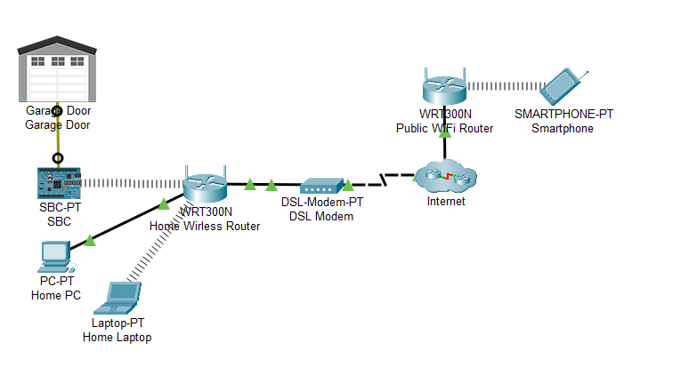

## Question 1
---
### 1.a)

1. Layer 1: Physical devices (Sensors & Actuators)
2. Layer 2: Controllers
3. Layer 3: Connectivity
4. Layer 4: Data Accumulation

>[!info] Explanation
>The seven-layer IoT Reference Model introduced by the IoT World Forum consists of the following layers:
>- **Physical Devices and Controllers**:
>	- Comprises endpoint devices and sensors that send and receive information.
>	- Responsible for collecting data and capable of being queried and/or controlled over a network.
>- **Connectivity**: Ensure reliable and timely data transmission between Layer 1 devices and Layer 3 information processing.
>- **Edge Computing**: Performs early data processing for faster information processing and reduced latency.
>- **Data Accumulation**: Stores data for later use.
>- **Data Abstraction**: Standardizes multiple data formats and ensures a consistent view from various sources
>- **Application:** Interprets data using software applications. Applications may monitor, control, and provide reports based on the data analysis.
>- **Collaboration & Processes**: Consumes and shares the application information
>
>However, since the given figure doesn't follow the model , the answer has been adjusted accordingly.

### 1.b)

Arduino UNO and Raspberry Pi can be implemented at Layer 2 because they function as controllers, and Layer 2 is dedicated to controllers.

### 1.c)
- **Data in motion** refers to data being actively transmitted between locations. It is primarily be found in Layer 1, 2 and 3, where data travels across the network.
- **Data at rest** refers to data that is not actively moving and is stored for later use. It is primarily found in Layer 4 (Data Accumulation), where data is persistently stored in databases or data centers. Data can also be temporarily "at rest" in Layer 3 if an edge device buffers or caches it before forwarding.

## Question 2
---
### 2.a)

![[Pasted image 20250707164457.png]]

Python
```python
from RPi.GPIO import GPIO
from time import *

def main():
	GPIO.setmode(GPIO.BCM)
	GPIO.setup(18, GPIO.IN)
	GPIO.setup(19, GPIO.OUT)
	
	while True:
		# The state will be either 'True' or 'False'
		state = GPIO.input(18)
		GPIO.output(19, state)
		sleep(0.2)

if __name__ == '__main__':
	main()
```

### 2.b)
```python
from RPi.GPIO import GPIO
from time import *

def main():
	GPIO.setmode(GPIO.BOARD)
	GPIO.setup(12, GPIO.IN)
	GPIO.setup(35, GPIO.OUT)
	
	while True:
		# The state will be either 'True' or 'False'
		state = GPIO.input(12)
		GPIO.output(35, state)
		sleep(0.2)

if __name__ == '__main__':
	main()
```
- `GPIO.BCM` allows the Raspberry Pi to use the Broadcom SoC (System on a Chip) pin numbering system.
- If the mode is changed to `GPIO.BOARD`, PIN 18 needs to be changed to PIN 12, while PIN 19 needs to be changed to PIN 35. A detailed breakdown
	- Change the `GPIO.setmode(GPIO.BCM)` to `GPIO.setmode(GPIO.BOARD)`
	- Change the `GPIO.pinMode(18, IN)` to `GPIO.pinMode(12, IN)`
	- Change the `GPIO.pinMode(19, OUT)` to `GPIO.pinMode(35, OUT)`
	- Change the `state = GPIO.input(18)` to `state = GPIO.input(12)`
	- Change `GPIO.output(19, state)` to `GPIO.output(35, state)`

### 2.c)

GPIO stands for General Purpose Input/Output.
![[Pasted image 20250707143152.png]]

```python
import RPi.GPIO as GPIO
from time import *

def main():
	GPIO.setmode(GPIO.BCM)
	GPIO.setup(18, GPIO.IN)
	
	LEDS = [6, 13, 19, 26]
	for led in LEDS:
		GPIO.setup(led, GPIO.OUT)
		GPIO.output(led, GPIO.LOW)

	index = -1
	size = len(LEDS)

	while True:
		left_to_right = GPIO.input(18) == True
		if(left_to_right):
			prev = size - 1 if index == -1 else index
			index = (index + 1) % size
		else:
			prev = 0 if index == -1 else index
			index = (index + size - 1) % size;
		
		GPIO.output(LEDS[prev], False)
		GPIO.output(LEDS[index], False)
		sleep(1)
```


## Question 3
---
### 3.a)
![[Pasted image 20250707180633.png]]


- **Raspberry Pi**
	- Can connect to Wi-Fi. Hence, it is used to establish the connection with a Wi-Fi router as well as setup the IoT server remotely, allowing end devices such as exhaust fan(s) and air filter(s) to be managed wirelessly.
	- It is typically unable to read analog input directly without external Analog-to-Digital Converter (ADC).
- Arduino UNO
	- Can directly read analog signals. Hence, it is used to read analog signals from the smoke sensor(s).
	- It is also used to control the actuators (i.e. air filter(s) and exhaust fan(s)) based on the predefined thresholds or upon user's actions.
	- Lacks native Wi-Fi connection capability.

No, because Raspberry Pi is crucial because it provides internet access and setup the IoT server to controls the end devices remotely. The Arduino UNO lacks this capability on its own.

### 3.b)

source: *Chapter 4 - Networks, Fog and Cloud Computing*

>[!info] LPWAN
>Low-Power Wide-Area Networks (LPWAN) is designed to support long range communications for low bit rate devices such as sensors, actuators, and controllers

- **LoRaWAN**:
	- A low-power, wide-area networking (LPWAN) protocol that uses LoRa radio modulation technique.
	- It operates in unlicensed frequency spectrum, providing long-range communication for battery-operated devices.
	- It is designed for IoT applications requiring low data rates, extended battery life, and features like bidirectional communication, mobility, and localization services.

- **NarrowBand IoT (NB-IOT)**:
	- A cellular-based, low-power, wide-area networking (LPWAN) protocol, allowing small IoT devices to operate efficiently on existing licensed LTE infrastructure.
	- It is optimized for sending small amounts of data from a massive number of devices and is known for its **deep indoor penetration**, making it ideal for sensors in basements or remote locations.

- **Wi-Fi**
	- It is a wireless for creating high-speed local area networks (LAN).
	- It is ideal for applications that need high bandwidth over short-to-medium distances, like streaming video or connecting computers.
	- While standard Wi-Fi is too power-hungry for many battery-operated IoT devices, a specific IoT-focused standard called **Wi-Fi HaLow (IEEE 802.11ah)** was developed to provide longer range and lower power consumption.

- **ZibBee**
	- A low-energy, low-power, low-data rate wireless protocol used to create personal area networks (PANs).
	- It is able to form robust, self-healing mesh networks, where devices can relay data for one another, extending network range and reliability.
	- It is commonly used in home automation, medical device data collection, and other low-power low-bandwidth needs.

- **Bluetooth**:
	- A wireless protocol used for short-range data communication in personal area network (PAN).
	- **Bluetooth Low Energy (BLE)**
		- A power-efficient variant designed for IoT.
		- It has extremely low power consumption, allowing devices to run for yeas on a small battery.
			- BLE devices sleeps when there's no active connection until one is reestablished, which significantly lengthens battery life for several years.
		- It establishes connections very quickly for short, intermittent data transfers.

- **4G/5G**
	- Cellular network technologies that provides reliable, wide-area communications offering high bandwidth and low latency.
	- Two popular 4G systems are Long Term Evolution (LTE) and WiMAX (IEEE 802.16e)
	- **5G** dramatically expands IoT capabilities by offering three distinct service types:
		- **eMBB** (high-speed data),
		- **URLLC** (ultra-reliable, low-latency communication for critical applications like autonomous cars)
		- **mMTC** (massive machine-type communications to connect a huge density of low-power sensors).

### 3.c)

Wi-Fi. Raspberry Pi can be controlled wirelessly via Wi-Fi. It supports packet transmission and reception between devices, and is widely available and compatible with consumer-grade networks.

## Question 4
---
![[Pasted image 20250707145249.png]]

| Horizontal Markets                                                                                                                                                                                                                                                                     | Vertical Markets                                                                                                                                                                                                                                                                                                                                                                                                                                                                                                                                                                                                                                                                                                                                                      |
| -------------------------------------------------------------------------------------------------------------------------------------------------------------------------------------------------------------------------------------------------------------------------------------- | --------------------------------------------------------------------------------------------------------------------------------------------------------------------------------------------------------------------------------------------------------------------------------------------------------------------------------------------------------------------------------------------------------------------------------------------------------------------------------------------------------------------------------------------------------------------------------------------------------------------------------------------------------------------------------------------------------------------------------------------------------------------- |
| Target a broad range of industries with general-purpose services or products.                                                                                                                                                                                                          | Target specific industries with tailored solutions for specialized needs.                                                                                                                                                                                                                                                                                                                                                                                                                                                                                                                                                                                                                                                                                             |
| **Examples**: Financial Auditing, Information Technology Services, Cybersecurity, Cloud Computing.                                                                                                                                                                                     | Examples: Healthcare, Automotive, Agriculture, Retail, Logistics.                                                                                                                                                                                                                                                                                                                                                                                                                                                                                                                                                                                                                                                                                                     |
| **IoT Connectivity Platforms:** Provide the infrastructure (like AWS IoT or Azure IoT Hub) for any industry to connect and manage devices.<br><br>**IoT Data Analytics Platforms:** Enable the analysis of large datasets from IoT devices, regardless of the industry source.<br><br> | **Agriculture: Smart Irrigation Systems**  <br>Uses soil moisture sensors and weather forecast data to automatically deliver the precise amount of water needed, conserving resources.<br><br>**Retail: Smart Inventory Management**  <br>Uses RFID tags or smart shelves to provide real-time tracking of stock levels, automating reordering and reducing theft.<br><br>**Automotive: Predictive Maintenance**  <br>Uses sensors in vehicles to monitor engine health and predict part failures before they happen, alerting the owner to schedule service.<br><br>**Healthcare: Remote Patient Monitoring**  <br>Uses wearable sensors to transmit patient vitals (e.g., heart rate, glucose levels) directly to healthcare providers for continuous care.<br><br> |


## Question 5
---
![[Pasted image 20250707145308.png]]



- `gpio`:
	- Enables the SBC to read the digital input from the garage door.
	- Allows controlling the garage door using input from TCP server, allowing users to control the garage door remotely.
- `tcp`:
	- Used to establish a TCP connection to the server.
	- Offers functions like `client.onReceive` for receiving data and `client.send` for send data or commands.
- `time`:
	- Add delay in the execution loop to avoid excessive network traffic and avoid overwhelming the controllers, ensuring system performance.