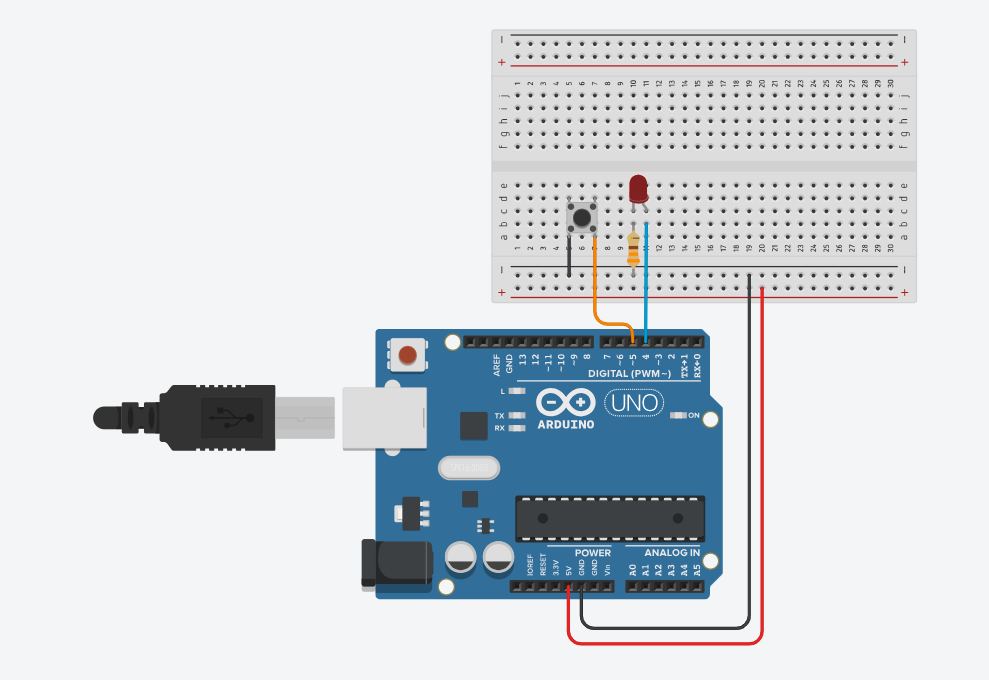
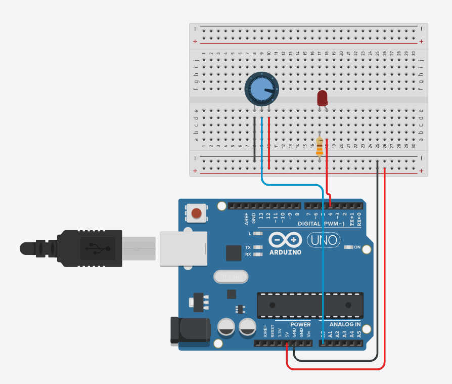
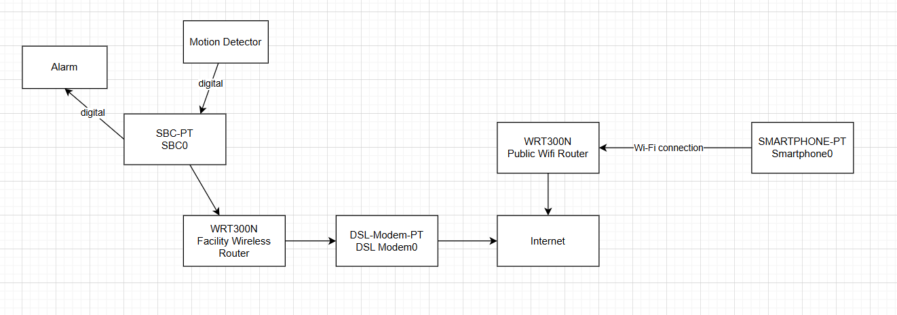
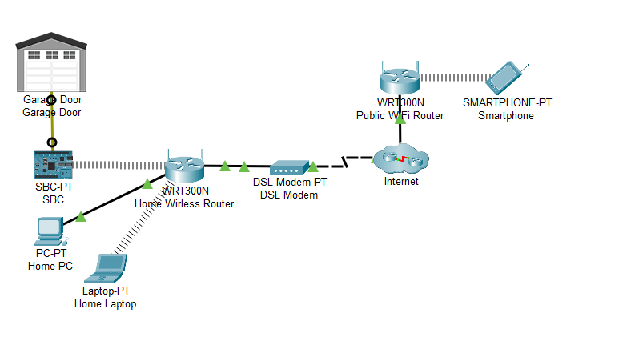
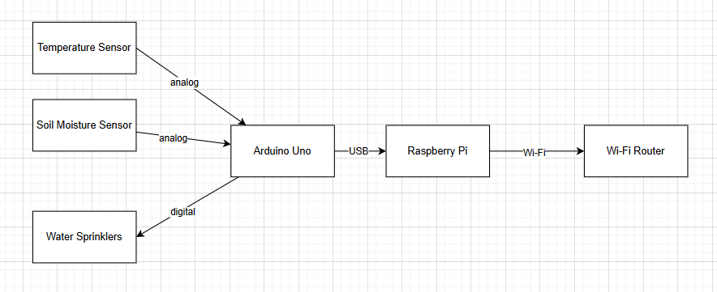

## Question 1
---
### 1.a)

| Open Loop Control System                                                                                  | Closed Loop Control System                                                                                                                            |
| --------------------------------------------------------------------------------------------------------- | ----------------------------------------------------------------------------------------------------------------------------------------------------- |
| Operates without feedback.                                                                                | Operates using feedback. It continuously measures the output and compares it to a desired setpoint, making corrections as needed.                     |
| The output doesn't influence the control action.                                                          | The output influences the control action.                                                                                                             |
| Example: <br>Simple Toaster: It toasts for a set time, whether the bread is perfectly browned or burnt.   | Example:<br>Air Conditioner: Maintains a target temperature.                                                                                          |
| Pros:<br>Simpler to implement and maintain.                                                               | Pros:<br>- More accurate as feedback allows the system to correct errors.<br>- More adaptive to disturbance and better at maintaining desired output. |
| Cons:<br>- Less adaptive to the environmental changes.<br>- Less accurate due to the absence of feedback. | Cons:<br>- More complex and costly to design and implement.<br>- Less stable if not properly design.                                                  |
### 1.c)

Reference: Chapter 4

| Cloud Computing                                                                                                                                                                                                                                                                                                                                                                                                                                                                            | Fog Computing                                                                                                                                                                                                                                                                                                                                                    |
| ------------------------------------------------------------------------------------------------------------------------------------------------------------------------------------------------------------------------------------------------------------------------------------------------------------------------------------------------------------------------------------------------------------------------------------------------------------------------------------------ | ---------------------------------------------------------------------------------------------------------------------------------------------------------------------------------------------------------------------------------------------------------------------------------------------------------------------------------------------------------------- |
| Uses centralized architecture where data storage and data processing are performed by the cloud service providers.                                                                                                                                                                                                                                                                                                                                                                         | A distributed computing infrastructure where computing occurs at somewhere closed to the network edge.                                                                                                                                                                                                                                                           |
| Has higher computing power. Hence, it is able store massive data and perform tasks that require higher resources.                                                                                                                                                                                                                                                                                                                                                                          | Has lower computing power. Hence, it is able to store limited amount of data and perform tasks that requires less computing power.                                                                                                                                                                                                                               |
| Cloud computing is further away from the end devices.                                                                                                                                                                                                                                                                                                                                                                                                                                      | Fog computing occurs closer to the end devices.                                                                                                                                                                                                                                                                                                                  |
| Cloud computing has higher latency since due to the time required for data transmission from one location to another.                                                                                                                                                                                                                                                                                                                                                                      | Fog computing has lower latency since it is closer to the edge devices and can perform the data processing quickly.                                                                                                                                                                                                                                              |
| Has to handle large amount of traffic.                                                                                                                                                                                                                                                                                                                                                                                                                                                     | Has to handle relatively small amount of traffic only.                                                                                                                                                                                                                                                                                                           |
| Examples:<br>**Cloud Storage**<br>Allows millions of users from worldwide to perform CRUD operations for their business data.<br><br>**IoT Data Analysis Platform**<br>Allows millions of users from worldwide to analyze the massive amount of data using the high computing power provided by the cloud service providers.                                                                                                                                                               | Examples:<br>**Smart Watch**<br>Smart Watch is able to collect the vital sign of users such as heart beat and blood pressure and visualize it in an interactive ways, providing certain extent of alert as well.<br><br>**Smart Cleaning Bot**<br>Smart cleaning bot is able to detect the dust and impurities around the area and perform cleaning accordingly. |
| **Advantages**<br>- High processing power<br>- Can store a large amount of data<br>- Reliable security measures and infrastructure are provided by the cloud service provider<br>- Cloud service providers ensure high availability and reliability, ensuring data and resources are almost always available<br>- Resources are made available quickly with minimal management effort.<br>- Reduced cost for equipment, energy, physical plant requirements, and personnel training needs. | **Advantages**<br>- Lower latency<br>- Reduce network traffic<br>- Enhance security and privacy as sensitive data are kept locally unless it is needed.                                                                                                                                                                                                          |
| **Disadvantages**<br>- Higher latency<br>- Risks of data tampering or data theft if data is not encrypted properly during the transmission.                                                                                                                                                                                                                                                                                                                                                | **Disadvantages**<br>- Lower processing power, cannot perform computing-intensive tasks.<br>- The memory will full quickly when the data reading is performed too often.                                                                                                                                                                                         |

## Question 2
---
### 2.a)

- **Digital Pins**:
	- These pins can read or write only two states:  HIGH or LOW.
	- They are used for simple inputs like a button press or outputs like turning an LED on or off.
- **Analog Pins**
	- These pins are used for reading a range of voltage levels.
	- The Arduino converts this voltage into an integer value from 0 to 1023.
	- They are used to read sensors with variable outputs, such as potentiometer or a light sensor.
- **PWM (Pulse Width Modulation) Pins**:
	- These are specialized digital pins that can simulate an analog output.
	- They control the analog output by switching rapidly between HIGH and LOW at a fixed frequency.
	- The output ranges from 0 to 255.


### 2.b)


```c++
const int PUSH_BUTTON_PIN = 5;
const int LED_PIN = 4;

void setup() {
	pinMode(PUSH_BUTTON_PIN, INPUT_PULLUP);
	pinMode(LED_PIN, OUTPUT);
}

void loop() {
	if(digitalRead(PUSH_BUTTON_PIN) == LOW) {
		digitalWrite(LED_PIN, HIGH);
	} else {
		digitalWrite(LED_PIN, LOW);
	}
	delay(10);
}
```

### 2.c)


```c++
const int POT_PIN = A0;
const int LED_PIN = 4;

void setup() {
	pinMode(POT_PIN, INPUT);
	pinMode(LED_PIN, OUTPUT);
}

// Ver1
void loop() {
	bool isTurned = analogRead(POT_PIN) > (1024 / 2);
	if(isTurned) {
		digitalWrite(LED_PIN, LOW);
	} else {
		digitalWrite(LED_PIN, HIGH);
	}
	delay(10);
}

// Ver2
void loop() {
	int potVal = analogRead(POT_PIN);
	int brightness = 255 - map(potVal, 0, 1023, 0, 255);
	analogWrite(LED_LIGHT, brightness);
}
```

## Question 3
---
### 3.a)

```python
from RPi.GPIO import GPIO
from time import *

PUSH_BUTTON_PIN = 18

# T stands for Traffic Light
T_RED_PIN = 6
T_YELLOW_PIN = 13
T_GREEN_PIN = 19

# P stands for Pedestrian Light
P_RED_PIN = 16;
P_GREEN_PIN = 20;

def setup():
	GPIO.semode(GPIO.BCM)
	
	GPIO.setup(PUSH_BUTTON_PIN, GPIO.IN, pull_up_down = GPIO.PUD_UP)

	# or GPIO.setup([T_RED_PIN, T_YELLOW_PIN, T_GREEN_PIN], GPIO.out), but the following approach is considered as 'more reliable'
	GPIO.setup(T_RED_PIN, GPIO.OUT)
	GPIO.setup(T_YELLOW_PIN, GPIO.OUT)
	GPIO.setup(T_GREEN_PIN, GPIO.OUT)
	
	# Initial state for traffic light
	handle_traffic_light(False, False, True)

	# or GPIO.setup([P_RED_PIN, P_GREEN_PIN), but the following approach is considered as 'more reliable'
	GPIO.setup(P_RED_PIN, GPIO.OUT)
	GPIO.setup(P_GREEN_PIN, GPIO.OUT)
	
	# Initial state for pedestrian light
	handle_pedestrian_light(True, False)

def handle_traffic_light(red, yellow, green):
	GPIO.output(T_RED_PIN, red)
	GPIO.output(T_YELLOW_PIN, yellow)
	GPIO.output(T_GREEN_PIN, green)

def handle_pedestrian_light(red, green):
	GPIO.output(P_RED_PIN, red)
	GPIO.output(P_GREEN_PIN, green)

def pedestrian_cross_sequence():
	# 0. Allow current traffic to go through
	sleep(0.5)
	
	# 1. Turn traffic light to yellow
	handle_traffic_light(False, True, False)
	sleep(2)
	
	# 2. Turn traffic light to red
	handle_traffic_light(True, False, False)
	sleep(1)

	# 3. Turn pedestrian light to green
	handle_pedestrian_light(False, True)
	sleep(4)

	# 4. Pedestrian light flashes Green then turns Red
	for _ in range(3):
		GPIO.output(P_GREEN_PIN, GPIO.LOW)
		time.sleep(0.5)
		GPIO.output(P_GREEN_PIN, GPIO.HIGH)
		time.sleep(0.5)
	handle_pedestrian_light(True, False)
	sleep(1)

	# 5. Turn traffic light back to green
	handle_traffic_light(False, False, True)
	
def main():
	setup()

	# Ver1
	while True:
		is_button_pressed = GPIO.input(PUSH_BUTTON_PIN)
		if(is_button_pressed):
			pedestrian_cross_sequence()
			is_button_pressed = False
		sleep(1)
		
	# Ver2
	GPIO.add_event_detect(PUSH_BUTTON_PIN, GPIO.FALLING, callback=pedestrian_cross_sequence, bouncetime=300)
	
if __name__ == '__main__':
	try:
		main()
	finally:
		GPIO.cleanup()
```

## Question 4
---
### 4.a)
- **Motion Sensor**: To detect suspicious motion from intruders.
- **Passive Infrared Motion Sensor**: To detect intruders by detecting the infrared radiation (body heat) emitted by people moving within its field of view. It is low-power and effective for securing an area at night.
- **Buzzer/Siren (Actuator)**: Produces a loud audible alarm to scare off the intruder and alert the security team on-site.

### 4.b)




```python
from tcp import *
from gpio import *
from time import *

client = TCPClient()

TCP_SERVER_IP = "209.165.201.2"
TCP_SERVER_PORT = 81

MOTION_PIN = 0
ALARM_PIN = 1

def onTCPConnectionChange(conn):
	print(f"Connection changed: { str(conn) }")

def onInputReceive(data):
	print(f"Data received: { data }" )
	
def main():
	# 1. Setup
	pinMode(MOTION_PIN, IN)
	pinMode(ALARM_PIN, OUT)
	digitalWrite(ALARM_PIN, LOW)

	client.onConnectionChange(onTCPConnectionChange)
	client.onReceive(onInputReceive)
	
	print(client.connect(TCP_SERVER_IP, TCP_SERVER_PORT))
	
	# 2. Main program logic
	while True:
		is_motion_detected = digitalRead(MOTION_PIN) == HIGH
		if(is_motion_detected):
			digitalWrite(ALARM_PIN, HIGH)
		else:
			digitalWrite(ALARM_PIN, LOW)
		client.send(is_motion_detected)
		sleep(1)

if __name__ == '__main__':
	main()
```

## Question 5
---
### 5.a)



- Raspberry Pi: Has built-in Wi-Fi capability and is used to establish Wi-Fi connection and setup remote IoT server remotely.
- Arduino Uno: Has analog pin and can read analog values directly from sensors (i.e., temperature sensor(s) and soil moisture sensor(s)). It is also used to turn on or off the actuators (i.e. water sprinkler(s)) based on the predefine thresholds or upon farmer's actions.
- No, we cannot remove the Raspberry Pi because Arduino Uno lacks native networking capabilities (Wi-Fi or Ethernet). The Raspberry Pi is essential to bridge the local system to the internet, enabling the remote access requested by the farmer.

>[!info] Additional notes
>- Raspberry Pi serves as the IoT gateway. It has built-in Wi-Fi to connect to the internet via the Wi-Fi router. It can
>	- Log data over time for analysis
>	- Communicate with the Arduino via USB Serial to get sensor data and send commands.
>- Arduino Uno acts as the real-time controller for the sensors and actuators. Due to the analog pins, it can read analog data directly from the soil moisture and temperature sensors.

### 5.b)

Servo motor and a ball valve

**Integration**
- Install the ball valve in the water pipe leading to the sprinklers.
- The servo motor is mounted onto the valve, with its alarm physically attached to the valve's handle.
- The servo motor is connected directly to a PWM pin or the Arduino Uno.

**Control Flow**
- The farmer remotely sends a command that specifies the desired water flow.
- The command goes through the internet, the Wi-Fi router, and the Raspberry Pi, which then relays the instruction to the Arduino.
- The Arduino would then send a specific PWM signal to the servo, causing it to rotate to a precise angle (e.g., 90 degrees for 50% flow), which in turn adjusts the ball valve to control the water flow.