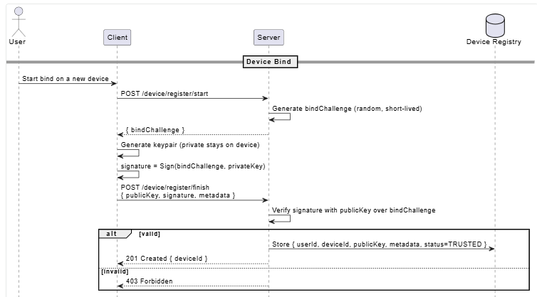
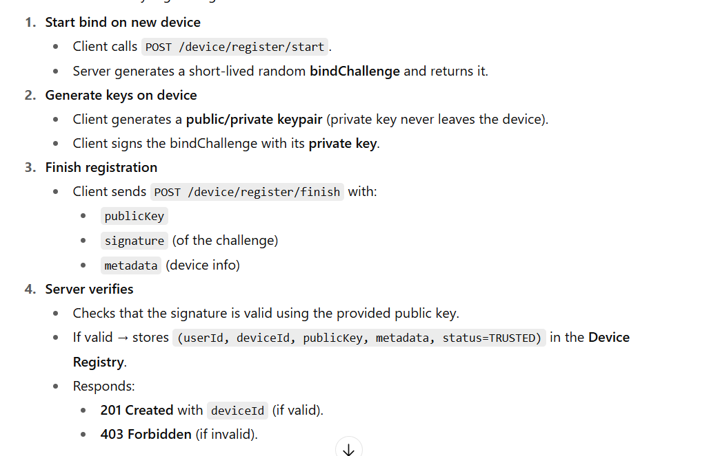
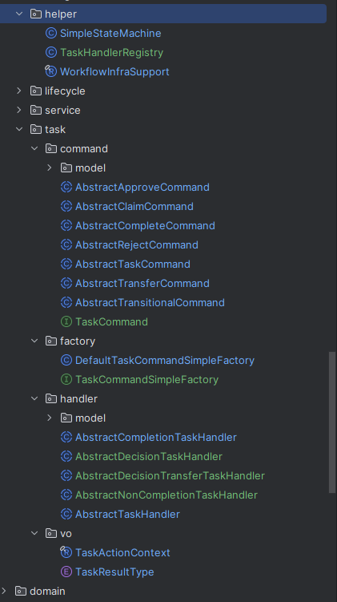
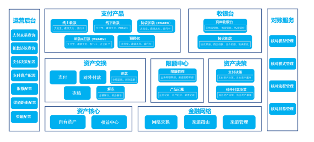
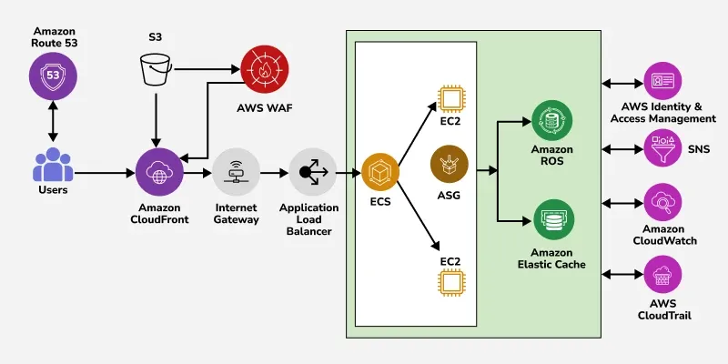
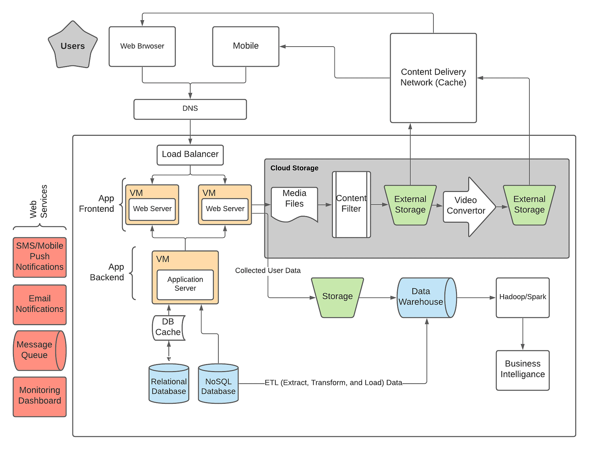
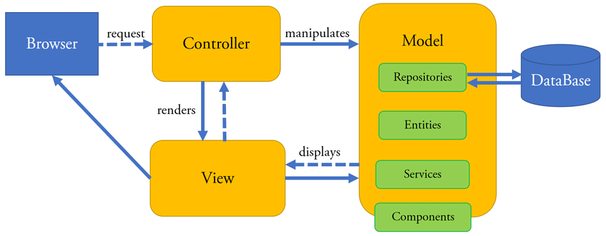

# WIA2002 - Software Modeling
---
- 课程编号：WIA2002
- 课程名字：Software Modeling
- 课程难度：⭐⭐
- 个人推荐：⭐⭐⭐⭐⭐
- 参考资源：无

## 学习内容

学习如何绘制 UML (Unified Modeling Language) Diagram，其中将重点学习 Use Case Diagram, Activity Diagram, Class Diagram 和 Sequence Diagram。

当然，这门课也涵盖了其他 UML 图，比如 State Machine Diagram, Timing Diagram, Package Diagram, Component Diagram, Deployment Diagram。

## 个人心得

### 为什么要学这门课？

大二时学这门课，我会认为 WIA2002 是一门水课，身边也有很多人认为这是一门水课。认为这是一门水课的原因是：他不是在教计算机的基础，不够硬核，只是在画画图而已。

但经历了两次实习，也有了 FYP 的经历之后，才愈发觉得这门课的重要性。这门课所学到的内容已经成为了我如今工作和学习的基础。虽然课程安排和教学内容有吐槽点，但瑕不掩瑜，且让我来论证 “为什么要学这门课？”。

在我看来，学习如何画 UML 图，就是在学习一套思考框架和认知。这套认知框架的目的是为了**沟通和理解**。

如果你有涉及需求工程（Requirement Engineering），比如你需要和客户确认 “你们想要一个什么样的产品呢？” 那你可能会有以下情况：
1. 你的客户有丰富的 IT 背景，有软件开发和产品设计的经验，他会把一份完整的需求文档发给你，你只需要跟着开发就可以了。
2. 你的客户有产品开发的经验，能提供大致完整的需求，你只需要稍加整理和确认就可以了。
3. 你的客户什么都不懂，他们只懂产品 “可能要有的功能”，但这个功能的用户体验、非功能性的考量、错误处理、产品的最终形态、软件开发的设计周期完全没有概念。

如果你可以碰到 1/2 类的客户，那恭喜你，你可以专注于技术设计，而不需要想太多（当然技术设计时也有一些难点）；但通常而言，你也会碰到 3 的情况。这时候，所谓一图胜千言，有个图片可以更直观地把客户的想法给落地，可以对齐（Align）彼此的想法；有了这样的框架（SOP），也可以让你有更小的力气做出有质量的需求分析。

**所以 UML 图可以方便开发人员和客户进行沟通。**

除此之外，**UML 图也可以优化开发人员之间的沟通。** 理论上来说，只要有了源码（Source Code），程序员可以理解任意系统，但是我们还要看到两朵乌云：代码的腐坏以及理解系统所需要的时间。

关于代码的腐坏，可以看看这个影片：[程序员都喜欢重构代码，但领导不喜欢【让编程再次伟大#45】 - YouTube](https://www.youtube.com/watch?v=HvLXaAle5jw)

有时候为了赶工，我们会留下一些技术债（Technical Debt），导致最后的系统架构和初期设计不符，这时候要了解起来就会陷入很多死胡同：“为什么一开始是 A，后来是 B？” 如果没有一些文档解释，那我们就无从得知做出这个决定的缘由。此外，理解高度抽象的系统（那种允许程序员通过配置完成开发的系统，肯定是高度抽象的）所需要的时间比起简单的 CRUD 调用也不同，但留给开发人员的时间也不多。

所以，UML 图的可视化可以让我们由上至下地去了解系统的运作方式，而不需要在意底层细节，让我们更容易看清系统本身的意图。这时，UML 图便提供了一套认知框架，帮助程序员去理解系统，降低了学习新系统的门槛。

所以 UML 图是很重要的。所以在这门课，重要的有三点：
1. 怎么画 UML 图？
2. 什么时候画 UML 图？
3. 怎么判断 UML 图的颗粒度（Granularity）？

这我会在《如何学习这门课？》提及。

### 如何学习这门课？

在我看来，每个 UML 图的使用时机和方法都不一样的。

所以对这门课的吐槽点来了：**这门课为了让我们学习完整的画图方法，会刻意要求我们尽可能地画图，所以有些图看起来毫无必要，却又费时费力。** 其中一种就是 Class Diagram，要求我们把所有 Class 都放在一起的 Class Diagram... 接下来我会论证为什么这是不必要且低效的做法。

如果要我选出最值得学习的 UML 图，那就是 Sequence Diagram；另外一个必须掌握的图是 ERD (Entity Relationship Diagram，但他似乎不是 UML，但这并不重要）。下面是我的 UML 图梯度榜：

- Tier 0: Sequence Diagram, Entity Relationship Diagram (ERD)
- Tier 1: Activity Diagram, State Machine Diagram
- Tier 2: Architecture/Package Diagram, Class/Component/Object Diagram, Use Case Diagram, Interaction Diagram

- Tier 0 的是必学的，一定会用到；
- Tier 1 的是高度推荐，经常会用到；
- Tier 2 的是要学习其思想内核，在特定场景下能发挥其价值。

当然这份榜单是根据我的个人理解和经验来安排的，可能和最纯正的 UML 定义不同，只能作为参考。

然后有一些原则可供参考：
1. UML 图有且唯一的目的是：**方便沟通和理解**。只要能做到达到方便沟通的目的，那是否根据标 “最佳实践”（Best Practices）并不重要。
2. 为了方便沟通，需要使用合适的 UML。合适可以从颗粒度（Granularity）和时机（Timing）这两点考量。
3. **严以律己，宽以待人。** 英文叫 Robustness Principle/ Postel's law (*be conservative in what you do, be liberal in what you accept from others*)。这就是说我们画图时可以有自我约束，但不要强迫他人也跟着这样的约束。唯一的约束是：**方便沟通和理解**。
4. 我们不一定，也没必要用到所有的 Diagram。


我就从软件开发的流程分享一下个人的画图心得。

#### 需求工程

##### Use Case Diagram + Use Case Description

- Use Case Diagram：在初期阶段用来收集用户的整体需求，看他们对系统有什么期待。如果用户已经提供了完整需求，那这部分可以略过。
- Use Case Description：提供了一套思考框架，用来系统地收集需求，其中 Main Flow, Alternative Flow, Exception Flow, Precondition, Postcondition 都可以看作一套 SOP，让开发人员可以有效地收集需求。搭配 WIF2002 的 Requirement Engineering, Use Case Description 会更如虎添翼。

##### Activity Diagram：
- 在我的理解里，Activity Diagram 可以作为 Use Case Diagram 和 Use Case Description 之间的桥梁，因为他可视化了 Main/Alternative/Exception Flow，让用户可以更直观地感受到整个流程，可以让用户更好地提出建议和想法。
- 在我的方法论里，我们的第一步会是 Use Case Diagram，第二部会是 Activity Diagram，第三部就是把 Activity Diagram 转成 Use Case Description 的文字描述，也补充其他重要信息。

##### State Machine Diagram

当涉及复杂的状态转换时，我们可以使用有限状态机（Finite State Machine）把状态描写画出来，可以更直观地专注于 “什么情况下，系统该做什么？”

##### 后话

所以从这里我们可以看到，其实不同的 UML 图的着重点也不同：Use Case 专注于主要的系统能力，Activity Diagram 则专注于整体流程（UIUX），Use Case Description 则是对 Activity Diagram 的整理和补充；State Machine Diagram 则更注重于系统的内部行为和约束。

当然，如果你的工作不涉及需求工程，那这些图你可以只了解个大概，没必要深入去使用啦。但是 State Machine Diagram 对于开发人员来说还是很有技术价值的。

#### 技术设计

##### Sequence Diagram：
- **重要程度**：
	- 王中王，我愿意称之为所有软件开发人员都必须掌握的 UML 图。在我看来，它的核心机制在于：**描述系统之间的交互**，以此延伸出来的作用太多了，最常的用法就是学习新系统。
	- 在日常工作里，我们不一定会有详细的设计文档，对系统的设计做出详细解释，所以我们就得自己去看源码。但是源码过于细节，特别是抽象程度特别高的，很容易让我们迷失在细节里。Sequence Diagram 作为学习的利器，让我们把系统交互的过程给画出来，让我们专注于**交互本身**，而不是实现细节。
	- 在设计技术方案的时候，我们也可以用上 Sequence Diagram，描述我们想要做出的改动或者互动流程，让其他人更好理解我们的意图，提供更切实的建议。
	- 在和其他人交流的时候，特别是 API 调用的时候，我们也可以用 Sequence Diagram 对 “如何与我们系统交互” 这件事进行可视化，提高联调成功率。
	- 所以，Sequence Diagram 涵盖了程序员的开发周期 —— 系统学习、方案设计、日后交流，是人手必备的一门技巧。
- **使用心得**：
	- Sequence Diagram 可以有不同的颗粒度（Granularity），也就是不同的抽象程度。在微服务里，他可以关注不同服务之间的调用和职责；在单一系统里，也可以关注不同模块（Module）之间的调用；在某个模块里，则能用来呈现出不同类（Class）的关系。具体需要到多详细，就取决于系统交互的复杂度了。如果是单纯的 CRUD (Controller -> Service -> Repository)，在我看来是没必要写的... 也不是每个方法都要写出来，保留关键交互就已经很足够了。







对比一下，看图比较简单还是文字更好理解（这个文字是简化过了的）。

##### Entity Relationship Diagram (ERD)

有涉及数据库（Database）/表（Table）改动的都十分建议写 ERD，并且配上 ERD Specification，比如字段含义、字段案例等。在我看来，ERD 的功能有二：
- 定义核心名称和字段
- 呈现不同表之间的关系

 这两点都很重要：
- 第一点：为了和技术领导和客户进行沟通。客户可以检查该模型的用词是否准确、是否精准对应了现实模型，也可以看看模型之间的关系是否合理；技术领导则可以给出建议。
- 第二点：更容易看到性能瓶颈或者设计缺陷。把表的关系画出来后，我们更容易看到是否存在 M:M 的关系，也可以思考是否有更好的实现方式，才可以更好地推进其他设计选型，比如 Normalization 和 Denormalization。
##### Class/Component/Object Diagram

在学这门课的时候，老师大概会让你把所有的 Class Diagram 都画出来。从刻意练习的角度出发，或许有成效，但如果你用的是 SpringBoot 之类的框架，有些类的功能十分直白，把他们画出来反而会模糊焦点；加上有些 Service 的字段是约定俗成或者依赖，本身不具备业务含义，那么画出来也没有帮助。

所以，在画 Class Diagram 之前，我认为要想清楚的是：我们想要通过 Class/Component/Object 表达什么？我认为比较有效的表达是：
- 设计模式（Design Pattern）
- 通用模型/领域模型的交互和关系

像我之前说的，普通的、直白的 CRUD 根本没有画 Class Diagram 的必要；但是如果运用了较为复杂的设计模式和 OOP 思想（Encapsulation, Inheritance, etc.），那画 Class Diagram 就很有必要了。



但看着这张图，你能马上了解他们之间的关系吗？比如 `TaskHandler` 和 `Command` 之间是什么关系？`SimpleFactory`, `SimpleStateMachine` 又是为了什么？

```plantuml
abstract class AbstractTaskHandler {
	WorkflowTaskActionResult handle(WorkflowTaskActionRequest workflowTaskActionRequest)
}

interface TaskCommandSimpleFactory {
	TaskCommand resolveByAction(TaskAction taskAction);
}

interface TaskCommand {
}

class TaskHandlerRegistry {
}


TaskHandlerRegistry --> AbstractTaskHandler: Determine
AbstractTaskHandler -down-> TaskCommandSimpleFactory: Uses
TaskCommandSimpleFactory -down-> TaskCommand: Determine
```


对的，在理解他们的关系这方面，在我看来只需要了解这四个接口（Interface）。
- `TaskHandlerRegistry` 会根据 Request 决定使用哪一个 `AbstractTaskhandler` 进行处理；
- `AbstractHandler` 会使用 `TaskCommandSimpleFactory` 决定要使用哪一个 `TaskCommand` 进行实际的工作处理。

从这里我们也可以推断出，`TaskCommand` 才是具体执行操作的类；`TaskHandler` 只会处理一些通用逻辑，以及作为 `TaskCommand` 的 Grouping。

如果要了解 `AbstractTaskHandler` 的分支，则可以看有另外一个 Class Diagram，如下：

```plantuml
abstract class AbstractTaskHandler {
	WorkflowTaskActionResult handle(WorkflowTaskActionRequest workflowTaskActionRequest)
}

abstract class AbstractDecisionTaskHandler {
}

abstract class AbstractDecisionTransferTaskHandler {
}

abstract class AbstractCompletionTaskHandler {
}

abstract class AbstractNonCompletionTaskHandler {
}

AbstractDecisionTaskHandler --|> AbstractTaskHandler
AbstractDecisionTransferTaskHandler --|> AbstractTaskHandler
AbstractCompletionTaskHandler --|> AbstractTaskHandler
AbstractNonCompletionTaskHandler --|> AbstractTaskHandler
```

这时候可以搭配一些解释，比如：
- 要怎么选择哪一个 `TaskHandler`？这些 `TaskHandler` 分别是做什么的？
- 具体开发时要怎么使用？有什么注意要点？
- 要如何拓展系统功能？

所以在我看来，Class Diagram 不应该是大而全，而是保留关键信息，确保其他人可以在不同时期（学习、开发、重构、拓展）更容易获得所需信息，降低沟通成本。大而全的 UML 往往会让程序员浪费时间在效益低的细节，模糊沟通焦点，过时速度也会更快，因为具体实现细节常常会更新。与之相反，底层的架构和设计通常都会保持相对的稳定，所以在描写 Service 之间的关系时，我更倾向于保留关键方法，所以你会看到只有一两个方法（Method），甚至都没有字段。

再比如建模，如果是要确保领域模型是否符合业务语境（Business Context），但我只会保留字段，而不会把方法写进去；反之，如果是要呈现某种关系或者职责，那我只会保留对外的方法。这里便是用上了封装的思想。

所以我把 Class/Component/Object 都放在了一起，并不是为了根据里面的规范，而是提炼出他们的思想，并在合适的时候使用这些图去表达我的想法。仅此。

#### 系统设计

##### Architecture Diagram

通常来说，在程序员的早期阶段我们都不会碰到架构设计，因为我们的 Assignment 不会太复杂（如果你使用了 DDD 架构或者 Microservices，那就当我没说...）；实习的时候也不会碰到架构设计。但是如果真的是比较复杂的架构，架构图就可以作为一种参考参考，对架构设计师来说有帮助（可能？。比如：

**蚂蚁的支付中心**


出处：[docs-aliyun.cn-hangzhou.oss.aliyun-inc.com/assets/attach/199614/AntCloud\_zh/1610604333062/蚂蚁科技-bPaaS-支付中心V1.1.0-产品简介V20201221.pdf](https://docs-aliyun.cn-hangzhou.oss.aliyun-inc.com/assets/attach/199614/AntCloud_zh/1610604333062/%E8%9A%82%E8%9A%81%E7%A7%91%E6%8A%80-bPaaS-%E6%94%AF%E4%BB%98%E4%B8%AD%E5%BF%83V1.1.0-%E4%BA%A7%E5%93%81%E7%AE%80%E4%BB%8BV20201221.pdf)

**AWS 服务调用**

**网页开发**


但一般来说我们的 Assignment 只会像下面这样...



#### 话说回来....

Ok 大致说完了每个 Diagram 的使用方法，那接下来便到 “如何应付这门课”。规范的方法依然值得学习，因为他们大而全，是个标准。但我们并不总是需要完全跟着，而是需要结合实际场景做出权衡。然而，由于这是一门课程，有考试的课程，因此也有一套客观标准 —— 老师的标准。因此，在学习之后，更重要的是和老师进行确认，看是不是老师所理解的 UML 图。

这门课的理论不多，更偏向于实战，因此可以在做 Assignment 时找到适合自己的一套框架，并和老师朋友讨论、相互琢磨，不断提升自己对这些 UML 图的理解，才能做到了然于胸，熟练于心，能够活学活用。

### 常用工具

在 Senior 的报告里你主要（甚至只会）会看到 Drawio 和 Visual Paradigm。

以下是个人测评：
- Drawio 的优势是好上手，即开即用，包罗万象；但对于 UML 图没有过多的优化；
- Visual Paradigm 针对各类 UML 图都有专门的优化，但是有一定的上手难度；网页版的操作有时候也挺违反人性，那就是他的保存机制...有点难评。

在此之外，我还推荐文本绘图，即 PlantUML 和 Mermaid。这两者的差别在于语法和设计，但两者共同的好处是可以通过 Code 的方式把 UML 画出来，省下很多 Drag & Drop 的时间。加上 AI 时代，这样的写法可以很大程度上提高效率，让你少些烦恼写 Report 的烦恼（至少我自己做 Assignment 时是先写 Code 再补上 Diagram...）

想要看效果的可以游览：[How to Make Easy UML Sequence Diagrams and Flow Charts with PlantUML - YouTube](https://www.youtube.com/watch?v=xObBUVDMbQs)

但是软件开发并没有银弹。在现实工作里，我都倾向于在不同场景使用不同的工具。以下是我的个人习惯：
- PlantUML/ Mermaid
	- Sequence Diagram: 像我之前说的，Sequence Diagram 是在需求相对稳定后才会使用的 UML，那使用文本绘图可以让我们更专注于系统流程，而不是花时间在调整 UML 的美观...
	- Activity Diagram：哪怕是初期阶段，我认为文本绘图在处理这类线性的 UML (Sequence - Horizontal, Activity - Vertical) 时都表现良好，因为它们的结构相对稳定。
- Use Case Diagram
	- 在需求工程的早期，由于需求随时会变动，加上其发散的结构，我更偏向于使用 Draw IO/ Visual Paradigm，除非是事后补上 Use Case，那才会用上绘本绘图。
- Class/Component/Object
	- 在设计阶段，我偏向使用 Draw.io/ VP，因为我脑中的想法还不确定，更需要拖曳这种自由的形式，让我的大脑足够发散；或者我也会使用笔记本（或者平板）进行手绘，作为草稿。
	- 在开发完成后的文档阶段，我会偏向使用文本绘图，因为我的思考已经确定了，这时候使用文本绘图可以让 AI 自动生成，而我只需要进行小优化就可以了。
- Architecture Diagram
	- 文本绘图貌似不支持这类图；但就算支持，我也会使用 Draw.io/ VP，因为他们更自由，更适合 Architecture Diagram 的组织。
- State Diagram
	- 在设计早期或者简单的状态机我会使用文本绘图；前者可以快速做出 MVP 方便讨论，后者则是文本绘图处理简单的状态机简直不要太舒服。
	- 但如果状态的变化比较复杂，使用 Draw.io 会是更好的选择，因为自由度更高，可以用来对复杂交互进行建模。

当然这些都是个人的一些思考和想法。实际运用时依然要以团队的考量为主。如果团队已经是 Opinionated 且已经有了明确规范，那就需要遵从，保持风格的统一，降低不同风格间的理解成本；如果没有，那就可以自己试试看那种方式更适合你。