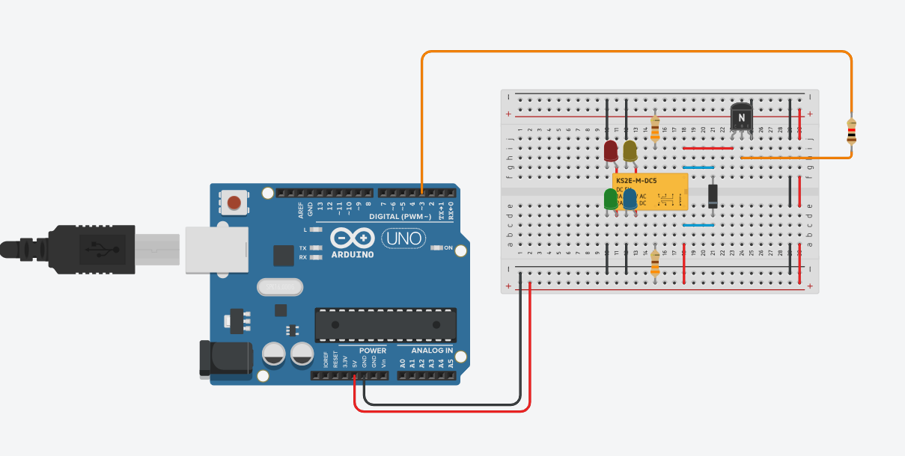
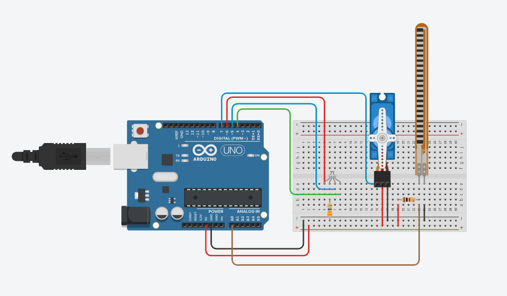

更新时间：2024/2025 Semester 2（1/9/2025)
# WIC2008
---
- 课程编号：WIC2008
- 课程名字：Internet of Things (IoT)
- 课程难度：⭐⭐⭐
- 个人推荐：⭐⭐
- 参考资源：—— 无 ——

## 学习内容

这门课围绕着 Internet of Things（IoT，物联网）主要介绍了 Arduino 和 Raspberry Pi。涉及的技术有 Arduino C++, Packet Tracer, SSH 等等。这门课也介绍了其他概念和技术，比如 Grafana, Docker, Blockly, ThingsBoard, etc.

通过这门课，你可以对 IoT 有个基础的认识。

## 分数结构

Lab + Assignment + Final

## 个人心得

如果你对 IoT 有兴趣，那我觉得这门课值得一试。我是挺喜欢它的设计的：以实战为主，理论知识为辅。这对于我这样喜欢通过 Get Your Hand Dirty 的人来说挺好的。这门课主要会和三个平台打交道：
- 前期：TinkerCad
- 中期：Packet Tracer
- 后期：Python + VMWare + Raspberry Pi

前期涉及了大量需要通过 TinkerCad 完成的练习，如下：

除了 TinkerCad，每一组也需要通过 Arduino 组件进行安装，使其在现实里也能正常运作才行。这需要写一些 C++ 代码。

到了中期会使用 Packet Tracer 作为过渡；通常 Packet Tracer 本身就已经自带完整的指示了，跟着做就完了。

最后便是 Python + VMWare + Raspberry Pi，这需要我们通过 SSH 或其他方式连接到 Raspberry Pi，然后把代码给写进去。这部分都是 Group Work。话虽如此，但也需要学习相关的语法，因为考试有考。

期间他也有其他的练习，比如 ThingsBoard 和 Webex。

**个人看法**：

如果你对 IoT 感兴趣/ FYP 打算做 IoT/ 打算拿 WIF3002，那这门课大概是必拿的，因为它介绍了很多基础概念，非常适合入门；加上他以实战为主，因此不用担心 “学了用不上”。但有挑战性的是：他的 Lab 也很多，估摸下来至少每星期有 2~3 个 Lab，虽然每个 Lab 不会很难，但要做好 + 学好也需要耗费一些时间。此外，他的 Final 涉及的概念也不少，若平常没有复习，那考试前的复习也是比较难的。

此外，如果你明确对 IoT/ Embedded System 不感兴趣的话，那这门课并不推荐（这也是为什么我会放两颗星，因为我对这类学科不感兴趣），因为其中的可迁移技术较少。其中比较通用的是 Grafana 和 Docker，但这在 Lecture 上也是匆匆带过，挺可惜的。虽然能理解他们相较于 IoT 属于是 “额外内容”，但还是略感遗憾。