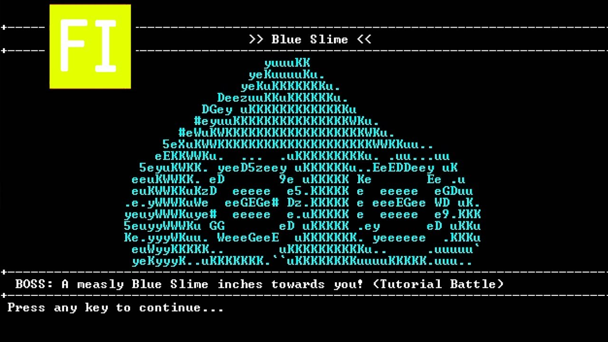
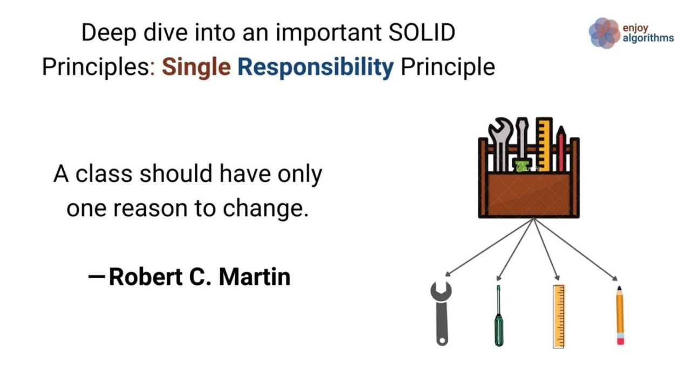
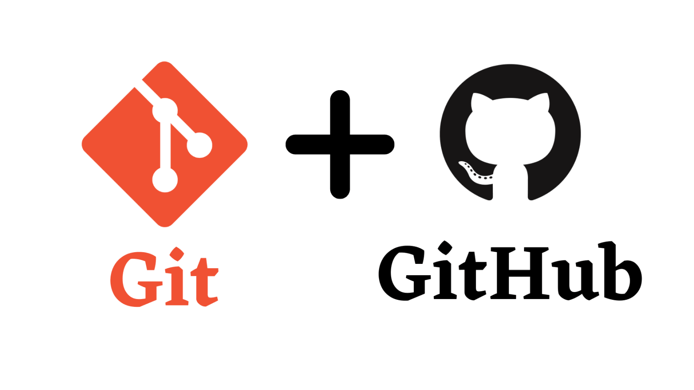

# FOP Valley

All the resources mentioned in this assignment can be found at [Here](https://github.com/fyiernzy/FOP_Valley/tree/main).

As of your Fundamental of Programming (FOP) Assignment, you're required to design a [Text Adventure](https://en.wikipedia.org/wiki/Text-based_game).

## 1 - Introduction



In this assignment, your task is to create an interactive fiction game where players can use the Command Line Interface (CLI) to interact with the system and navigate through the story. Your goal is to develop an intriguing narrative where players can acquire and control heroes and progress by overcoming challenges.

## 2 - Basic Requirement (Total - 8 marks)

### 2.1 Map Design (0.5 mark)

1. Design a 40x40 map consisting of the character # as obstacles where players cannot pass through.

2. Enable players can move their characters using the W, A, S, and D keys. W means upward, S means downward, A means left, and D means right.

### 2.2 - Creating archetypes (1 marks)

#### 2.2.1 Create 5 archetypes

1. Create five archetype classes based on the information provided in `archetypes.txt`. This file contains the names of archetypes along with their initial attributes, including `healthPoints`, `manaPoints`, `physicalDefense`, `magicalDefense`, `physicalAttack`, and `magicalAttack`. When a player creates a new character, the character's initial attributes should be determined by the data in `archetypes.txt`.

2. You should apply your knowledge of File I/O to handle the archetypes.txt instead of hardcoding it. In other words, you should read the data from the file rather than copying and pasting it. No marks will be given if you have not demonstrated your File I/O knowledge. However, it's acceptable to hard code it after you have showcased your File I/O knowledge.

3. `Archetypes` class should include a method called `levelUp()`.

4. Incorporate the principles of OOP. For instance, you can structure your code as follows in Java:

```java
class Warrior extends Archetypes {
    // Define instance variables here
}
```

#### 2.2.2 Implement leveling-up system

As characters progress on their journey, they have the ability to level up. Here are the general rules for character progression:

- During the first 10 levels, characters will require fewer experience points to level up, allowing for rapid early advancement.
- Each time a character levels up, their `healthPoints`, `manaPoints`, `physicalAttack`, `magicalAttack`, `physicalDefense`, and `magicalDefense` will increase.
- After reaching level 10, characters will level up at a slower pace.
- The maximum attainable level for characters is set at 35.
- The rate of attribute increase upon leveling up will vary based on the character's archetype:
  - `Warrior`: Health Points and defenses will receive significant boosts.
  - `Mage`: Magical Attack and Mana Points will experience substantial improvements.
  - `Rogue`: Both Physical Attack and Physical Defense will be enhanced.
  - `Paladin`: All forms of Attack will become more potent.
  - `Archer`: Physical Attack will be substantially strengthened.
- You are required to create a custom leveling-up algorithm for each archetypes.

### 2.3 - Design Monster (1 marks)

1. Design a `Monster` class that possesses attributes such as `healthPoints`, `manaPoints`, `physicalDefense`, `magicalDefense`, `physicalAttack`, and `magicalAttack`.
2. Design **5 unique monsters** that extend the `Monster` class based on description in `monsters.txt`
3. The locations of the monsters on the map are generated randomly.
4. Each time a player enters the game, 7 monsters of different types will be generated.

```java
// Define the Monster class to represent in-game monsters.
class Monster {
    String name;            // Name of the monster.
    int healthPoints;       // Current health points of the monster.
    int manaPoints;         // Current mana points of the monster.
    int physicalAttack;            // Attack attribute for dealing damage.
    int magicalAttack;            // Attack attribute for dealing damage.
    int physicalDefense;           // Defense attribute for mitigating damage.
    int magicalDefense;           // Defense attribute for mitigating damage.
    List<Ability> abilityList; // List of spells that the monster can use.
}
```

### 2.4 - Design spells (2.5 marks)

The heroes usually have their own spells. The spells could have special effect, say `Silence`, makes the opponent unable to cast a skill on your character; Perhaps `FireBall`, that is, merely cause damage to the opponent.

1. Create **3 spells** for each archetype.
2. These spells will only become accessible once the character reaches a specific level. *For instance, let's consider a character named the "Warrior." The first spell, named "Roaring," will unlock and become usable once the character reaches level 5.*
3. The spells have a cooldown period, meaning that a spell can only be used after a certain amount of time. You should integrate the concept of cooldown into the spell design.
4. All of the spells for each archetype, including their descriptions and cooldowns, are documented in `spells.txt`.
5. The monsters have the capability to replenish their `manaPoints`.
6. You are not restricted to follow the following design. It only serves as a reference.

```md
Warrior
--> HP: [:::::           ] (45 / 60)
--> MP: [//////////////  ] (80 / 100)
+-------------------------------------------------------------+
OPERATION: 1 / 3

>> Starter
[S1] Attack
[S2] Defend
[S3] Heal                   < -20 MP, 0 / 3 CD, +200 HP, ->
[S5] Escape

>> spells
[A1] Roaring                < -10 MP, 2 / 3 CD,    0 HP, Cast silence>
[A2] <Locked - 30>
+-------------------------------------------------------------+
```

### 2.5 Round-based Battle System (3 marks)

Now that we have archetypes, monsters, and spells in place, the next step is to implement the battle system. In a text-based RPG game, players are allowed to engage in round-based battles through interfaces.

1. In each round, players can make moves, which may include using spells or launching attacks.

2. The battle will only end when the player wins, loses, or chooses to exit the game. It's important to note that both the player and the monster can cast spells on each other.

3. Players have the option to attack, defend, heal, or escape. They are also allowed to use spells.

4. Your interface should provide informative descriptions that reflect the current situation. For instance, *You have HIT the skeleton warrior, causing 151 damage!*

5. Your interface should display the HP (Health Points) bars and MP (Mana Points) bars of both parties.

6. The battle system should be able to make the monster automatically battle with the player. They will attack or cast spells only, without the intention to defend.

```md
> You have HIT the skeleton warrior, causing 151 damage!

Skeleton Warrior
--> HP: [::              ] (27 / 60)
--> MP: [//////////////  ] (80 / 100)

> CRITICAL! Skeleton Warrior has SLASHED you for 57 damage!

Warrior
--> HP: [:::::           ] (45 / 60)
--> MP: [//////////////  ] (80 / 100)
+-------------------------------------------------------------+
>> Starter
[S1] Attack
[S2] Defend
[S3] Heal                   < -20 MP, 0 / 3 CD, +200 HP, ->
[S5] Escape

>> spells
[A1] Rabid Lunge            < -10 MP, 2 / 3 CD,    0 HP, Cast silence>
[A2] <Locked - 30>
+-------------------------------------------------------------+
```

## 3 - Extra Feature Requirement (Total - 4 marks)

### 3.1 Save game functionality (1 mark)

It would be a great pity if someone couldn't save their game progress. Without the ability to save, they'd have to replay the same content repeatedly, which can become monotonous.

1. To enhance the player experience, it's crucial to provide a way for them to record their current game status so they can pick up their progress next time.
2. The game could remind them to save their progress before exiting, in case they forget to do so. Players would greatly appreciate this feature, as it ensures they don't lose their hard-earned progress.
3. Remember to leave a place for them to save the game.

Consider using a database and the knowledge you have acquired in File I/O for implementing this functionality.

### 3.2 Abnormal input Handling (0.5 mark)

Mistakes can occur, whether unintentionally or intentionally. Therefore, our game should be capable of handling these abnormal inputs wisely and, perhaps, provide valuable feedback to inform the player about what's wrong with the input. It could be a typo or an unrecognized command.

### 3.3 Colorful text (0.5 mark)

It would be more interesting if certain keywords could be displayed in different colors. For example, it would provide a clearer reminder if the materials required for upgrading the weapon are marked in green when they are sufficient and in red when they are insufficient. You can implement this feature easily by searching on Google or using ChatGPT. You might found some useful resources [here](https://github.com/fyiernzy/Assignment-Suzume/blob/main/suzume/src/main/java/com/assignment/suzume/constants/FontStyle.java).

### 3.4 Database Implementation (1 mark)

When considering the implementation of a user login function or storing the base attributes of each archetype to streamline your workflow, it's advisable to use an embedded database. Using SQLite with a database file ending in `.db` is a good option, while choosing MySQL or PostgreSQL would be a more popular choice. You can select the one that best suits your needs and preferences.

### 3.5 ASCII Art (1 mark)

Looking at text can be quite boring. Consider adding some ASCII art to make the game more attractive. You can refer to the following ASCII art. Your ASCII art should be stored in `.txt` file rather than hardcoding it into the code.

⠀⠀⠀⠀⠀⠀⠀⠀⠀⠀⠀⢀⣀⠀⠀⠀⠀⠀⠀⠀⠀⠀⠀⠀⠀⠀⠀⠀⠀⠀
⠀⠀⠀⠀⠀⠀⠀⠀⠀⠀⣰⣿⣿⣷⡄⠀⠀⠀⠀⠀⠀⠀⢠⣄⣤⣦⣤⣀⠀⠀
⠀⠀⠀⠀⠀⠀⠀⠀⠀⠀⢿⣿⣿⣿⡇⠀⠀⠀⠀⠀⠀⠀⠀⠈⠉⠛⠿⠟⠀⠀
⠀⠀⠀⠀⠀⠀⠀⠀⣠⠀⠘⢿⣿⠟⠀⢠⡀⠀⠀⠀⠀⠀⠀⠀⣰⡗⠀⠀⠀⠀
⠀⠀⠀⠀⠀⢠⣾⠀⣿⠀⣷⣦⣤⣴⡇⢸⡇⠀⣷⠀⠀⠀⠀⣰⡟⠀⠀⠀⠀⠀
⠀⠀⠀⠀⠀⣿⣿⠀⣿⣤⣈⣉⣉⣉⣠⣼⡇⠀⣿⡆⠀⠀⣰⡟⠀⠀⠀⠀⠀⠀
⠀⠀⠀⠀⠀⣿⣿⠀⣿⣿⣿⣿⣿⣿⣿⣿⡇⠀⣿⠇⠀⠀⠛⠀⠀⠀⠀⠀⠀⠀
⠀⠀⠀⠀⠀⠛⠛⠀⠛⠛⠛⠛⠛⠛⠛⠛⠃⠀⠛⠀⠀⠀⠀⠀⠀⠀⠀⠀⠀⠀
⠀⠀⠀⠀⣤⣤⣤⣤⣤⣿⣿⣿⣿⣿⣿⣿⣿⣿⣿⣿⣿⣿⣇⠀⠀⠀⠀⠀⠀⠀
⠀⠀⠀⠀⠈⠻⣿⣿⣿⣿⣿⣿⣿⣿⣿⣿⣿⣿⣿⣿⣿⣿⣿⣿⣷⣤⠀⠀⠀⠀
⠀⠀⠀⠀⠀⠀⠈⠙⠛⣿⣿⣿⣿⣿⣿⣿⣿⣿⣿⣿⣿⣿⡿⠟⠋⠀⠀⠀⠀⠀
⠀⠀⠀⠀⠀⠀⠀⠀⠀⠿⠿⠿⣿⣿⣿⣿⣿⣿⣿⠿⠿⠿⠇⠀⠀⠀⠀⠀⠀⠀
⠀⠀⠀⠀⠀⠀⠀⠀⠀⠀⠀⣰⣿⣿⣿⣿⣿⣿⣿⣧⡀⠀⠀⠀⠀⠀⠀⠀⠀⠀
⠀⠀⠀⠀⠀⠀⠀⠀⢀⣠⣾⣿⣿⣿⣿⣿⣿⣿⣿⣿⣿⣦⡀⠀⠀⠀⠀⠀⠀⠀
⠀⠀⠀⠀⠀⠀⠀⠘⠛⠛⠛⠛⠛⠛⠛⠛⠛⠛⠛⠛⠛⠛⠛⠛⠃⠀⠀⠀

Feel free to incorporate any other features that you find interesting! Don't confine yourselves to the assignment question. Get as creative as you can, because there are no limits!

## 4 - Reminders

### 4.1 Modularity

#### 4.1.1 Object-Oriented Programming (OOP)

You need to apply the principles of Object-Oriented Programming (OOP) in your code to eliminate redundant code. It is important to grasp the concept of abstraction and effectively utilize classes, abstract classes, interfaces, and enums. Let's consider the following code as an example:

```java
class Monster {
    int healthPoints;
    int mana;
    List<String> status;    
}

class Hero {
    int healthPoints;
    int mana;
    List<String> status;
}
```

Instead of duplicating the variables `healthPoints`, `mana`, and `status`, we can create a suitable parent class to achieve abstraction. For instance:

```java
class Character {
    int healthPoints;
    int mana;
    List<String> status;
}

class Monster extends Character {

}

class Hero extends Character {

}
```

By refactoring the code in this manner, we indeed improve scalability and maintainability.

#### 4.1.2 Single Responsibility Principle (SRP)

<div style="text-align:center">
    
</div>

The Single Responsibility Principle is a fundamental programming principle that states that *A class should have only one reason to change.* It emphasizes that each class should be responsible for a single behavior or functionality.

In the given example, while applying OOP, it is important to ensure that each class is responsible for its own specific behavior. For instance, a `Hero` class may be responsible for attacking monsters or healing teammates, but it should not handle tasks unrelated to its core purpose, such as interacting with the operating system or managing database connections. Applying the SRP helps in maintaining cohesive and focused classes.

### 4.2 Using Git and Github for Cooperation

#### 4.2.1 Stop using Whatsapp or Telegram for exchanging .zip file!

It's quite common for newcomers who have no prior experience in programming to collaborate with others by sharing .zip files or sending .java files. However, this approach can lead to several issues.

1. The recipient needs to review all the code to identify the changes made, which can be time-consuming and error-prone.

2. If the recipient accepts all the changes and a bug is later discovered, it becomes challenging to revert to a bug-free version.

3. Frequent code changes can create confusion, especially when files are shared with different names or under the same name.

Therefore, it's advisable to refrain from using platforms like WhatsApp or Telegram for exchanging .zip files. Instead, consider using version control systems like Git and platforms like GitHub or Bitbucket, which are designed for efficient and collaborative code management.

<div style="text-align:center">
    
</div>

Among the various version control systems (VCS) available, Git stands out as one of the best options. Although some people may mistakenly believe that Git and GitHub are synonymous, they are, in fact, distinct entities.

Git is a distributed version control system designed to track changes in computer files. It excels at facilitating collaborative software development among programmers. Its key objectives include speed, data integrity, and support for distributed and non-linear workflows.

On the other hand, GitHub serves as an online hosting service specifically tailored for software development and version control using Git. It enhances Git's capspells by providing features such as access control, bug tracking, software feature requests, task management, continuous integration, and project wikis.

In your assignment, it is crucial for you and your teammates to leverage Git and GitHub for effective team cooperation. Merely relying on copying and pasting or sharing ZIP files might suffice for small projects. However, as the codebase grows significantly, such approaches can lead to disastrous consequences. Utilizing Git and GitHub ensures streamlined collaboration and mitigates the challenges associated with managing large-scale projects.

#### 4.2.2 Recommended resources on studying Git

You might refer to the [Missing Semester | Lecture 6 | Version Control (Git) (2020)](https://www.youtube.com/watch?v=2sjqTHE0zok) and [GitHub Basics Tutorial - How to Use GitHub](https://www.youtube.com/watch?v=x0EYpi38Yp4) for more details.

#### 4.2.3 Brief Guideline on Using Git

```bash
# Configure your Git with a username and email
git config --global user.name "Your Name"
git config --global user.email "youremail@yourdomain.com"
```

If you've recently downloaded [Git](https://git-scm.com/), it's essential to set up your username and email. This information helps identify who made specific changes. If you have any inquiries about the changes, you can easily reach out to the contributor via email.

```bash
# Clone your repository from GitHub
cd path/to/your/code
git clone <GitHub_Repository_URL>
```

Once your Git configuration is in place, the next step is to register an account on GitHub and create a new repository. Copy the GitHub repository URL and paste it into the code snippet as indicated.

```bash
# Share your changes with your team
git add .
git commit -m "✨ Added new features"
git push
```

After making changes, like creating a new function such as `Login`, and wanting to share your work with your team, you should push the changes to the remote repository so that others can benefit from your code. Here's a breakdown of the commands:

- `git add .` stages all changes for commit.
- `git commit -m "your message"` provides a commit message to describe your changes.
- `git push` indicates that you've finalized your changes, at least in their current state, and you're ready to share them with others.

#### 4.2.4 Writing a good commit message

Writing informative commit messages and committing changes frequently not only helps others understand the modifications you've made but also enables easier access to specific older versions. A well-crafted commit message can serve as a helpful update log. Let's compare the following examples:

```bash
git commit -m "Add new files"
git commit -m "New updates"
git commit -m "Some changes"
```

and these messages:

```bash
git commit -m "Implement login authentication"
git commit -m "Fix bug in loading the file"
git commit -m "Implement embedded database for storage"
```

Which set of messages is more descriptive? Undoubtedly, the second set is more informative.

It is important to understand that commit messages should accurately reflect the changes made in the commit. The messages should be concise yet descriptive, providing a clear understanding of the modifications introduced. By following good commit message practices, developers can enhance collaboration and make it easier for others to navigate and utilize previous versions of the codebase.

### 4.3 Writing readable code

<div style="text-align:center">
    
</div>

Code is read more often than it is written. Avoid trying to be overly clever. While it may seem impressive to code swiftly with three-character variables or craft complex one-liners with numerous loops and clauses, both your present and future selves, along with your teammates, will benefit from the improved readability that comes from taking the time to give your methods and variables meaningful names, maintain proper spacing, and add meaningful comments. Always approach coding as if you'll need to explain it a week later, because the reality is, you will, even if it's just to yourself.

There are generally three naming conventions, which are known as camelCase, snake_case and PascalCase. You might refer to [This Article](https://www.freecodecamp.org/news/snake-case-vs-camel-case-vs-pascal-case-vs-kebab-case-whats-the-difference/#snake-case) which clearly explains everything you would need for the naming convention.

## 5 - Contact Me

For any questions or clarifications, please contact me, Ng Zhi Yang, via WhatsApp or Telegram at 017-7809298, or by email at 22004833@siswa.um.edu.my. However, WhatsApp and Telegram will always be the preferred choices. If you contact me through email and I don't reply within 24 hours, please feel free to contact me through those messaging apps.

If you are seeking for the possible input and output, you might watch the following videos on Youtube:

1. [SanctuaryRPG - (Classic Text Adventure Game)](https://www.youtube.com/watch?v=_nuS86ITjIM)
2. [Open world Ascii based Python RPG | Python Curses](https://www.youtube.com/watch?v=DX1a8Uz12Xc)
3. [Python Text RPG Showcase | OldenRPG](https://www.youtube.com/watch?v=rz_2ml0AQ4k)