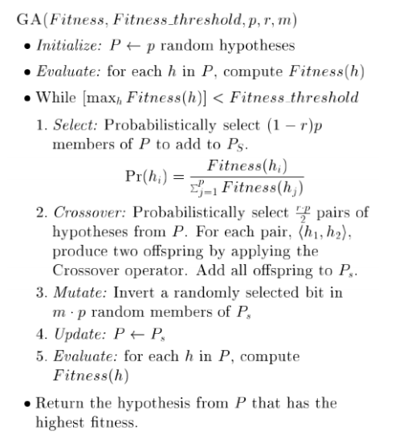

# Genetic Algorithm (GA)

## Outline

## Introduction

Genetic Algorithm (GA) is an optimization algorithm inspired by Darwinian natural selection and genetics. It is used to find the best solution to a problem. As the name "Genetic" suggested, Genetic Algorithm (GA) borrows biological concepts and terminologies such as genes and chromosomes, to represent and manipulate solutions.

## Mating Process

Pairs are randomly selected from the intermediate population, and it's possible for the same individual to be chosen twice. Recombination occurs to produce offspring, which are then included in the next generation population. This process is repeated until the next population has the desired number of individuals, often equal to the current population size, maintaining a constant population size.

Generation represents a specific iteration or round in the algorithm. Each generation consists of a population of individuals.

Analogous to real-life scenarios:

- Some highly fit individuals may encounter unfortunate circumstances where they:
  (a) fail to find a partner, or
  (b) are unable to reproduce even if they find a partner.
- Conversely, some less fit individuals may experience luck and:
  - Find a partner and produce numerous offspring!
  
However, the analogy has its limitations:

- There is no concept of sexes in genetic algorithms.
  - Although there are certain types of asexual organisms, such as worms, etc.
- Individuals have the ability to mate with themselves.
  - Although cells can reproduce independently.

## Recombination process

A Genetic Algorithm begins with a group of potential solutions referred to as a population. Each solution within the population is called an individual. The chromosome represents a string of bits, usually encoded as 1s and 0s, which carries the genetic information of an individual.

Genetic algorithms aim to find individuals with higher fitness from each population and use recombination techniques to create the next generation of solutions.

As we all know, humans have 23 pairs of chromosomes, and these chromosomes determine our characteristics, including our personalities to some extent. If you have some basic knowledge about genetic, then you will know that during fertilization, when a sperm and an egg combine, the genetic material from both parents is combined, resulting in a unique set of chromosomes for the offspring.

The same situation can be applied to machine learning as well. Since chromosome in machine learning is similar to individual, which refers to the bit-string that represent the solution to the problem. In genetic algorithms, crossover refers to the process of combining genetic information from two parent solutions to create offspring with a combination of traits.

During cell division, mutations can occur, leading to permanent changes in our gene sequence. While genetic mutations can have both positive and negative effects on an individual's fitness, in machine learning and genetic algorithms, mutations are important as they can introduce beneficial changes and increase variation in solutions.

In addition to mutation, another mechanism for introducing variation in genetic algorithms is inversion. Inversion refers to the rearrangement of a section of genetic material within a chromosome.

The process mimics the concept of sexual reproduction in biology, where offspring inherit traits from both parents. By combining different traits through crossover, genetic algorithms can explore and exploit different combinations of solutions, potentially leading to improved offspring in each generation.

However, it is worth noting that recombination usualyy kepp large strings the same while producing a large range of possible solutions. However, it might lead to the local maxima and hence random mutation comes into play. Bit might be flipped and this help avoid local maxima.

## Selection process

Now, we should enter the world of `Darwinian natural selection`. Assume we have new population of offsprings, and how can we choose among the best? Similar to examination, we should develop some metrics and evaluation method to evaluate their performance and therefore we can choose the best among them. The criteria, or the metrics, is known as `evaluation function`. The evaluation function will evaluate the performance of the individual to the problem and give them a metric. It is depends on the desirable properties of the solutions.

Later on, the evaluation function can be used to define a more useful metric, which is called a fitness function. Fitness function determines the probability of each individual being used in the mating process for the next generation.

Usually, $fitness(c) = g(c) / A$, where $A$ is the average of $g(c)$ over the entire population. Integer part of the fitness value is the number of copies of individuals guaranteed to go in IP (Intermediate Population). Fractional part is the probability that an extra copy will go into IP. It use a probabilistic function (roll dice) to determine whether the extra copies are added to the IP

There are two types of selections, namely tournament selection and rank selection. Tournament selection, as the name suggested, it will randomly pick two hypotheses, $h1$ and $h2$ and compare their probability, P which is defined as Fitness(hi) / Sum of fitness(j). While rank selection refers to the selection of probability proportional to rank.

## Termination Check

Termination in a genetic algorithm can involve testing whether an individual has reached a satisfactory standard in solving the problem, rather than necessarily finding a definitive answer. Alternatively, termination can occur after a fixed condition or a predetermined number of generations. It's important to note that the best individual in a population may not always be superior to the best individual in a previous population. Therefore, your genetic algorithm should record the best individual from each generation and output the best individual from all populations as the final answer.
