# WIA1003 Report

## Question 1

### Source Code

```assembly
INCLUDE Irvine32.inc
    
.data
    arr WORD 0, 2, 5, 9, 10
    result WORD 0

.code
main PROC
    mov ecx, LENGTHOF arr - 1 ; Set iteration number
    mov esi, OFFSET arr       ; Set array pointer

L1:
    mov ax, [esi + 2]       ; Set AX to next value
    sub ax, [esi]           ; Subtract AX by previous value
    add result, ax          ; Add the gap to result
    add esi, 2              ; Increment the ESI by 2

Loop L1
    mov eax, result ; Display result
    call WriteInt
    call Crlf

    exit
main ENDP
END main
```

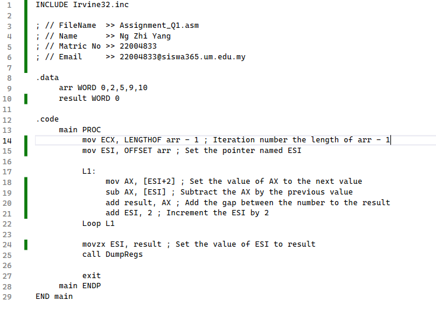

### Output

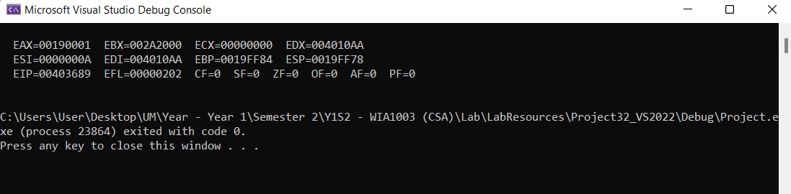

## Question 2

### Q2 - Source Code

```assembly
INCLUDE Irvine32.inc

.code
main PROC
    mov eax, 1
    mov edx, 1

L1:
    call WriteDec
    inc eax
    cmp eax, 9      ; Compare eax and 9
    jne L1          ; If not equal, go to L1

L2:
    call Crlf       ; Create new line
    inc edx
    mov eax, edx
    cmp edx, 9      ; Compare edx and 9
    jne L1          ; If not equal, go to L1

    exit

main ENDP
END MAIN
```

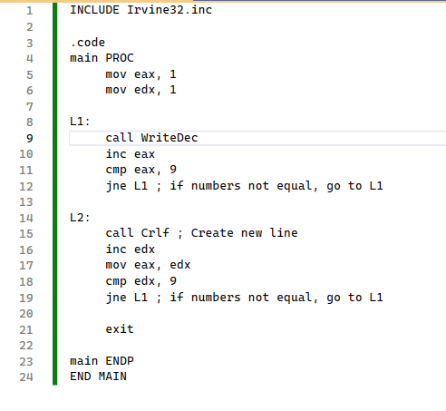

### Q2 - Output

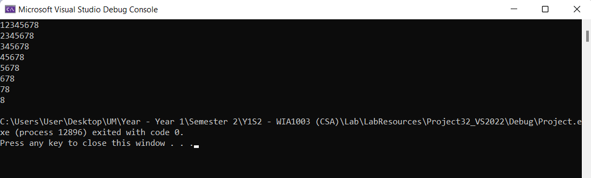

## Question 3

### Q3 - Source Code

```assembly
INCLUDE Irvine32.inc

.data
prompt BYTE "Enter 32-bit integer: ",0
result BYTE "The sum of 32-bit integers is : ",0
sum DWORD 0

.code
main PROC
    mov ecx, 3                ; ecx stores number of iteration
    mov edx, OFFSET prompt    ; edx stores string
     
    L1: 
        call WriteString     ; Display prompt message
        call ReadInt         ; Read input int into EAX
        add sum, eax
    loop L1

    mov eax, sum
    mov edx, OFFSET result
     
    call WriteString
    call WriteInt
     
exit
main ENDP
END main
```

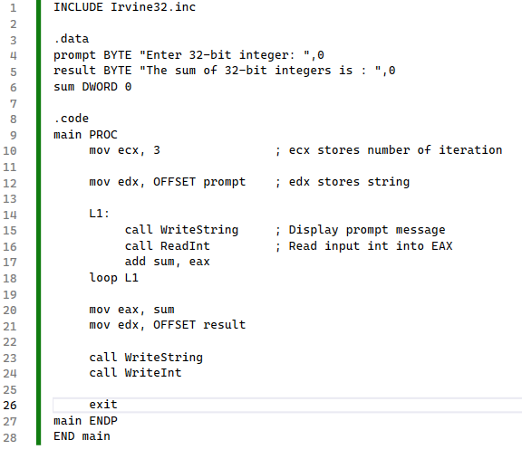

### Q3 - Output

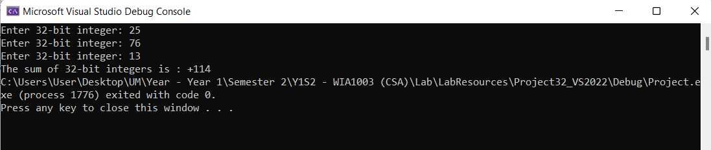

## Question 4

### Q4 - Source Code

```assembly
INCLUDE Irvine32.inc

.data
prompt BYTE "Enter mark (0-100): ",0
result BYTE "Grade: ",0

.code
main PROC
    mov edx, OFFSET prompt  ; Store prompt in edx
    call WriteString        ; Print prompt message
    call ReadInt            ; Read integer to eax
    call crlf
    
    .if eax >= 90
        mov al, 'A'
    .elseif eax >= 80
        mov al, 'B'
    .elseif eax >= 70
        mov al,'C'
    .elseif eax >= 60
        mov al,'D'
    .else
        mov al,'F'
    .endif
    
    mov edx, OFFSET result  ; Store result in edx
    call WriteString        ; Print result message
    call WriteChar          ; Print char
    call crlf
    
exit
main ENDP
END main
```

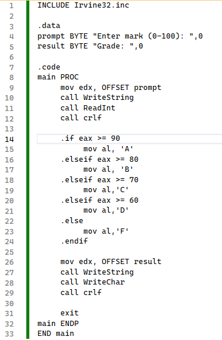

### Q4 - Output

#### Grade A

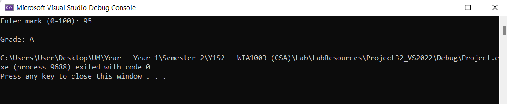

#### Grade B

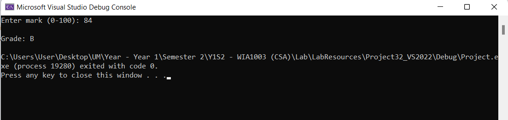

#### Grade C

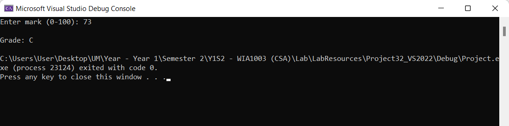

#### Grade D

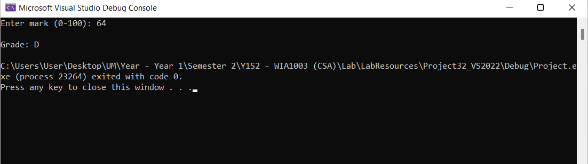

#### Grade F

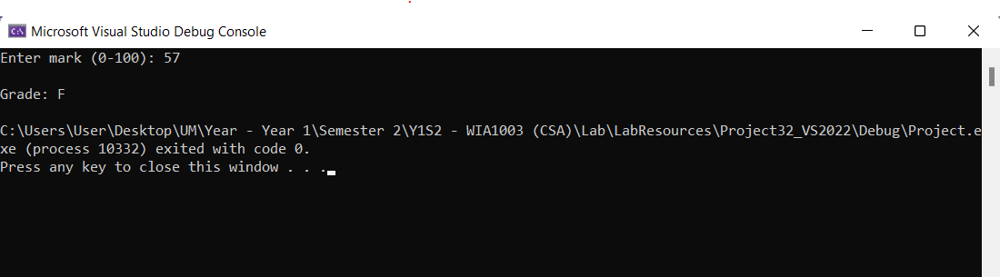
