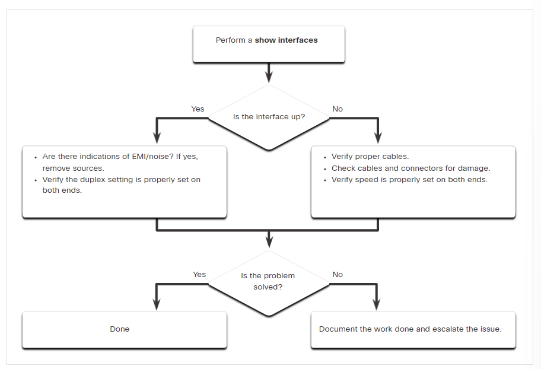

# Note

## Duplex Communication

1. Terminology explained

    | Term            | Explanation                                                                                                                                                                                   |
    | --------------- | --------------------------------------------------------------------------------------------------------------------------------------------------------------------------------------------- |
    | Full-duplex     | Bi-directional communication increases bandwidth efficiency by allowing both ends of a connection to transmit and receive data simultaneously.                                                |
    | Half-duplex     | Unidirectional communication creates performance issues because data can flow in only one direction at a time, often resulting in collisions.                                                 |
    | Auto-MDIX       | Automatic medium-dependent interface crossover enables automatic detection of the required cable connection type (straight-through or crossover) and configures the connection appropriately. |
    | Input errors    | The sum of all errors in datagrams that were received on the examined interface.                                                                                                              |
    | Output errors   | The sum of all errors that prevented the final transmission of datagrams out of the examined interface.                                                                                       |
    | Runt            | Discarded Ethernet frames that are shorter than the 64-byte minimum allowed length.                                                                                                           |
    | Giants          | Discarded Ethernet frames that are larger than the maximum allowed size (1518 bytes).                                                                                                         |
    | CRC errors      | Cyclic Redundancy Check errors are generated when the checksum calculated != checksum received.                                                                                               |
    | Collisions      | Number of messages retransmitted because of an Ethernet collision.                                                                                                                            |
    | Late Collisions | A collision that occurs after 512 bits of the frame have been transmitted.                                                                                                                    |

2. Errors and common causes

    | Error           | Causes                                                                      |
    | --------------- | --------------------------------------------------------------------------- |
    | Excessive runts | Malfunctioning NICs or collisions                                           |
    | CRC errors      | Electrical interference, loose or damaged connections, or incorrect cabling |
    | Late collisions | Excessive cable lengths and duplex misconfiguration                         |

3. Input Errors includes runts, giants, no buffer, CRC, frame, overrun, and ignored counts.

4. There is no collision domain associated with a switch port operating in full-duplex mode.

5. 

## Secure Remote Access

1. Telnet
    - Uses TCP port 23
    - Uses unsecure plaintext transmission of both the login authentication (username & password) and the data transmitted between the communicating devices

2. SSH (Secure Shell)
    - Uses TCP port 22
    - Provides encryption for login authentication and the data transmitted.

## Configure a Router

### Loopback

The loopback interface is a logical/ software interface internal to the router and is automatically placed in an UP state, as long as the router is functioning.It is not assigned to a physical port and can therefore never be connected to any other device.

Multiple loopback interfaces can be enabled on a router. It is useful in testing and managing because it ensures that at least one interface will always be available.

## Frame Forwarding

1. Terminology

    | Term    | Explanation                              |
    | ------- | ---------------------------------------- |
    | Ingress | The port where a frame enters the device |
    | Egress | The port where a frame leaves the device |

2. LAN switch has CAM (Content Addressable Memory)/ MAC address table which stores association between MAC addresses and ports.

3. Switch learning and forwarding process

    - Add/ update/ keep src MAC/ port in CAM table.
    - If dst MAC address exists, forward out of the specified port
    - If dst MAC address X exists,, perform unknown unicast (flood out all the ports except the incoming port)
    - If MAC address is a broadcast/ multicast, do the same as unknown unicast.

4. Store-and-Forward switching
    - Error checking
        - Check the frame for errors using CRC (Cyclic Redundancy Check)
        - Compares the frame check sequence (FCS) value in the last field of the datagram against its own FCS calculations
        - If the frame is error-free, the switch forwards the frame. Otherwise, the frame is dropped.

    - Automatic buffering is used to support any mix of Ethernet speeds.

5. Cut-through switching
    - Does not wait for the entire frame to enter the ingress port
    - Does not perform FCS check
    - Has low latency
    - Can forward frames with errors
    - If the error rate (invalid frames) is high, cut-through can clog up the bandwidth
    - Fast-forward switching immediately forwards a packet after reading the destination address.
    - In fragment-free switching, the switch stores the first 64 bytes of the frame before forwarding.

6. FCS is an error checking process that helps to ensure that the frame is free of physical and data-link errors.

7. Difference between switching methods

    | Store-and-Forward                                           | Cut-through                                                                      |
    | ----------------------------------------------------------- | -------------------------------------------------------------------------------- |
    | Performs FCS check on each frame                            | Does not perform FCS check                                                       |
    | Waits for the entire frame to be received before forwarding | Makes forward decision after receiving the minimum required portion of the frame |
    | Does not forward invalid frames                             | May forward invalid frames                                                       |
    | Slower processing time due to FCS check and waiting         | Faster processing time due to immediate forwarding decision                      |

8. Received frames with a destination MAC address that is associated with the switch port on which it is received are not forwarded because the destination exists on the network segment connected to that port.

## Collision and Broadcast Domains

1. Terminology explained

    | Term             | Explanation                                                         |
    | ---------------- | ------------------------------------------------------------------- |
    | Collision domain | The network segments that share the same bandwidth between devices. |
    | Broadcast domain | A collection of interconnected switches                             |
    | Congestion       | Heavy traffic load on a network due to excessive broadcasts.        |

2. If an Ethernet switch port is operating in half-duplex, each segment is in its own collision domain.

3. Only a network layer device, such as a router, can divide a Layer 2 broadcast domain.

4. Routers are used to segment broadcast domains, but will also segment a collision domain.

5. Adding a Layer 2 switch to a network increases the number of collision domains and increases the size of the broadcast domain.

    - Each switch port is a separate collision domain, and thus more, but smaller, collision domains are created.
    - A switch that receives a broadcast frame will forward the frame out all other interfaces, including interfaces that connect to other switches. These switches will also perform the same forwarding action. By adding more switches to the network, the size of the broadcast domain increases.

6. Switches provide microsegmentation so that one device does not compete for the same Ethernet network bandwidth with another network device, thus practically eliminating collisions.

7. A router defines a broadcast boundary, so every link between two routers is a broadcast domain.

8. Hubs operate only at the physical layer, forwarding bits as wire signals out all ports, and extend the collision domain of a network.

## Alleviate Network Congestion

1. Switch Characteristic

    | Characteristic          | Explanation                                                                        |
    | ----------------------- | ---------------------------------------------------------------------------------- |
    | Fast port speeds        | -                                                                                  |
    | Fast internal switching | Fast internal bus/ shared memory is used                                           |
    | Large frame buffers     | Allow data waiting to be transmitted to be stored so the data will not be dropped. |
    | High port density       | Reduce the number of switches required. It also help keep traffic local.            |
    |                         |                                                                                    |

2. Large frame buffers is beneficial especially if the incoming traffic is from a faster port than the egress port used for transmitting.

## VLAN

1. (Virtual LAN) VLANs allow an administrator to segment switched Layer 2 networks based on factors such as function, team, or application, without regard for the physical location of the users or devices.

2. Each VLAN is considered a separate logical network.

3. Benefit:
    1. **Smaller broadcast domain**
    2. **Improved security** since only users in the same VLAN can communicate to each other and without the use of router
    3. **Improved IT efficiency** because users with similar network requirement are grouped together.
    4. **Reduced cost** for expensive network upgrade
    5. **Better performance** due to smaller broadcast domains

4. Type of VLAN

    | Type       | Explanation                                                                                                                                          |
    | ---------- | ---------------------------------------------------------------------------------------------------------------------------------------------------- |
    | Default    | -                                                                                                                                                    |
    | Data/ User | Send user-generated traffic                                                                                                                          |
    | Native     | Send untagged traffic                                                                                                                                |
    | Management | For network management traffic (SSH, Telnet, HTTPS, HTTP, SNMP)                                                                                      |
    | Voice      | Support VoIP (Voice over IP) which requires assured bandwidth, transmission priority, less delay and the ability to be routed around congested areas |
    |            |                                                                                                                                                      |

5. VLAN trunks allow all VLAN traffic to propagate between switches.

6. A trunk is a point-to-point link between two network devices that carries more than one VLAN.

7. A VLAN is the equivalent to an IP network (or subnet)

8. IEEE 802.1Q header includes a 4-byte tag inserted within the original Ethernet frame header, specifying the VLAN to which the frame belongs. FCS will be recalculated after tag is inserted.

    | Field                             | Explanation                                    |
    | --------------------------------- | ---------------------------------------------- |
    | Type                              | (2byte) Tag Protocol ID (TPID) - 0x8100        |
    | User priority                     | (3bit) Supports level/ service implementation  |
    | Canonical Format Identifier (CFI) | (1bit) Enables Token Ring frames to be carried |
    | VLAN ID (VID)                     | (12bit) Supports 1 - 4096 ID                   |
    |                                   |                                                |

9. If an 802.1Q trunk port receives a tagged frame with the VLAN ID that is the same as the native VLAN, it drops the frame.

10. VLAN Range
    - Normal
        - Range = [1, 1005]
        - Used in small- and medium-sized business and enterprise networks
        - 1002 - 1005 are reserved for legacy network technologies
    - Extended
        - Range = [1006, 4094]
        - Used by service providers to service multiple customers and by global enterprises
        - Support fewer feature

11. Dynamic Trunk Protocol (DTP) enables switches to automatically negotiate trunking with a neighboring device. *(Access, Trunk, Dynamic Auto, Dynamic Desirable, no-negotiable)*

12. If the VLAN that is associated with a port is deleted, the port becomes inactive and cannot communicate with the network any more.

13. When a Cisco switch trunk port receives untagged frames (unusual in well-designed networks), it forwards these frames to the native VLAN.

14. The show interfaces trunk command displays the ports that are trunk ports, the trunking mode, the encapsulation type, the trunk status, the native VLAN, and the allowed VLANs on the link.

15. VLAN trunk links allow all VLAN traffic to propagate between devices. Switches can also utilize trunk links to routers, servers, and to other switches.

16. DTP is a Cisco proprietary protocol. Non-Cisco switches do not support DTP.

## Inter-VLAN routing

1. Legacy Inter-VLAN Routing
    - Each router interface was connected to a switch port in different VLANs.
    - Not scalable because routers have a limited number of physical interfaces。

2. Router-on-a-stick
    - Only one 801.1Q trunk physical interface is used.
    - Software-based, virtual, 802.Q sub-interfaces are configured independently with IP address, subnet, encapsulation type and VLAN assignment.
    - After exit interface is made, data frames are VLAN-tagged with the new VLAN.
    - Not scalable beyond 50 VLANs.
    - Simple to implement for a small to medium-sized organization
    - Interface is not configured with IP address.

3. Layer 3 Switch
    - An SVI(Switched Virtual Interface) is a virtual interface that is configured on a layer 3 switch.
    - Layer 3 switch is also called a multilayer switch as it operates at layer 2 and layer 3.
    - Compared to router-on-a-switch ...
        1. Much faster because everything is hardware switched and routed.
        2. No external links (switch -> router) for routing .
        3. Lower latency because data does not need to leave the switch for routing
        4. Commonly deployed in a campus LAN than routers
        5. Not limited to one link because Layer 2 EtherChannels can be used as trunk links between the switches to increase bandwidth
        6. More expensive
    - A routed port is configured with an IP address for a specific subnet.
