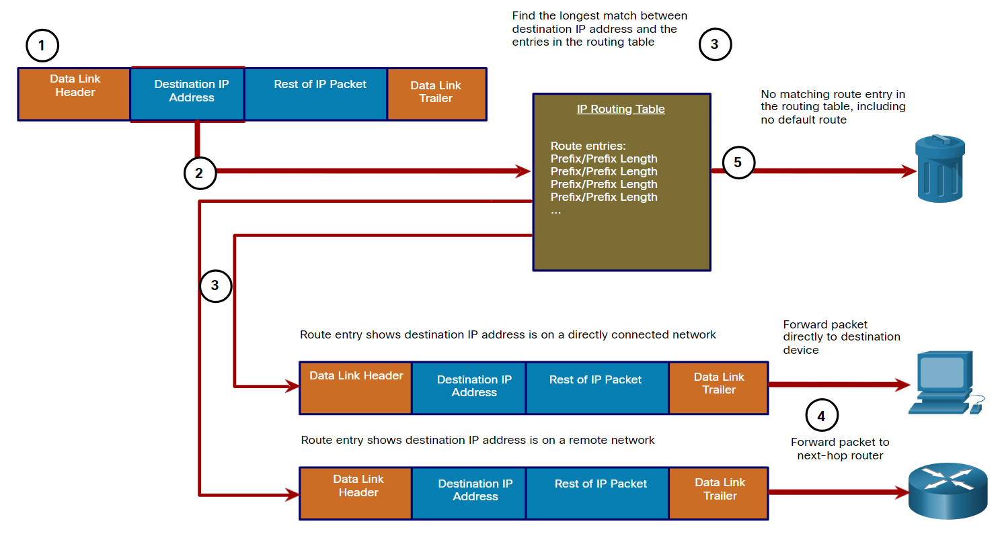
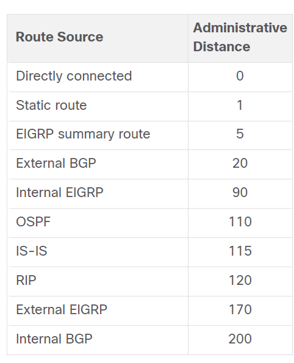

# Routing Concept

1. Two functions of a router:
    - Determine the best path to forward packets based on the information in its routing table
    - Forward packets toward their destination

2. Routing is the process in which a router determine the interface used to forward the received packet to the destination.

3. The longest match is a process the router uses to find a match between the destination IP address of the packet and a routing entry in the routing table.

4. The longest match (preferred route) is the route in the routing table that has the greatest number of far-left matching bits with the destination IP address of the packet.

5. The prefix length of the route in the routing table is used to determine the minimum number of far-left bits that must match.

6. Types of routes
    1. Directly connected Network
        - Networks that are configured on the active interfaces of a router which is configured with ip address and subnet mask
        - Added to the routing table when an interface is configured with an ip address and subnet mask and is active
    2. Remote network
        - Networks that are not directly connected to the router
        - Static routes
            - Added to the routing table when a route is manually configured
        - Dynamic routing protocols
            - Added to the routing table when routing protocols dynamically learn about the remote network.

            | Acronym | Full Name                                  |
            | ------- | ------------------------------------------ |
            | OSPF    | Open Shortest Path First                   |
            | EIGRP   | Enhanced Interior Gateway Routing Protocol |
            |         |                                            |

    3. Default route
        - Specifies a next-hop router to use when the routing table does not contain a specific route that matches the destination IP address
        - Can be configured statically or dynamically
        - Referred to as a gateway of last resort
        - IPv4 - 0.0.0.0/0, IPv6 - ::/0, indicating that zero bits or no bits need to match the destination IP address for this route entry to be used

## Packet Forwarding

1. If there is no match between the destination IP address and a prefix in the routing table, and if there is no default route, the packet will be dropped.

2. The way to determine the MAC address from IP address:
    - IPv4 packet
        - The router checks its ARP table for the destination IPv4 address and an associated Ethernet MAC address
        - If there is no match, the router sends an ARP Request.
        - The destination device will return an ARP Reply with its MAC address.
    - IPv6 packet
        - The router checks its neighbor cache for the destination IPv6 address and an associated Ethernet MAC address.
        - If there is no match, the router sends an ICMPv6 Neighbor Solicitation (NS) message. The destination device will return an ICMPv6 Neighbor Advertisement (NA) message with its MAC address.

3. Three forwarding mechanisms
    1. Process switching
        - When a packet arrives on an interface, it is forwarded to the control plane where the CPU
            - matches the destination address with an entry in its routing table
            - determines the exit interface and forwards the packet.
        - The router performs this operation for every packet, even if the destination is the same for a stream of packets, resulting in a slow process.

    2. Fast switching
        - The arrived packet will be forwarded to the control plane where the CPU searches for a match in the fast-switching cache.
        - If a match is not found, the packet is process-switched, and its flow information is stored in the fast-switching cache.
        - If a match is found, the packet will be forwarded based on the *next-hop information in the fast-switching cache* without CPU intervention.
        - Hence, in a stream of data, only the first packet takes a longer time to be processed, while the subsequent packets can be processed quickly.

    3. Cisco Express Forwarding (CEF)
        - CEF builds a Forwarding Information Base (FIB), and an adjacency table.
        - However, the table entries are not packet-triggered but change-triggered, such as when something changes in the network topology.
        - When a network has converged, the FIB and adjacency tables contain all the information that a router would have to consider when forwarding a packet.
        - Therefore, all packets can be processed quickly in the data plane.

## IP Routing table

1. A routing table contains a list of routes to known networks, including directly connected networks, static routes and dynamic routing protocols.

2. Three routing table principle
    1. Every router makes its decision alone, based on the information it has in its own routing table.
    2. The information in a routing table of one router does not necessarily match the routing table of another router.
    3. Routing information about a path does not provide return routing information.

3. Local route is the IP address that is assigned to the interface on that directly connected network. For IPv4 local routes, the prefix length is /32, and for IPv6 local routes, it is /128. This implies that the destination IP address of the packet must match all the bits in the local route for it to be considered a match.

## Static routing

1. Static routes are manually configured and defining an explicit path between two networking devices.

2. Advantages of static route
    1. Improved security
        - Administrators restricts the access to specific network segments/ resources through explicit routing definition.
    2. Improved resource efficiency
        - Use less bandwidth
        - No CPU cycles are used to calculate and communicate routes.

3. Disadvantages
    - lack of automatic reconfiguration and must be configured manually if the network topology changes.

4. Three primary uses:
    - It simplify the routing table maintenance in smaller networks which the growth is not significant.
    - It routes to and from stub networks.
    - It uses a single default route to represent a path to networks without a specific match in the routing table.

5. Commonly-used scenario:
    1. As a default route forwarding packets to a service provider
    2. For routes outside the routing domain and not learned by the dynamic routing protocol
    3. When the network administrator wants to explicitly define the path for a specific network
    4. For routing between stub networks

## Dynamic Routing

1. Dynamic routing protocols are used by routers to automatically share information about the reachability and status of remote networks.

2. Advantages:
    1. Select a best path
    2. Automatically discover a new best path when network topology changes.

## Default route

1. A default route can be either a static route or learned dynamically.

2. A default route has an IPv4 route entry of 0.0.0.0/0 or an IPv6 route entry of ::/0. This means that zero or no bits need to match between the destination IP address and the default route.

3. The default route specifies a next-hop router to use when the routing table does not contain a specific route that matches the destination IP address.

## Administrative Distance (AD)

1. The AD represents the "trustworthiness" of the route.

2. The lower the AD, the more trustworthy the route source.

## Static Route vs Dynamic Route

| Feature                  | Dynamic Routing                                     | Static Routing                          |
| ------------------------ | --------------------------------------------------- | --------------------------------------- |
| Configuration complexity | Independent of network size                         | Increases with network size             |
| Topology changes         | Automatically adapts to topology changes            | Administrator intervention required     |
| Scalability              | Suitable for simple to complex network topologies   | Suitable for simple topologies          |
| Security                 | Security must be configured                         | Security is inherent                    |
| Resource Usage           | Uses CPU, memory, and link bandwidth                | No additional resources needed          |
| Path Predictability      | Route depends on topology and routing protocol used | Explicitly defined by the administrator |

## Routing Protocol

1. A routing protocol is a set of processes, algorithms, and messages that are used to exchange routing information and populate the routing table with the choice of best paths.

2. Commonly-used scenario:

    - In larger network
    - Automatic path determination is required due to network topology changes.
    - For scalability (be able to learn new networks)

3. Purpose:

    1. Discovers remote networks
    2. Maintains up-to-date routing information
    3. Choose the best path to destination networks
    4. Find a new best path if the current path is no longer available

4. By using dynamic routing protocols, routers exchange routing information when there is a topology change. This exchange allows routers to automatically learn about new networks and to find alternate paths when there is a link failure to a current network.

## Load balancing

1. A metric is the quantitative value used to measure the distance to a given network.

2. The best path to a network is the path with the lowest metric.

3. Equal cost load balancing is a mechanism where the router forwards the packets using all alternative paths equally if the router has two or more paths to a destination with equal cost metrics.

| Routing Protocol                                   | Metric                                                                                                                                          |
| -------------------------------------------------- | ----------------------------------------------------------------------------------------------------------------------------------------------- |
| Routing Information Protocol (RIP)                 | The metric is "hop count". Each router along a path adds a hop to the hop count.                                                                |
| Open Shortest Path First (OSPF)                    | The metric is "cost" based on the cumulative bandwidth from source to destination. Faster links have lower costs compared to slower links.      |
| Enhanced Interior Gateway Routing Protocol (EIGRP) | It calculates a metric based on the slowest bandwidth and delay values. It could also include load and reliability into the metric calculation. |

## Terminology

1. Network discovery is the ability of a routing protocol to share information about the networks that it knows about with other routers that are also using the same routing protocol.

2. A stub network is a network accessed by a single route, and the router has only one neighbor.

3. When a router learns that multiple paths are available to a destination network from the same routing protocol, the route with the lowest metric is put into the routing table to forward packets toward that network.
