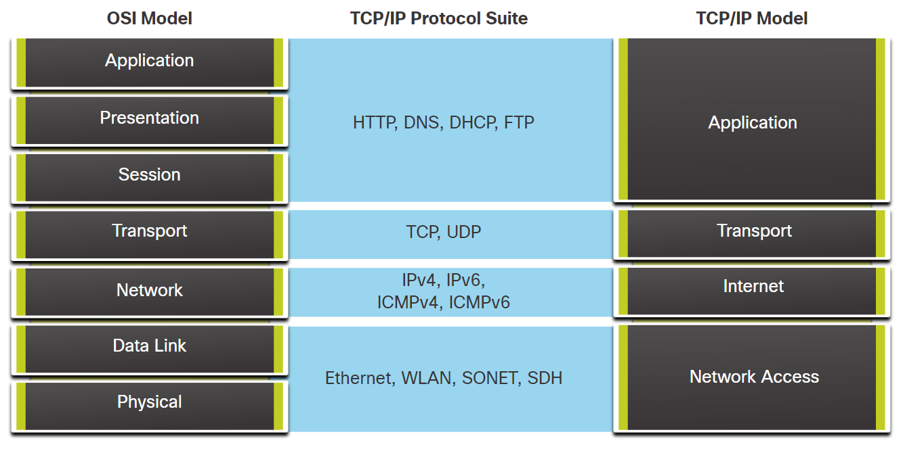

# Module 1 - 3

## Network Component

1. Hosts/ End devices/ Clients refers to devices on the network that are assigned IP (Internet Protocol) addresses for communication purposes.

2. An IP address identifies the host and the network to which the host is attached.

3. Servers are computers with software that allow them to provide information.

4. Pear-to-Pear (P2P) network is a network in which each devices can be both client and server.

5. Advantages of P2P (Peer-to-Peer networking)

    - Easy to set up
    - Less complex
    - Lower cost (network devices & dedicated servers may not be required)
    - Can be used for simple tasks (Transferring files and sharing printers)

6. Disadvantages of P2P

    - No centralized administration
    - Not secure
    - Not scalable
    - All devices may act as both clients and servers which can slow the performance

## Network Type

1. Internet (inter-network) means a “network of networks”. It is a collection of interconnected private and public networks.

2. Network infrastructures vary greatly in terms of:

    - Size of the area covered
    - Number of users connected
    - Number and types of services available
    - Area of responsibility

3. LAN (Local Area Network)
    - A LAN is a network infrastructure that interconnect and provides access to end devices in a small geographical area.
    - Provide high-speed bandwidth to internal end devices and intermediary devices

4. WAN (Wide Area Network)
    - A WAN is a network infrastructure that interconnect LANs and provides access to other networks over a wide geographical area
    - WANs typically provide slower speed links between LANs.

5. An intranet is designed to be accessible only by the organization's members, employees, or others with authorization.

6. An extranet is designed to provide secure and safe access to individuals who work for a different organization but require access to the organization’s data

## Reliable Network

1. Fault Tolerance
    - Limits the number of affected devices during a failure.
    - Allow quick recovery when such a failure occurs.
    - Redundancy refers to the multiple paths between the source and destination.

2. Scalable
    - Be able to expands quickly to support new users and applications without degrading the performance of current services.

3. Quality of Service (QoS)
    - A mechanism that implements queue management strategies to manage and prioritize different types of application data.

4. Security

    | Requirement     | Explanation                                                                 |
    | --------------- | --------------------------------------------------------------------------- |
    | Confidentiality | Only authorized recipients can access and read data                         |
    | Integrity       | Information has not been altered in transmission from origin to destination |
    | Availability    | Timely and reliable access to data services for authorized users.           |
    |                 |                                                                             |

5. Congestion occurs when the demand for bandwidth exceeds the amount available.

6. Network bandwidth is measured in the number of bits that can be transmitted in a single second, or bits per second (bps).

## Network Threat

| Threat                         | Explanation                                                                               |
| ------------------------------ | ----------------------------------------------------------------------------------------- |
| Malware                        | Viruses/ Worms/ Trojan horse contain malicious software or code running on a user device. |
| Spyware and adware             | They are installed on a user’s device and secretly collects information about the user.   |
| Zero-day/ Zero hour attacks    | The attack occur on the first day that a vulnerability becomes known.                     |
| Threat actor attacks           | A malicious person attacks user devices or network resources.                             |
| Denial of Service (DOS) attack | These attacks slow or crash applications and processes on a network device.               |
| Data interception and theft    | This attack captures private information from an organization’s network.                  |
| Identity theft                 | This attack steals the login credentials of a user in order to access private data.                   |
|                                |                                                                                           |

## Network Security

| Approach                           | Explanation                                                                          |
| ---------------------------------- | ------------------------------------------------------------------------------------ |
| Antivirus/ antispyware             | Protect end devices from becoming infected with malicious software.                  |
| Firewall filtering                 | Blocks unauthorized access into and out of the network.                              |
| Dedicated firewall systems         | Filter large amounts of traffic with more granularity.                               |
| Access control lists (ACL)         | further filter access and traffic forwarding based on IP addresses and applications. |
| Intrusion prevention systems (IPS) | identify fast-spreading threats, such as zero-day or zero-hour attacks.              |
| Virtual private networks (VPN)     | provide secure access into an organization for remote workers.                       |
|                                    |                                                                                      |

## Protocol Basics

1. Term Explanation

    | Term                  | Explanation                                                                                                      |
    | --------------------- | ---------------------------------------------------------------------------------------------------------------- |
    | Encoding              | The process of converting information into another acceptable form for transmission                              |
    | Decoding              | The process of reversing the encoding process to interpret the received information                              |
    | Addressing            | Identifies the sender and intended receiver using a defined addressing scheme                                    |
    | Reliability           | Provides guaranteed delivery mechanisms in case messages are lost or corrupted in transit                        |
    | Flow Control          | Ensures efficient data flow between communicating devices                                                        |
    | Sequencing            | Uniquely labels each transmitted data segment to aid correct reassembly in case of lost or out-of-order segments |
    | Error Detection       | Used to determine data corruption during transmission                                                            |
    | Application Interface | Contains information for process-to-process communications between network applications                          |
    | Response Timeout      | Specifies the duration to wait for responses and defines the action to take if a response timeout occurs         |
    | Protocol Suite        | A group of inter-related protocols necessary to perform a communication function                                 |
    | Unicast               | Information is being transmitted to a single end device                                                          |
    | Multicast             | Information is being transmitted to one or more end devices                                                      |
    | Broadcast             | Information is being transmitted to all end devices                                                              |

2. Benefits of a layered model
    - Assists in protocol design by providing clear information and interfaces for each layer.
    - Facilitates competition by enabling interoperability among products from different vendors.
    - Prevents changes in one layer from affecting other layers, ensuring stability and compatibility.
    - Provides a standardized language to describe networking functions and capabilities.

3. The protocols are organized into layers, with higher-level services relying on the functionality of lower-level protocols.

4. Lower layers handle data transmission and provide services to upper layers, which focus on message content.

5. Segmentation divides data into smaller units for network transmission.

6. Advantages of segmentation:
   - Increased speed: Enables multiplexing and efficient data transmission without occupying the entire communications link.
   - Increased efficiency: Only the failed segment needs to be retransmitted, reducing retransmission overhead compared to resending the entire data stream.

7. Multiplexing is a situation in which many different conversations to be interleaved on the network called multiplexing.

## Application Layer

### Name System

DNS

- Domain Name System.
- Translates domain names such as cisco.com, into IP addresses.

### Host Config

1. DHCPv4
    - Dynamic Host Configuration Protocol for IPv4.
    - A DHCPv4 server dynamically assigns IPv4 addressing information to DHCPv4 clients at start-up and allows the addresses to be re-used when no longer needed.

2. DHCPv6
    - Dynamic Host Configuration Protocol for IPv6.
    - A DHCPv6 server dynamically assigns IPv6 addressing information to DHCPv6 clients at start-up.

3. SLAAC
    - Stateless Address Auto-Configuration.
    - A method that allows a device to obtain its IPv6 addressing information without using a DHCPv6 server.

### Email

1. SMTP
    - Simple Mail Transfer Protocol.
    - Enables clients to send email to a mail server
    - Enables servers to send email to other servers.

2. POP3
    - Post Office Protocol version 3.
    - Enables clients to retrieve email from a mail server.
    - Enables clients to download the email to the client's local mail application.

3. IMAP
    - Internet Message Access Protocol.
    - Enables clients to access email stored on a mail server as well as maintaining email on the server.

### File Transfer

1. FTP
    - File Transfer Protocol
    - Sets the rules to enable file access and transfer between hosts over a network.
    - FTP is a reliable, connection-oriented, and acknowledged file delivery protocol.

2. SFTP
    - Secure Shell (SSH) File Transfer Protocol.
    - SFTP is used to establish a secure file transfer session in which the file transfer is encrypted.

3. TFTP
    - Trivial File Transfer Protocol.
    - A simple, connection-less file transfer protocol with best-effort, unacknowledged file delivery.
    - It uses less overhead than FTP.

### Web and Web Service

1. HTTP
    - Hypertext Transfer Protocol.
    - A set of rules for exchanging text, graphic images, sound, video, and other multimedia files on the WWW.

2. HTTPS
    - HTTP Secure.
    - A secure form of HTTP that encrypts the data that is exchanged over the WWW.

3. REST
    - Representational State Transfer.
    - A web service that uses application programming interfaces (APIs) and HTTP requests to create web applications.

## Transport layer

1. TCP
    - Transmission Control Protocol.
    - Connection-Oriented
    - Enables reliable communication between processes on separate hosts by ensuring acknowledged transmissions and confirming successful delivery.

2. UDP
    - User Datagram Protocol
    - Connection-less
    - Enables a process running on one host to send packets to a process running on another host.
    - However, UDP does not confirm successful datagram transmission.

## Internet Layer

### Internet Protocol/ Addressing

1. IPv4
    - Internet Protocol version 4.
    - Uses a 32-bit address.
    - Receives message segments from the transport layer, packages messages into packets, and addresses packets for end-to-end delivery over a network.

2. IPv6
    - IP version 6.
    - Uses a 128-bit address.

3. NAT
    - Network Address Translation.
    - Translates IPv4 addresses from a private network into globally unique public IPv4 addresses.

### Messaging

1. ICMPv4
    - Internet Control Message Protocol for IPv4.
    - Provides feedback from a destination host to a source host about errors in packet delivery.

2. ICMPv6
    - ICMP for IPv6

3. ICMPv6 ND
    - ICMPv6 Neighbor Discovery.
    - Used for address resolution and duplicate address detection.
    - Neighbor Solicitation, Neighbor Advertisement, Router Solicitation, Router Advertisement

### Routing Protocols

1. OSPF
    - Open Shortest Path First.
    - OSPF is an open standard interior routing protocol.
    - Link-state routing protocol that uses a hierarchical design based on areas.

2. EIGRP
    - Enhanced Interior Gateway Routing Protocol.
    - An open standard routing protocol developed by Cisco
    - Uses a composite metric based on bandwidth, delay, load and reliability.

3. BGP
    - Border Gateway Protocol.
    - An open standard exterior gateway routing protocol
    - Used between Internet Service Providers (ISPs).
    - Used between ISPs and their large private clients to exchange routing information.

## Network Access Layer

### Address Resolution

ARP

- Address Resolution Protocol.
- Provides dynamic address mapping between an IPv4 address and a hardware address.

### Data Link Protocols

1. Ethernet
    - Defines the rules for wiring and signaling standards of the network access layer.

2. WLAN
    - Wireless Local Area Network.
    - Defines the rules for wireless signaling across the 2.4 GHz and 5 GHz radio frequencies.

## Protocol Model

**OSI Model:**

| OSI Layer | Layer Name   | Description                                                                    |
| --------- | ------------ | ------------------------------------------------------------------------------ |
| 7         | Application  | Contains protocols used for process-to-process communications.                 |
| 6         | Presentation | Provides a common representation of the data transferred between layers.       |
| 5         | Session      | Manages the dialogue and data exchange between presentation layer entities.    |
| 4         | Transport    | Segments, transfers, and reassembles data for individual communications.       |
| 3         | Network      | Exchanges data between identified end devices over the network.                |
| 2         | Data Link    | Describes methods for data frame exchange between devices on a common media.   |
| 1         | Physical     | Describes the mechanical, electrical, and procedural aspects of data transfer. |

**TCP/IP Model:**

| TCP/IP Layer | Layer Name     | Description                                                                |
| ------------ | -------------- | -------------------------------------------------------------------------- |
| 4            | Application    | Represents data to the user, handles encoding, and manages dialog control. |
| 3            | Transport      | Supports communication between devices across diverse networks.            |
| 2            | Internet       | Determines the optimal path through the network.                           |
| 1            | Network Access | Controls the network hardware devices and media.                           |

## Encapsulation

1. Encapsulation is a adding of protocol information into an application data as it is passed down the protocol stack.

2. PDU (Protocol Data Unit) is the form that a piece of data takes at any layer.

3. PDU at each level:

    | Layer       | PDU                            |
    | ----------- | ------------------------------ |
    | Application | Data                           |
    | Transport   | Segment (TCP) / Datagram (UDP) |
    | Network     | Packet                         |
    | Data Link   | Frame                          |
    | Physical    | Bits                           |

## IP Addresses

1. The IP packet contains two IP addresses:

    - Source IP address - The IP address of the sending device
    - Destination IP address - The IP address of the receiving device

2. An IP address contains two parts:

    - Network portion (IPv4) or Prefix (IPv6)
        - The left-most part of the address that indicates the network in which the IP address is a member.
        - All devices on the same network will have the same network portion of the address.

    - Host portion (IPv4) or Interface ID (IPv6)
        - The remaining part of the address that identifies a specific device on the network.
        - This portion is unique for each device or interface on the network.

3. The subnet mask (IPv4) or prefix-length (IPv6) is used to identify the network portion of an IP address from the host portion.

4. MAC Address
    - The source MAC address refers to the MAC address of the device that sends the data link frame.
    - The destination MAC address represents the MAC address of the receiving device.
    - In cases where the sender and receiver are on different networks, the Ethernet frame must be sent to a router or default gateway for further routing.
