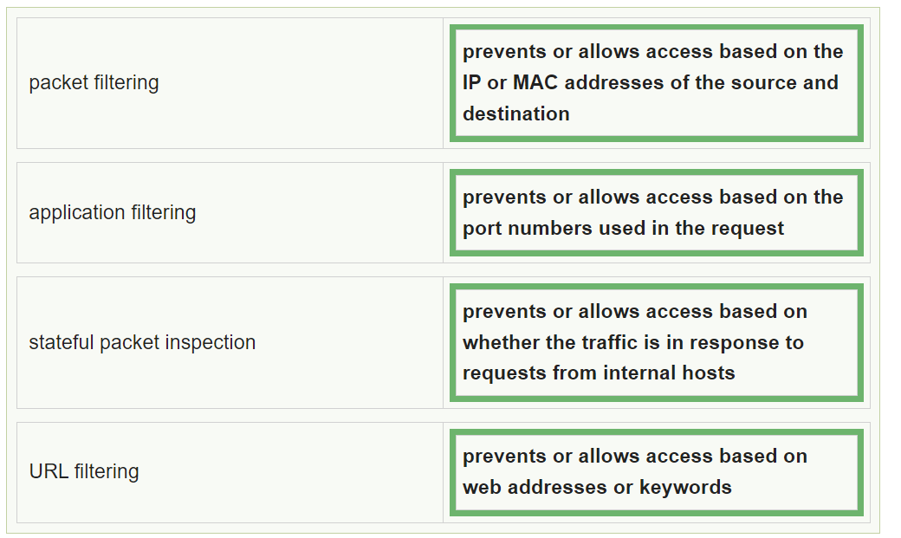
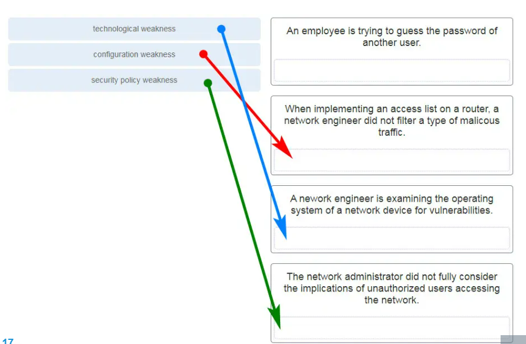

# Question Bank

## Questions

Part 1

1. Which component is designed to protect against unauthorized communications to and from a computer?
2. What is the role of an IPS?
3. What is the purpose of the network security accounting function?
4. What is the difference between a virus and a worm?
5. Which attack involves a compromise of data that occurs between two end points?
6. What is the purpose of the network security authentication function?
7. Which firewall feature is used to ensure that packets coming into a network are legitimate responses to requests initiated from internal hosts?
8. An administrator decides to use "WhatAreyouwaiting4" as the password on a newly installed router. Is this a strong password? Justify your answer.
9. What is considered the most effective way to mitigate a worm attack?

Part 2

1. What information about a Cisco router can be verified using the show version command?
2. Which method is used to send a ping message specifying the source address for the ping?
3. A network technician issues the `C:\> tracert -6 www.cisco.com` command on a Windows PC. What is the purpose of the -6 command option?
4. Why would the network administrator issue this `show cdp neighbors` command if the ping failed between the two routers?
5. Which command should be used on a Cisco router or switch to allow log messages to be displayed on remotely connected sessions using Telnet or SSH?
6. A network engineer is analyzing reports from a recently performed network baseline. In which situation would a possible latency issue be depicted?
7. Why would a network administrator use the `tracert` utility?
8. Which command can an administrator issue on a Cisco router to send debug messages to the vty lines?
9. Users are complaining that they are unable to browse certain websites on the Internet. An administrator can successfully ping a web server via its IP address but cannot browse to the domain name of the website. Which troubleshooting tool would be most useful in determining where the problem is?
10. Which statement describes the ping and tracert commands?
11. Students who are connected to the same switch are having slower than normal response times. The administrator suspects a duplex setting issue. What is the best command to use to accomplish the task?
12. A user wants to know the IP address of the PC. What is the best command to use to accomplish the task?
13. By following a structured troubleshooting approach, a network administrator identified a network issue after a conversation with the user. What is the next step that the administrator should take?
14. An administrator is troubleshooting connectivity issues and needs to determine the IP address of a website. What is the best command to use to accomplish the task?
15. A network engineer is troubleshooting connectivity issues among interconnected Cisco routers and switches. Which command should the engineer use to find the IP address information, host name, and IOS version of neighboring network devices?

## Network Security

1. Which component is designed to protect against unauthorized communications to and from a computer?
   - Firewall

2. What is the role of an IPS?
   - Detecting and blocking attacks in real time

3. Which example of malicious code would be classified as a Trojan horse?
   - Malware that attaches itself to a legitimate program and spreads to other programs when launched

4. What is the purpose of the network security accounting function?
   - To keep track of the actions of a user

5. 

6. What is the difference between a virus and a worm?
   - Worms self-replicate, but viruses do not.

7. Which attack involves a compromise of data that occurs between two end points?
   - Man-in-the-middle attack

8. What is the purpose of the network security authentication function?
   - To require users to prove who they are

9. Which firewall feature is used to ensure that packets coming into a network are legitimate responses to requests initiated from internal hosts?
   - Stateful packet inspection

10. On which two interfaces or ports can security be improved by configuring executive timeouts? (Choose two.)
    - Console ports
    - VTY ports

11. A user is redesigning a network for a small company and wants to ensure security at a reasonable price. The user deploys a new application-aware firewall with intrusion detection capabilities on the ISP connection. The user installs a second firewall to separate the company network from the public network. Additionally, the user installs an IPS on the internal network of the company. What approach is the user implementing?
    - Layered

12. An administrator decides to use "WhatAreyouwaiting4" as the password on a newly installed router. Which statement applies to the password choice?
    - It is strong because it uses a passphrase.

13. What is considered the most effective way to mitigate a worm attack?
    - Download security updates from the operating system vendor and patch all vulnerable systems.

14. 

## Troubleshooting

1. What information about a Cisco router can be verified using the show version command?
   - The value of the configuration register

2. Which method is used to send a ping message specifying the source address for the ping?
   - Issue the ping command without specifying a destination IP address.

3. A network technician issues the `C:\> tracert -6 www.cisco.com` command on a Windows PC. What is the purpose of the -6 command option?
   - It forces the trace to use IPv6.

4. Why would the network administrator issue this `show cdp neighbors` command if the ping failed between the two routers?
   - The network administrator wants to verify Layer 2 connectivity.

5. An employee complains that a Windows PC cannot connect to the Internet. A network technician issues the `ipconfig` command on the PC and is shown an IP address of 169.254.10.3. What can be inferred from this information? (Choose two.)
   - The PC cannot contact a DHCP server.
   - The PC is configured to obtain an IP address automatically.

6. Which command should be used on a Cisco router or switch to allow log messages to be displayed on remotely connected sessions using Telnet or SSH?
   - `logging synchronous`

7. A network engineer is analyzing reports from a recently performed network baseline. In which situation would a possible latency issue be depicted?
   - An increase in host-to-host ping response times

8. Why would a network administrator use the `tracert` utility?
   - To identify where a packet was lost or delayed on a network

9. Which command can an administrator issue on a Cisco router to send debug messages to the vty lines?
   - `terminal monitor`

10. Users are complaining that they are unable to browse certain websites on the Internet. An administrator can successfully ping a web server via its IP address but cannot browse to the domain name of the website. Which troubleshooting tool would be most useful in determining where the problem is?
    - `nslookup`

11. Which statement describes the ping and tracert commands?
    - Tracert shows each hop, while ping shows a destination reply only.

12. Students who are connected to the same switch are having slower than normal response times. The administrator suspects a duplex setting issue. What is the best command to use to accomplish the task?
    - `show interfaces`

13. A user wants to know the IP address of the PC. What is the best command to use to accomplish the task?
    - `ipconfig`

14. By following a structured troubleshooting approach, a network administrator identified a network issue after a conversation with the user. What is the next step that the administrator should take?
    - Establish a theory of probable causes.

15. An administrator is troubleshooting connectivity issues and needs to determine the IP address of a website. What is the best command to use to accomplish the task?
    - `nslookup`

16. A network engineer is troubleshooting connectivity issues among interconnected Cisco routers and switches. Which command should the engineer use to find the IP address information, host name, and IOS version of neighboring network devices?
    - `show cdp neighbors detail`

## Network Establishment

1. What is the purpose of a small company using a protocol analyzer utility to capture network traffic on the network segments where the company is considering a network upgrade?
   - To document and analyze network traffic requirements on each network segment

2. A network administrator is upgrading a small business network to give high priority to real-time applications traffic. What two types of network services is the network administrator trying to accommodate?
   - Voice
   - Video

layered
structured
risk based
attack based

## Concept to review

Part 1

1. Firewalls
2. IPS (Intrusion Prevention System)
3. Network security accounting
4. Virus vs. Worm
5. Man-in-the-middle attack
6. Network security authentication
7. Stateful packet inspection
8. Password strength
9. Worm attack mitigation

Part 2

1. show version
2. ping
3. tracert
4. show cdp neighbors
5. ipconfig
6. logging synchronous
7. show interfaces
8. terminal monitor
9. nslookup
10. show cdp neighbors detail
11. extended ping
