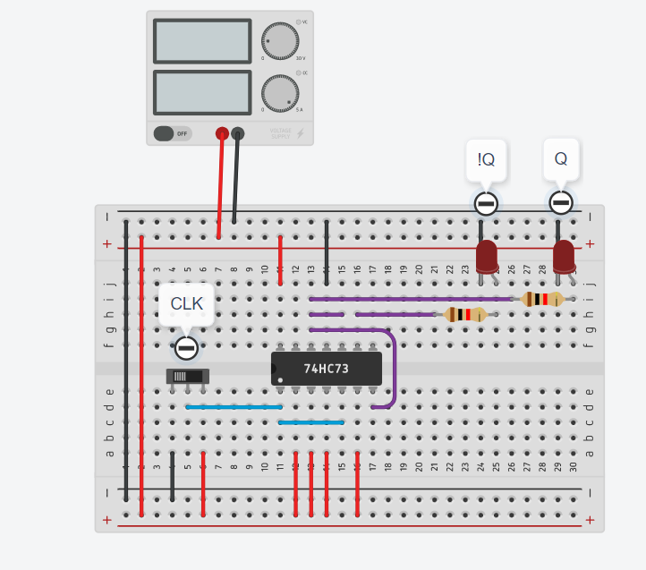
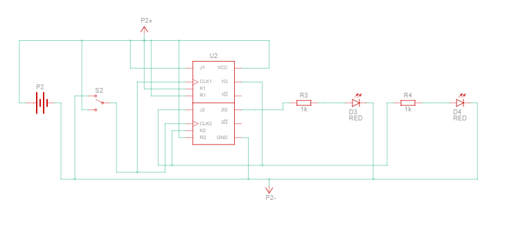
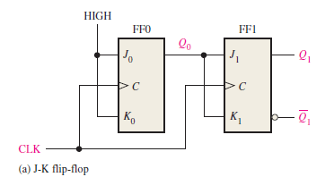
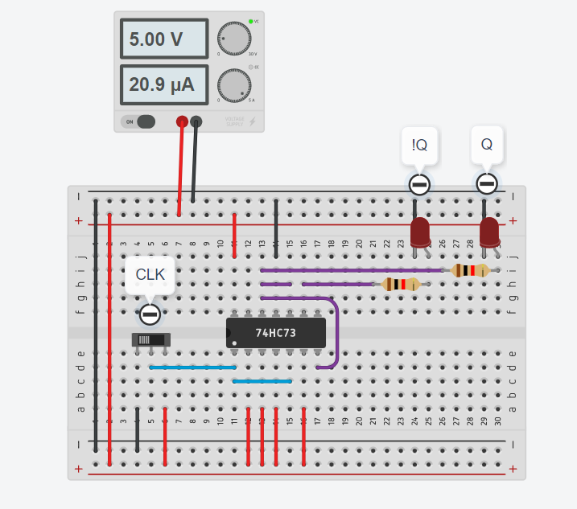
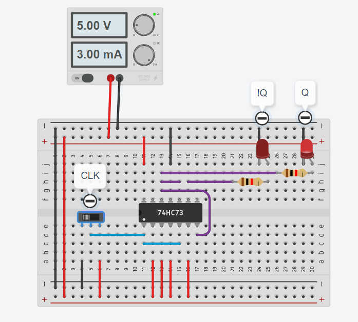
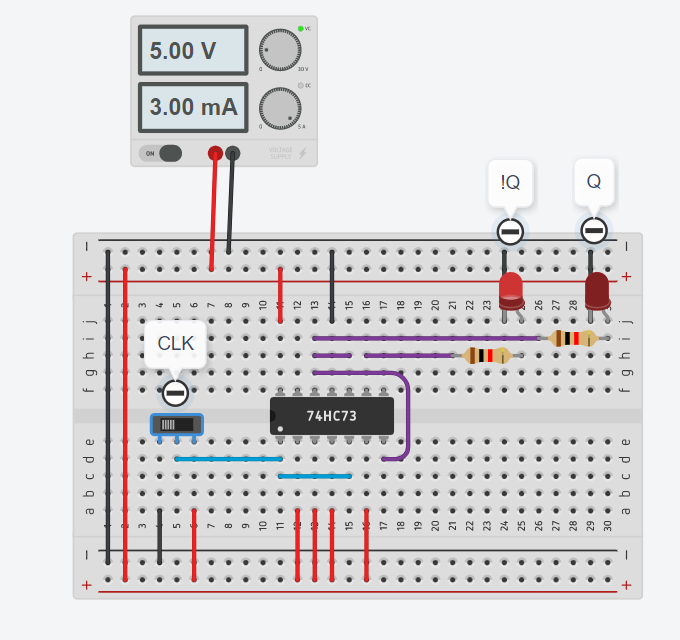
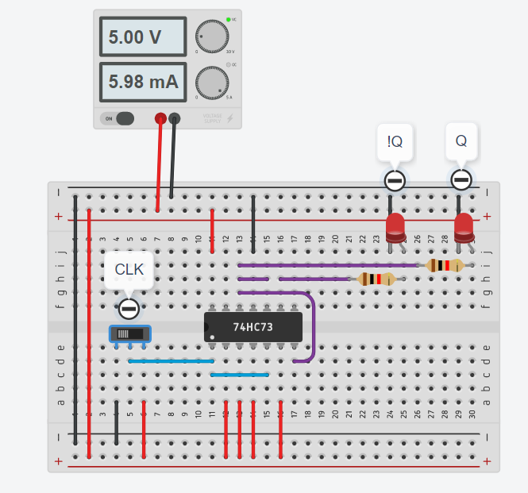
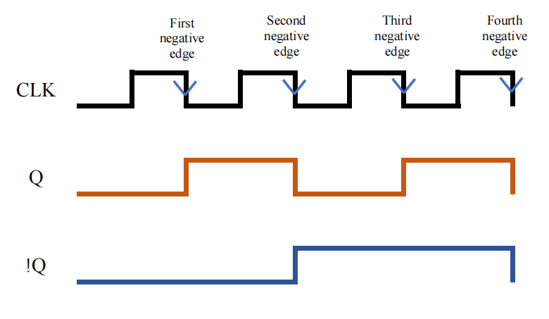
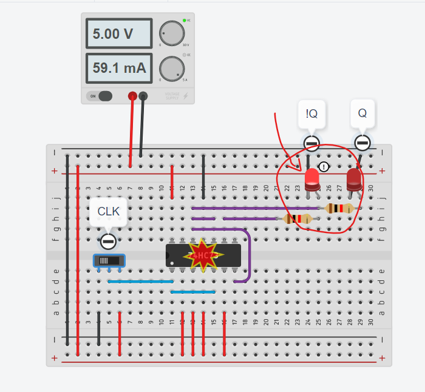
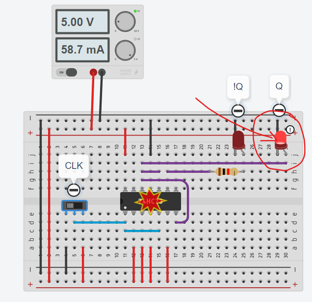

# WIX1003/Lab3/Complete Report

## Question Overview

---

- Construct a 2-bit flip-flop counter by using JK flip flop.
- Schematic diagram of the 2-bit counter.
- Screenshot to show the function of the 2-bit counter.

Noted that we are asked to construct a 2-bit flip-flop ***counter*** instead of simply a J-K flip flop. The truth table for a 2-bit flip-flop counter is as follows:

| CLK |  Q  | !Q  | Counting |
| :-: | :-: | :-: | :------: |
|  F  |  0  |  0  |    00    |
|  F  |  0  |  1  |    01    |
|  F  |  1  |  0  |    10    |
|  F  |  1  |  1  |    11    |
|  F  |  1  |  1  |    00    |
|  F  |  1  |  1  |    01    |

...

As you can see, whenever the clock pulse is at its falling edge (represented by the symbol F), the binary number, or counting, is increased by one. The counting loops again when it reaches 11, which is 3. This is a basic representation of a 2-bit flip-flop counter.

 

## Solution

---

### **Diagram**

*FIGURE 1: Circuit Diagram*

*FIGURE 2: Schematic Diagram*

The circuit is connected according to the following diagram:

*FIGURE 3: <https://physicsteacher.in/2021/11/16/logic-diagram-operation-timing-diagram-of-2-bit-synchronous-binary-counter/>*

 

### **Explanation**

---

The complete truth table for this circuit is as follows:

| T   | CLK | J1  | K1  | Output1 | Comment | J2  | K2  | Output2 | Comment   |
| --- | --- | --- | --- | ------- | ------- | --- | --- | ------- | --------- |
| 1   | F   | 1   | 1   | 0       | RESET   | 0   | 0   | 0       | RESET     |
| 2   | F   | 1   | 1   | 1       | TOGGLE  | 0   | 0   | 0       | NO CHANGE |
| 3   | F   | 1   | 1   | 0       | TOGGLE  | 1   | 1   | 1       | TOGGLE    |
| 4   | 1   | 1   | 1   | 1       | TOGGLE  | 0   | 0   | 1       | NO CHANGE |
| 5   | F   | 1   | 1   | 0       | TOGGLE  | 1   | 1   | 0       | TOGGLE    |
|     |     |     |     |         |         |     |     |         |           |

...

According to the Figure 2, the 2-bit counter is composed of 2 types of flip flops which are `J-K Flip Flop` and `D Flip Flop`. J-K Flip Flop takes two bit input J1 and K1 while D Flip Flop takes the previous output from J-K Flip Flop, that is, output1.

- At T = 1, J2 and K2 are 0s. This is because output1 at T = 0 is 0 (RESET).
- At T = 2, J2 and K2 are 0s. This is because output1 at T = 1 is 0.
- At T = 3, J2 and K2 are 1s. This is because output1 at T = 2 is 1.
- At T = 4, J2 and K2 are 0s. This is because output1 at T = 3 is 0.
- ...

The output of Output2 is same as the truth table of a D Flip Flop:

| T   | CLK | J2  | K2  | Output2 | Output2   |
| --- | --- | --- | --- | ------- | --------- |
| 2   | F   | 0   | 0   | 0       | NO CHANGE |
| 3   | F   | 1   | 1   | 1       | TOGGLE    |
| 4   | F   | 0   | 0   | 1       | NO CHANGE |
| 5   | F   | 1   | 1   | 0       | TOGGLE    |
|     |     |     |     |         |           |

 

### **Output ScreenShot**

---

Demonstration Video: <https://drive.google.com/file/d/1IFoxVsf-tlNlZy8VFgHTXHlLY8xwe25w/view?usp=share_link>

*Figure 4: When clock pulse is at 1st negative edge, !Q = 0, Q = 0*

*Figure 5: When clock pulse is at 2nd negative edge, !Q = 0, Q = 1*

*Figure 6: When clock pulse is at 3rd negative edge, !Q = 1, Q = 0*

*Figure 7: When clock pulse is at 4th negative edge, !Q = 1, Q = 1*

*Figure 8: The waveform of the JK Flip Flop counter (Draw using Microsoft Excel)*

 

### **Notes**

---

The device may broke because of 2 reasons:

1. Wrongly connect the output to the LED
2. Never use resistor on the output to LED

*Figure 8: Wrongly connect the output to the LED*

*Figure 9: Never use resistor on the output to LED*

